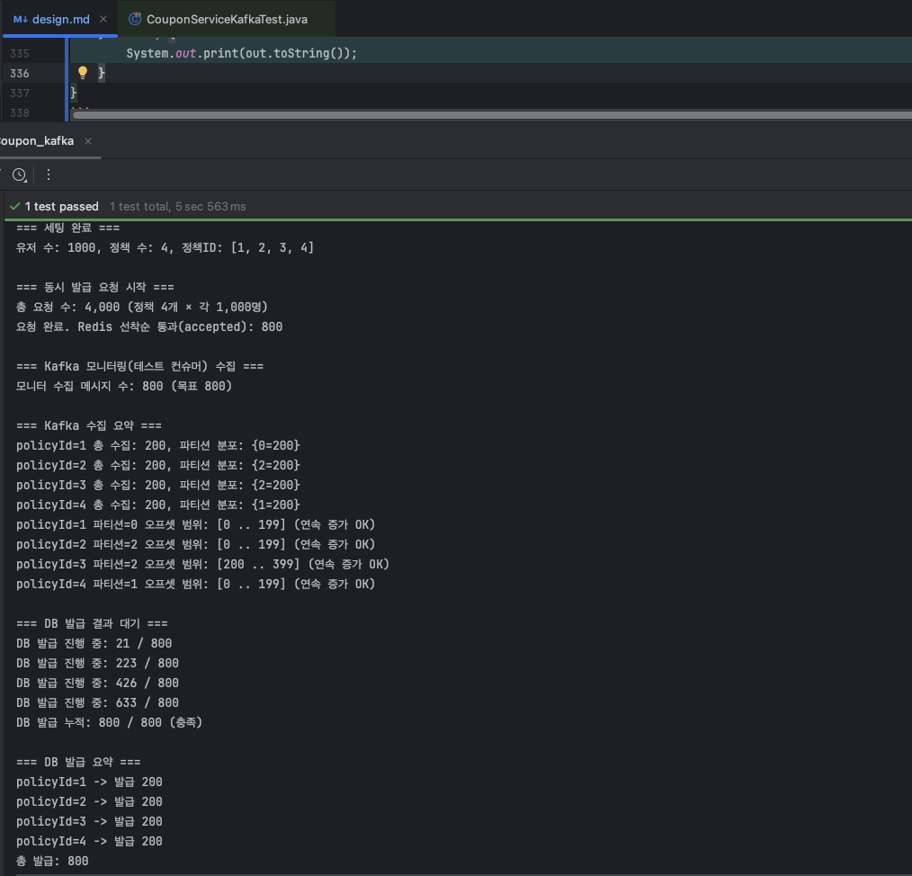

# E-commerce Asynchronous Design With Kafka

> 기존 `Redis`는 선착순을 메모리 기반으로 빠르게 보장하고, DB의 영속화는 Kafka를 통해 병렬적으로 처리

## Redis 기반 선착순 쿠폰 발급 설계

### 기존 설계

> - 지지난주차에 과제 피드백을 반영하여 수정되었습니다.
>   - `RedisService`는 부적절, `RedisRepository`인프라 레이어로 `service`에서 사용

- `Client` → `Redis` 발급 시도 및 즉시 응답
  <details><summary>(구)시퀀스 다이어그램</summary>

  ```mermaid
  sequenceDiagram
    Client->>CouponService: tryIssue(userId, policyId)
    CouponService->>CouponRedisRepository: tryIssue(userId, policyId)
    CouponRedisRepository->>Redis: DECR & ZADD(PENDING)
    CouponRedisRepository-->>CouponService: true/false
    CouponService-->>Client: OK/Fail
  ```
  </details> 

  - DECR로 남은 수량을 원자적으로 차감(선착순 게이트).
  - 성공 시 PENDING ZSET에 (userId, 시간+랜덤)으로 대기열 등록.
  - 호출자는 즉시 성공/실패를 응답받음(실제 DB 확정은 별도 단계).

- `Worker`에 의한 DB ↔ `Redis` 정책 동기화
  <details><summary>(구)시퀀스 다이어그램</summary>

  ```mermaid
  sequenceDiagram
    CouponWorker->>CouponService: syncActivePolicies()
    CouponService->>CouponPolicyRepository: findActive()
    CouponService->>CouponRedisRepository: setRemaining/removePolicy
  ```
  </details> 

  - DB의 유효 정책과 Redis의 잔여수량 키를 맞춤.
  - `Redis`에만 남은 오래된 정책 키는 정리.
  - 활성 정책의 `remainingCount`를 `Redis`에 동기화.

- `Worker`에 의한 대기열 처리
  <details><summary>(구)시퀀스 다이어그램</summary>

  ```mermaid
  sequenceDiagram
    CouponWorker->>CouponService: processAllPending()
    CouponService->>CouponRedisRepository: peekPending(N)
    loop for each userId
      CouponService->>CouponService: issueCoupon(userId, policyId)
      CouponService->>CouponPolicyRepository: decreaseRemaining()
      CouponService->>CouponRepository: save(Coupon)
    end
    CouponService->>CouponRedisRepository: removePending(succeeded)
  ```
  </details> 

  - 1초마다 PENDING ZSET을 배치(최대 500) 로 가져와 DB에 발급 확정.
  - 성공한 사용자만 ZREM으로 PENDING에서 제거.
  - PENDING이 비면 키를 삭제(수동 만료 전략).
  - DB는 트랜잭션 & 조건부 감소로 초과 발급 방지(동시성 예외는 무시/스킵).

### 변경된 설계

- `Client` → `Redis` 발급 시도 및 즉시 응답
  ```mermaid
  sequenceDiagram
    Client->>CouponService: tryIssue(userId, policyId)
    CouponService->>CouponRedisRepository: tryIssue(userId, policyId)
    CouponRedisRepository->>Redis: DECR & ZADD(PENDING)
    alt 성공
      CouponService-->>Client: Accepted
      CouponService->>CouponEventPublisher: publish(CouponIssueRequestedEvent)
    else 실패
      CouponService-->>Client: SoldOut
    end
  ```
  - Redis 선착순 성공 직후 이벤트 발행
    - 동기 로직과 분리
    - RedisRepository는 Transaction이 아니므로, 즉시 이벤트 발행

- `Kafka` 컨슈머에 의한 DB 확정 처리
  ```mermaid
  sequenceDiagram
    Kafka->>CouponIssueConsumer: CouponIssueRequestedMessage(userId, policyId)
    CouponIssueConsumer->>CouponService: issueCoupon(userId, policyId)
    CouponService->>CouponPolicyRepository: decreaseRemaining(policyId)
    CouponService->>CouponRepository: save(Coupon)
    CouponIssueConsumer-->>Kafka: commit offset
  ```
  - Kafka Consumer에 의해서 CouponService 쿠폰 발급
    - 학습 목적 상 분산 환경, 혹은 다른 서비스로 분리되었다 가정
  - 성공시 offset 커밋하여 순차 진행

- `Worker`에 의한 DB ↔ `Redis` 정책 동기화 **(동일)**
  ```mermaid
  sequenceDiagram
    CouponWorker->>CouponService: syncActivePolicies()
    CouponService->>CouponPolicyRepository: findActive()
    CouponService->>CouponRedisRepository: setRemaining/removePolicy
  ```
  - `RedisRepository`의 상태를 주기적으로 동기화 하는 역할만 수행

## 기능 구현

- [CouponService.java](https://github.com/hanghae-plus-anveloper/hhplus-e-commerce-java/blob/develop/src/main/java/kr/hhplus/be/server/coupon/application/CouponService.java): `CouponService.tryIssue` 이벤트 발행 추가
  ```java
  public boolean tryIssue(Long userId, Long policyId) {
    boolean accepted = couponRedisRepository.tryIssue(userId, policyId);
    if (accepted) {
      publisher.publishEvent(new CouponPendedEvent(userId, policyId));
    }
    return accepted;
  } 
  ```
  - Redis에 쿠폰 발급 요청 적재 시 **적재됨** 이벤트 발행

- [CouponWorker.java](https://github.com/hanghae-plus-anveloper/hhplus-e-commerce-java/blob/develop/src/main/java/kr/hhplus/be/server/coupon/application/CouponWorker.java)
  ```java
  // 확정처리는 Kafka로 이전
  // @Scheduled(fixedDelay = 1000) // 1초마다 실행
  public void processAllPending() { }
  ```
  - 기존 배치 스케쥴러는 제외처리

- [KafkaTopics.java](https://github.com/hanghae-plus-anveloper/hhplus-e-commerce-java/blob/develop/src/main/java/kr/hhplus/be/server/kafka/KafkaTopics.java): 토픽 변경
  ```java
  @Bean
  NewTopic couponPendedTopic(
          @Value("${app.kafka.topics.coupon-pended}") String name,
          @Value("${app.kafka.partitions.coupon-pended:3}") int partitions
  ) {
    return TopicBuilder.name(name).partitions(partitions).replicas(1).build();
  } 
  ```
  - coupon-issued나 coupon-issue-requested 보단 현재 상태인 pended 사실 기반으로 변경

- [CouponPendedEvent.java](https://github.com/hanghae-plus-anveloper/hhplus-e-commerce-java/blob/develop/src/main/java/kr/hhplus/be/server/common/event/coupon/CouponPendedEvent.java)
  ```java
  public record CouponPendedEvent(Long userId, Long policyId) {} 
  ```

- [CouponPendedMessage.java](https://github.com/hanghae-plus-anveloper/hhplus-e-commerce-java/blob/develop/src/main/java/kr/hhplus/be/server/kafka/message/OrderCompletedMessage.java)
  ```java
  public record CouponPendedMessage(Long userId, Long policyId, Instant requestedAt) {}
  ```

- [OrderCompletedKafkaPublisher.java](https://github.com/hanghae-plus-anveloper/hhplus-e-commerce-java/blob/develop/src/main/java/kr/hhplus/be/server/kafka/publisher/OrderCompletedKafkaPublisher.java)
  ```java
  @Slf4j
  @Component
  @RequiredArgsConstructor
  public class CouponIssueKafkaPublisher {
  
      private final KafkaTemplate<String, CouponPendedMessage> kafkaTemplate;
  
      @Value("${app.kafka.topics.coupon-pended}")
      private String topic;
  
      @EventListener
      public void on(CouponPendedEvent event) {
          CouponPendedMessage msg = new CouponPendedMessage(event.userId(), event.policyId(), Instant.now());
          String key = String.valueOf(event.policyId());
  
          kafkaTemplate.send(topic, key, msg).whenComplete((res, ex) -> {
              if (ex != null) {
                  log.error("[KAFKA] publish failed: policyId={}, userId={}, reason={}", event.policyId(), event.userId(), ex.getMessage(), ex);
              } else {
                  var md = res.getRecordMetadata();
                  log.info("[KAFKA] published coupon pended: topic={}, partition={}, offset={}", md.topic(), md.partition(), md.offset());
              }
          });
      }
  }
  ```
  - 이벤트 기반 kafka 메세지 발행
    - RedisRepository는 트랜젝션이 아니어서 직접 발행해도 될 것으로 보이나, 
    - 분리 시 로깅이나 메세지 발행 재시도 로직을 넣기에 용이할것으로 보여 구성

- [KafkaCouponConsumerConfig.java](https://github.com/hanghae-plus-anveloper/hhplus-e-commerce-java/blob/develop/src/main/java/kr/hhplus/be/server/kafka/config/KafkaCouponConsumerConfig.java)
  ```java
  @EnableKafka
  @Configuration
  public class KafkaCouponConsumerConfig {
  
    @Bean
    public ConsumerFactory<String, CouponPendedMessage> couponPendedConsumerFactory(KafkaProperties properties) {
      Map<String, Object> props = new HashMap<>(properties.buildConsumerProperties());
  
      props.keySet().removeIf(k -> k.toString().startsWith("spring.json."));
  
      props.put(ConsumerConfig.KEY_DESERIALIZER_CLASS_CONFIG, StringDeserializer.class);
      props.put(ConsumerConfig.VALUE_DESERIALIZER_CLASS_CONFIG, JsonDeserializer.class);
  
      JsonDeserializer<CouponPendedMessage> value = new JsonDeserializer<>(CouponPendedMessage.class);
      value.ignoreTypeHeaders();
      value.addTrustedPackages("kr.hhplus.*");
  
      return new DefaultKafkaConsumerFactory<>(props, new StringDeserializer(), value);
    }
  
    @Bean(name = "couponPendedKafkaListenerContainerFactory")
    public ConcurrentKafkaListenerContainerFactory<String, CouponPendedMessage> couponPendedKafkaListenerContainerFactory(
            ConsumerFactory<String, CouponPendedMessage> couponPendedConsumerFactory
    ) {
      ConcurrentKafkaListenerContainerFactory<String, CouponPendedMessage> factory = new ConcurrentKafkaListenerContainerFactory<>();
      factory.setConsumerFactory(couponPendedConsumerFactory);
      factory.setBatchListener(false);
      return factory;
    }
  }
  ```
  - coupon-pended용 컨슈머 팩토리/리스너 컨테이너를 만들고 JsonDeserializer를 코드로 고정해 메시지를 안전하게 역직렬화하도록 설정
    - Producer의 타입헤더가 불일치하더라도 무시가능, 보안 리스크 경감
    - 메세지 스키마 고정으로 일관성 유지, 다른 컨슈머와 섞이지 않음

- [CouponIssueKafkaConsumer.java](https://github.com/hanghae-plus-anveloper/hhplus-e-commerce-java/blob/develop/src/main/java/kr/hhplus/be/server/kafka/consumer/CouponIssueKafkaConsumer.java) 
  ```java
  @Slf4j
  @Component
  @RequiredArgsConstructor
  public class CouponIssueKafkaConsumer {
  
      private final CouponService couponService;
  
      @KafkaListener(
              topics = "${app.kafka.topics.coupon-pended}",
              groupId = "${app.kafka.consumer-group.coupon}",
              containerFactory = "couponPendedKafkaListenerContainerFactory"
      )
      public void onMessage(CouponPendedMessage msg) {
          try {
              Coupon coupon = couponService.issueCoupon(msg.userId(), msg.policyId());
              log.info("[KAFKA][coupon-pended] issue couponId={} userId={} policyId={}",
                      coupon.getId(), msg.userId(), msg.policyId());
          } catch (Exception e) {
              log.warn("[KAFKA][coupon-pended] issue failed userId={} policyId={} - {}",
                      msg.userId(), msg.policyId(), e.getMessage(), e);
          }
      }
  }
  ```
  - coupon-pended 토픽을 구독해 수신 메시지마다 CouponService.issueCoupon을 호출해 DB 발급을 확정하고 결과를 로깅

## 테스트 코드

### 조건

- [CouponServiceKafkaTest.java](https://github.com/hanghae-plus-anveloper/hhplus-e-commerce-java/blob/develop/src/test/java/kr/hhplus/be/server/coupon/application/CouponServiceKafkaTest.java)
- 4개의 정책을 설정하고, 각각의 발급 수량을 200로 제한하여, 각 쿠폰 정책별 1000번의 요청을 시도한다.
- 800건의 kafka 메세지 발행을 확인한다.

### 주요 코드

```java
@Test
@DisplayName("4개의 정책에 1000명이 동시 발급 요청을 했을때, 남은 수량만큼만 쿠폰이 발급된다.")
void issueCoupon_kafka() throws Exception {
    try (KafkaConsumer<String, CouponPendedMessage> monitor = newTestConsumer()) {
        monitor.subscribe(Collections.singletonList(couponPendedTopic));
        monitor.poll(Duration.ofMillis(0));

        int totalRequests = 4_000; // 4정책 × 1,000명
        ExecutorService pool = Executors.newFixedThreadPool(64);
        CountDownLatch start = new CountDownLatch(1);
        CountDownLatch done = new CountDownLatch(totalRequests);
        AtomicInteger acceptedCounter = new AtomicInteger();

        header("동시 발급 요청 시작");
        append("총 요청 수: %,d (정책 %d개 × 각 1,000명)%n", totalRequests, policies.size());

        for (CouponPolicy policy : policies) {
            for (User u : users) {
                pool.submit(() -> {
                    try {
                        start.await();
                        boolean ok = couponService.tryIssue(u.getId(), policy.getId());
                        if (ok) acceptedCounter.incrementAndGet();
                    } catch (InterruptedException ignored) {
                    } finally {
                        done.countDown();
                    }
                });
            }
        }

        start.countDown();
        done.await(10, TimeUnit.SECONDS);
        pool.shutdownNow();

        append("요청 완료. Redis 선착순 통과(accepted): %,d%n", acceptedCounter.get());

        header("Kafka 모니터링(테스트 컨슈머) 수집");
        List<ConsumerRecord<String, CouponPendedMessage>> collected = new ArrayList<>();
        long deadline = System.currentTimeMillis() + 20_000;
        while (System.currentTimeMillis() < deadline) {
            ConsumerRecords<String, CouponPendedMessage> polled = monitor.poll(Duration.ofMillis(500));
            polled.forEach(collected::add);
            if (collected.size() >= 800) break;
        }
        append("모니터 수집 메시지 수: %,d (목표 800)%n", collected.size());
        assertThat(collected.size()).isGreaterThanOrEqualTo(800);

        Map<Long, List<ConsumerRecord<String, CouponPendedMessage>>> byPolicy =
                collected.stream().collect(Collectors.groupingBy(r -> r.value().policyId()));

        printKafkaSummary(byPolicy);

        // 파티션 단일 매핑 및 오프셋 증가 검증 + 요약 저장
        for (CouponPolicy p : policies) {
            List<ConsumerRecord<String, CouponPendedMessage>> list =
                    byPolicy.getOrDefault(p.getId(), Collections.emptyList());
            if (list.isEmpty()) continue; // 모니터가 모두 수집 못했을 수 있어 스킵

            long distinctPartitions = list.stream().map(ConsumerRecord::partition).distinct().count();
            assertThat(distinctPartitions)
                    .as("policyId=%d must map to single partition".formatted(p.getId()))
                    .isEqualTo(1);

            long minOffset = Long.MAX_VALUE;
            long maxOffset = Long.MIN_VALUE;
            long last = -1;
            for (ConsumerRecord<String, CouponPendedMessage> r : list) {
                assertThat(r.offset()).isGreaterThan(last);
                last = r.offset();
                minOffset = Math.min(minOffset, r.offset());
                maxOffset = Math.max(maxOffset, r.offset());
            }
            append("policyId=%d 파티션=%d 오프셋 범위: [%d .. %d] (연속 증가 OK)%n",
                    p.getId(), list.get(0).partition(), minOffset, maxOffset);
        }

        header("DB 발급 결과 대기");
        awaitTotalIssued(800, 20_000);

        Map<Long, Long> dbByPolicy = countByPolicy();
        printDbSummary(dbByPolicy);

        for (CouponPolicy p : policies) {
            assertThat(dbByPolicy.getOrDefault(p.getId(), 0L))
                    .as("DB issued count per policy")
                    .isEqualTo(200L);
        }
        long total = dbByPolicy.values().stream().mapToLong(Long::longValue).sum();
        assertThat(total).isEqualTo(800L);
    } finally {
        System.out.print(out.toString());
    }
}
```

### 테스트 결과



- 유저 1000명, 청책 4개를 설정한 뒤
- 각 정책별로 1000명의 유저가 요청, 총 4000건 요청
- 모니터링을 위한 테스트 컨슈머의 테스트 수집 개수 4000건 확인 완료

- 파티션별 분포 현황 
  - 1번 정책 → 0번 파티션에 200개
  - 2번 정책 → 2번 파티션에 200개 
  - 3번 정책 → 2번 파티션에 200개 offset 200~399 번 확인완료
  - 4번 정책 → 1번 파티션에 200개
  - 파티션별 쿠폰 정책 ID 구분 확인완료

- DB에 총 800건 발급 확인 완료


