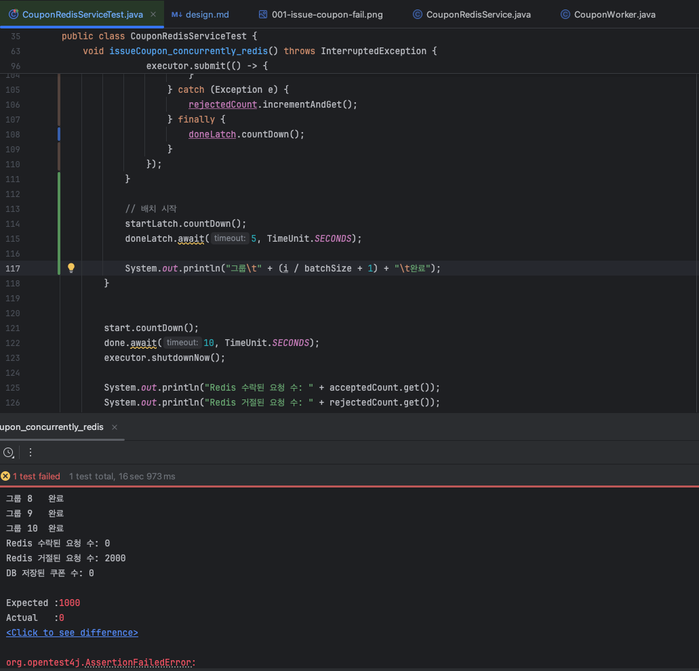
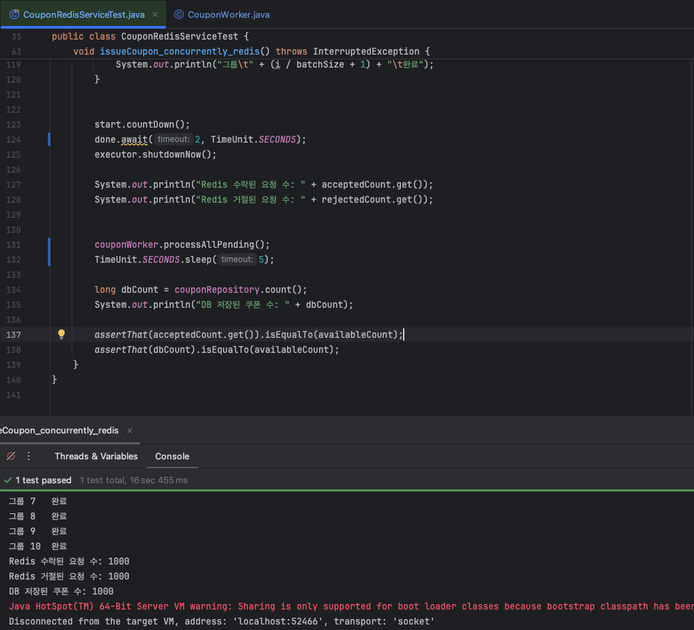
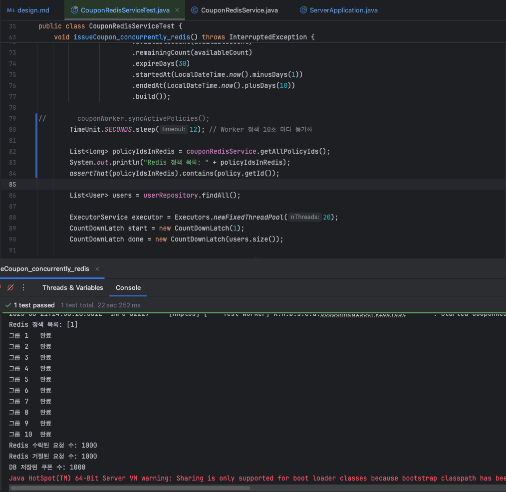
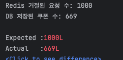
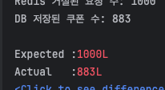

# E-commerce Asynchronous Design

> `Redis` 기반으로 비즈니스 로직 '선착순'이 보장되는 기능을 설계한다. 해당 설계를 기반으로 개발 및 구현한다.

## Redis 기반 선착순 쿠폰 발급 설계

### 문제 정의

- 기존에 조건부 업데이트 쿼리를 통해서 초과 발급은 방지하였으나, 선착순은 보장되지 않음
- 트래픽이 몰리는 상황에서 Redis를 활용한 분산환경 및 선착순 제어 로직 추가 필요

### 설계 목표

1. 선착순 보장: 초과된 요청에 대하여 즉시 차단
2. 비동기 확정: 쿠폰 엔티티를 생성하는 확정 로직은 큐/비동기 프로세스에서 수행
3. 장애 격리: Redis 장애 시 우아한 폴백(graceful fallback) 설계 - 학습

### Key & 자료구조

- 남은 수량 관리
  - key: `COUPON:POLICY:{policyId}:REMAINING`
  - 자료구조: `String` 에 최초 발급 수량 저장
    - `DECR`로 원자적 차감, 0 미만 시 마감 처리
  - `TTL`: `CouponPolicy.endedAt` 기준으로 `expire` 설정 → 이벤트 종료 시 자동 정리

- 선착순 관리
  - key: `COUPON:POLICY:{policyId}:PENDING`
  - 자료구조: `ZSET`(`userId`, `timestamp`)
    - Redis 선착순 통과 직후 사용자를 넣음
    - score: 요청 시간(ms + 랜덤숫자) 저장 → "누가 몇 번째로 도착했는지" 순서 관리 가능
      - `ms`까지 동일한 경우를 대비해서, `ms + 랜덤 숫자`를 지정해야할까? 어느정도 중복이 되나 
      - ms까지 동일한데, 1장 남았을 경우가 과연 많을까 고민하였지만, 설계는 중복되지 않는 것을 목표로 작성했습니다.
    - consumer가 DB 반영 후 ISSUED로 이동.
  - `TTL`
    - `CouponPolicy.endedAt` 이후 자동 삭제(기본)
    - `Worker`가 주기적(10초 미만)으로 `poll` → DB 반영 완료 후 `ISSUED`로 이동
    - (질문): PENDING에 있는 값도 쿠폰 정책 종료 일자로 만료를 지정하는 것과 워커 실행 주기보다만 길게 가져가는 것에 대해 고민했습니다.
      - 워커에서 100~1000개씩 처리를 한다고 하더라도, 

- 발급 확정
  - key: `COUPON:POLICY:{policyId}:ISSUED`
  - 자료구조: `SET`(`userId`)
    - DB 반영 완료된 사용자
    - 중복 요청 차단 및 발급 최종 이력 확인용
  - `TTL`: `CouponPolicy.endedAt` 기준으로 `expire` 설정

### 서비스 계층 개선

- 현재 구조에서의 쿠폰 발급 흐름 
  > CouponController → CouponFacade → CouponService → CouponPolicyRepository 
  - 쿠폰 발급 요청이 그대로 DB에 반영됨.
  - `CouponPolicyRepository`에서 남은 수량을 관리하며, 조건부 업데이트 쿼리로 초과 발급을 방지함
  - DB에 직접 부하가 발생하며, 선착순 보장이 안됨

- Redis를 적용한 쿠폰 발급 흐름
  > CouponController → CouponFacade → _**CouponRedisService**_ → (Redis)   
  > (Redis) → _**CouponWorker**_ → CouponService → CouponPolicyRepository
  - 남은수량(`String`), 선착순(`ZSET`) 을 `Redis`에서 원자적으로 제어.
  - 이후 `CouponWorker`에 의해 기존 `CouponService`를 호출하여 쿠폰 발급

- 설계 의도 
  - 선착순 보장과 DB의 직접적인 부하 방지를 목적으로 했습니다.
  - `Redis`의 수량 관리를 통해 사용자에겐 즉시 응답으로 발급 중 혹은 실패를 반환하고, 
  - 확정하는 로직은 `Worker`에 의해서 동작하도록 구성했습니다.

- 책임 계층 분리
  - 사실 `CouponService` 계층을 완전히 교체 하는 방향도 고민했는데,
  - `Worker`에 의해서 실행될 때 기존의 조건부 업데이트나, 트랜젝션을 그대로 가져갈 수 있을 것으로 보여,
  - `CouponRedisService`라는 계층으로 분산 제어의 책임을 분리하도록 구성했습니다.

### Redis가 적용된 쿠폰 발급 흐름

```mermaid
sequenceDiagram
  participant Controller
  participant Facade
  participant RedisService
  participant (Redis)
  participant Worker
  participant CouponService
  participant DB

  Controller->>Facade: 발급 처리 위임
  Facade->>RedisService: 발급 처리

  RedisService->>(Redis): 잔여 수량 차감(DECR)
  alt 수량 부족
    RedisService-->>Facade: 실패(마감)
    Facade-->>Controller: 응답 반환
  else 수량 있음
    RedisService->>(Redis): 대기열 추가(PENDING ZSET)
    RedisService-->>Facade: "발급 대기"
    Facade-->>Controller: 응답 반환
  end

  Worker->>(Redis): 대기열 확인(PENDING → POP)
  Worker->>CouponService: 쿠폰 발급 확정 처리
  CouponService->>DB: 쿠폰 엔티티 저장
  Worker->>(Redis): 발급완료 처리(ISSUED SET)

```

### Worker 설계

- 기존 발급 역할을 위임 받은 CouponFacade의 동작을 대신 처리함
- 10초 미만의 시간 단위로 동작
  - 너무 길어지면 사용자에게 장시간 발급되지 않은 상태를 노출
  - 테스트 코드로 발급 쿼리 시간을 확인하여 설정 → 
- 현재 유효한 CouponPolicy ID 목록을 조회함
- policyId 별로 redis에서 PEDING 상태의 선착순 목록을 batch 사이즈(500) 만큼 가져와서 
- CouponService.issueCoupon 으로 쿠폰 발급
- 성공 시 ZSET에서 제거, ISSUED SET에 기록(중복 발급 여부 정책에 따라)
- 배치가 끝나면 발급된 수량을 Redis에 갱신(임시 차감과 실제 DB 값 동기화)

## 통합 테스트

### 통합 테스트 목적

- 동시 다발적인 요청에도 Redis에 의해 남은 수량만큼만 `PENDING`에 포함되는 지 확인한다.
- 비동기 발급 확정 검증을 위해 Worker 실행 이후에 DB의 반영을 확인한다. 


### 조건

- [CouponRedisServiceTest.java](https://github.com/hanghae-plus-anveloper/e-commerce/blob/main/src/test/java/kr/hhplus/be/server/coupon/application/CouponRedisServiceTest.java)
- 1000개가 가용한 쿠폰에 대하여 사용자 요청은 2000개 수행
- 사용자 요청은 200개씩 10번 동시요청으로 수행(ms 값 중복 발생 테스트용)
  - 워커는 500개씩 처리시켜볼 예정이고, ms + 랜덤숫자는 3자리 숫자 001~999까지 부여할 예정입니다.

- 주요 코드

  ```java
  @Test
  @DisplayName("잔여수량이 1000개 쿠폰 정책에 대해 2000명이 동시에 발급 요청 시 Redis 응답 카운트와 DB 저장 결과를 검증한다")
  void issueCoupon_concurrently_redis() throws InterruptedException {
      /* ... */
  
      int batchSize = 200; // 200명씩 10번 나눠서 동시 요청
      for (int i = 0; i < users.size(); i += batchSize) {
          List<User> batch = users.subList(i, Math.min(i + batchSize, users.size()));
  
          CountDownLatch startLatch = new CountDownLatch(1);
          CountDownLatch doneLatch = new CountDownLatch(batch.size());
  
          for (User user : batch) {
              executor.submit(() -> {
                  try {
                      startLatch.await(); // 동시에 시작
                      boolean result = couponRedisService.tryIssue(user.getId(), policy.getId());
                      if (result) {
                          acceptedCount.incrementAndGet();
                      } else {
                          rejectedCount.incrementAndGet();
                      }
                  } catch (Exception e) {
                      rejectedCount.incrementAndGet();
                  } finally {
                      doneLatch.countDown();
                  }
              });
          }
  
          // 배치 시작
          startLatch.countDown();
          doneLatch.await(5, TimeUnit.SECONDS);
  
          System.out.println("그룹\t" + (i / batchSize + 1) + "\t완료");
      }
  
  
      start.countDown();
      done.await(10, TimeUnit.SECONDS);
      executor.shutdownNow();
  
      System.out.println("Redis 수락된 요청 수: " + acceptedCount.get());
      System.out.println("Redis 거절된 요청 수: " + rejectedCount.get());
  
      couponWorker.processPending(policy.getId());
      TimeUnit.SECONDS.sleep(1);
  
      long dbCount = couponRepository.count();
      System.out.println("DB 저장된 쿠폰 수: " + dbCount);
  
      assertThat(acceptedCount.get()).isEqualTo(availableCount);
      assertThat(dbCount).isEqualTo(availableCount);
  }
  ```

### 통합 테스트 실패 결과


- 동시요청 확인, 요청 결과 false 값 고정으로 컴파일만 되도록 구현


## Redis 기반 비동기 기능 구현

### 클래스 별 기는 상세

- [CouponRedisKey.java](https://github.com/hanghae-plus-anveloper/e-commerce/blob/main/src/main/java/kr/hhplus/be/server/coupon/application/CouponRedisKey.java)
  - Key를 일관성 있게 관리하기 위한 유틸리티 클래스
  - 쿠폰 정책별로 남은 수량(REMAINING), 대기열(PENDING), 발급 완료(ISSUED) 키를 생성
    ```java
    public class CouponRedisKey {
        public static String remainingKey(Long policyId) {
            return "COUPON:POLICY:" + policyId + ":REMAINING";
        }
        public static String pendingKey(Long policyId) {
            return "COUPON:POLICY:" + policyId + ":PENDING";
        }
        public static String issuedKey(Long policyId) {
            return "COUPON:POLICY:" + policyId + ":ISSUED";
        }
    }
    ```
    - `remainingKey(Long policyId)`
      - 해당 정책의 남은 수량을 관리하는 Key를 생성합니다.
      - Redis의 String 구조를 사용해 수량을 차감(DECR)할 때 사용됩니다.
    - `pendingKey(Long policyId)`
      - 해당 정책에서 발급 대기(PENDING) 사용자 목록을 저장하는 Key를 생성합니다.
      - Redis의 ZSET 구조를 활용해, score를 시간 기반(+ 랜덤숫자 세자리 000 ~ 999 연결)으로 지정하여 순서를 보장합니다.
    - `issuedKey(Long policyId)`
      - 최종적으로 발급 확정된 사용자를 관리하는 Key를 생성합니다.
      - Redis의 SET 구조를 사용하며, 중복 발급 차단과 이력 관리에 활용됩니다.


- [CouponRedisService.java](https://github.com/hanghae-plus-anveloper/e-commerce/blob/main/src/main/java/kr/hhplus/be/server/coupon/application/CouponRedisService.java)
  - 쿠폰 발급 요청이 Redis를 통해 처리될 수 있도록 지원하는 서비스 계층
    - 기존 `CouponFacade`에서의 요청을 처리하던 CouponService(DB) 대신에 발급 성공/실패 여부를 미리 반환합니다.   
  - 발급 요청을 Redis에 기록하고, Worker가 처리할 수 있도록 데이터를 관리하는 역할을 수행
- 전체 코드 
    ```java
    @Service
    @RequiredArgsConstructor
    public class CouponRedisService {
      
      private final StringRedisTemplate redisTemplate;
      
      public List<Long> getAllPolicyIds() {
        Set<String> keys = redisTemplate.keys("COUPON:POLICY:*:REMAINING");
        return keys.stream()
                .map(key -> key.split(":")[2])
                .map(Long::parseLong)
                .toList();
      }
      
      public void setRemainingCount(Long policyId, int remainingCount) {
        String remainingKey = CouponRedisKey.remainingKey(policyId);
        redisTemplate.opsForValue().set(remainingKey, String.valueOf(remainingCount));
      }
      
      public void removePolicy(Long policyId) {
        redisTemplate.delete(CouponRedisKey.remainingKey(policyId));
        redisTemplate.delete(CouponRedisKey.pendingKey(policyId));
        redisTemplate.delete(CouponRedisKey.issuedKey(policyId));
      }
      
      public List<Long> peekPending(Long policyId, int count) {
        String key = CouponRedisKey.pendingKey(policyId);
        Set<ZSetOperations.TypedTuple<String>> tuples =
                redisTemplate.opsForZSet().rangeWithScores(key, 0, count - 1);
      
        if (tuples == null) return List.of();
      
        return tuples.stream()
                .map(ZSetOperations.TypedTuple::getValue)
                .map(Long::valueOf)
                .collect(Collectors.toList());
      }
      
      public void removePending(Long policyId, List<Long> userIds) {
        if (userIds.isEmpty()) return;
        String key = CouponRedisKey.pendingKey(policyId);
        redisTemplate.opsForZSet()
                .remove(key, userIds.stream().map(String::valueOf).toArray());
      }
      
      public boolean tryIssue(Long userId, Long policyId) {
        String remainingKey = CouponRedisKey.remainingKey(policyId);
        String pendingKey = CouponRedisKey.pendingKey(policyId);
      
        Long remaining = redisTemplate.opsForValue().decrement(remainingKey);
        if (remaining == null || remaining < 0) {
          return false;
        }
      
        redisTemplate.opsForZSet().add(pendingKey, userId.toString(), getRandScore());
      
        return true;
      }
      
      private long getRandScore () {
        int rand = ThreadLocalRandom.current().nextInt(0, 1000);
        String randStr = String.format("%03d", rand); // "001" ~ "999"
        return  Long.parseLong(System.currentTimeMillis() + randStr);
      }
      
      public void clearAll() {
        redisTemplate.delete(redisTemplate.keys("COUPON:POLICY:*"));
      }
    }
    ```
    - `getAllPolicyIds()`
      - 현재 Redis에 등록된 모든 쿠폰 정책 ID 목록을 조회
      - Worker가 실행될 때, 어떤 정책을 처리해야 하는지 확인하는 용도로 사용됩니다.
    - `setRemainingCount(Long policyId, int remainingCount)`
      - 특정 정책의 남은 수량을 Redis에 초기화하거나 갱신
      - 이벤트 시작 시 `CouponPolicy` 엔티티의 수량을 Redis에 반영합니다.
      - 느슨한 요청 중에는 정해진 시간(10초) 마다 DB와 동기화 하는 역할도 수행합니다. 
    - `removePolicy(Long policyId)`
      - 정책 종료 시 관련된 모든 Redis Key(`REMAINING`, `PENDING`, `ISSUED`)를 삭제
      - 불필요한 Key를 정리하여 메모리 사용을 방지합니다.
    - `peekPending(Long policyId, int limit)`
      - PENDING ZSET에서 선착순으로 사용자 ID를 조회
      - `redisTemplate.opsForZSet().rangeWithScores()`을 사용하여 **정해진 수량(`limit`)** 만큼 순서대로 꺼냅니다.
      - Worker가 DB 반영을 위해 호출합니다.
    - `removePending(Long policyId, List<Long> userIds)`
      - 발급에 성공한 id만 `Redis`에서 제거 
    - `tryIssue(Long userId, Long policyId)`
      - 사용자가 쿠폰 발급을 시도할 때 호출되는 메서드입니다.
      - 먼저 `REMAINING` 키를 `DECR`하여 수량을 줄이고,
        - 남은 수량이 없으면 실패를 반환
        - 남은 수량이 있으면 `PENDING` ZSET에 사용자 ID와 score를 저장
      - 즉시 응답으로 성공/실패 여부를 반환할 수 있어 API의 응답 속도를 보장합니다.
    - `getRandScore()` (private)
      - PENDING ZSET에 저장될 score를 생성
      - `System.currentTimeMillis()`와 3자리 랜덤값을 조합하여 **밀리초 단위 요청 충돌을 방지**합니다.
    - `clearAll()`
      - 테스트나 초기화 시 모든 쿠폰 정책 관련 Redis Key를 정리합니다.

- [CouponWorker.java](https://github.com/hanghae-plus-anveloper/e-commerce/blob/main/src/main/java/kr/hhplus/be/server/coupon/application/CouponWorker.java)
  - Redis에 쌓인 대기열(PENDING) 을 주기적으로 처리하여 DB에 발급을 확정하는 역할을 수행
  - DB를 주기적으로 조회하여 현재 유효한 정책 목록으로 Redis의 정책-남은 수량을 업데이트
  - Redis를 주기적으로 조회하여 PENDING 상태의 쿠폰 발급 요청을 특정 수만큼 가져와 순차적으로 쿠폰 발급
    - 쿠폰 발급 시 issueCoupon(User, PolicyId)에서 issueCoupon(UserId, PolicyId) 로 발급 할 수 있도록 JPA 일부 수정 
  - 전체 코드
    ```java
    @Component
    @RequiredArgsConstructor
    public class CouponWorker {
    
      private final CouponService couponService;
      private final CouponRedisService couponRedisService;
    
      @Scheduled(fixedDelay = 10_000) // 10초마다 실행
      public void syncActivePolicies() {
        List<CouponPolicy> activePolicies = couponService.getActivePolicies();
    
        // 현재 DB에 유효한 정책 ID
        List<Long> activePolicyIds = activePolicies.stream()
                .map(CouponPolicy::getId)
                .toList();
    
        // redis 에 존재하는 정책 ID
        List<Long> redisPolicyIds = couponRedisService.getAllPolicyIds();
    
        // redis 에만 존재하는 정책 제거
        for (Long redisPolicyId : redisPolicyIds) {
          if (!activePolicyIds.contains(redisPolicyId)) {
            couponRedisService.removePolicy(redisPolicyId);
          }
        }
    
        // 유효한 정책은 Redis에 반영  + 남은 수량 포함
        for (CouponPolicy policy : activePolicies) {
          couponRedisService.setRemainingCount(policy.getId(), policy.getRemainingCount());
        }
      }
    
      @Scheduled(fixedDelay = 1000) // 1초마다 실행
      public void processAllPending() {
        List<Long> policyIds = couponRedisService.getAllPolicyIds();
    
        for (Long policyId : policyIds) {
          while (true) {
            List<Long> userIds = couponRedisService.peekPending(policyId, 500);
    
            if (userIds.isEmpty()) break;
    
            List<Long> succeeded = new ArrayList<>();
    
            for (Long userId : userIds) {
              try {
                couponService.issueCoupon(userId, policyId);
                succeeded.add(userId);
              } catch (Exception ignored) {
              }
            }
    
            couponRedisService.removePending(policyId, succeeded);
          }
        }
      }
    }
    ```
    - `syncActivePolicies()`
      - DB에서 현재 유효한 정책을 조회 후 Redis와 동기화
        - DB에는 유효하지 않고, `Redis`에만 남아있는 정책을 제거
        - 남은 수량(`remainingCount`)을 `Redis`에 다시 세팅하여 DB 값과 `Redis` 값의 차이를 보정
    - `processAllPending()`
      - `Redis PENDING ZSET`에서 사용자 ID를 `batch(500)` 단위로 가져와 처리
      - 각 사용자에 대해 `CouponService.issueCoupon`을 호출하여 DB에 발급 확정
      - 처리된 요청은 `ZSET`에서 제거

- [CouponService.java](https://github.com/hanghae-plus-anveloper/e-commerce/blob/main/src/main/java/kr/hhplus/be/server/coupon/application/CouponService.java) 기능 추가/변경
  ```java
  @Transactional(readOnly = true)
  public List<CouponPolicy> getActivePolicies() {
      return couponPolicyRepository.findAll()
              .stream()
              .filter(CouponPolicy::isWithinPeriod)
              .toList();
  }
  @Transactional
  public Coupon issueCoupon(Long userId, Long policyId) {
    /* ... */
  }
  ```
  - DB에서 유효한 정책 조회 함수 추가 
  - issueCoupon 호출 시 User → UserId로 변경 
  
- [Coupon.java](https://github.com/hanghae-plus-anveloper/e-commerce/blob/main/src/main/java/kr/hhplus/be/server/coupon/domain/Coupon.java) 변경
  - JPA 매핑 방식 변경
    - Redis 에서 userId와 policyId 만으로 조회하기 용이하도록, 연관관계 매핑에서 FK 식별자로 직접 매핑으로 리팩토링
  - 변경전
    ```java
      @ManyToOne(fetch = FetchType.LAZY, optional = false)
      @JoinColumn(name = "user_id", nullable = false)
      private User user;
    ```
  - 변경후
    ```java
      @Column(name = "user_id", nullable = false)
      private Long userId;

      @ManyToOne(fetch = FetchType.LAZY) 
      @JoinColumn(name = "user_id", insertable = false, updatable = false)
      private User user;
    ```
  - 관련된 테스트 build 코드 모두 수정완료

### 구현 후 테스트 성공 결과 1



- 2000개의 요청 중 1000개만 성공, 1000개는 바로 거절로 반환완료됨
- 이후 워커의 배치에 의해 DB에 1000개 반영이 완료되는 것 확인 완료
- 다만 해당 테스트 결과는 Worker의 syncActivePolicies, processAllPending 를 직접 호출함

### @EnableScheduling 추가 및 테스트 코드 수정

- 수정된 테스트 코드
  ```java
  
      @Test
      @DisplayName("잔여수량이 1000개 쿠폰 정책에 대해 2000명이 동시에 발급 요청 시 Redis 응답 카운트와 DB 저장 결과를 검증한다")
      void issueCoupon_concurrently_redis() throws InterruptedException {
          /* ... */
        
          // couponWorker.syncActivePolicies();
          TimeUnit.SECONDS.sleep(12); // Worker 정책 10초 마다 동기화
        
          List<Long> policyIdsInRedis = couponRedisService.getAllPolicyIds();
          System.out.println("Redis 정책 목록: " + policyIdsInRedis);
          assertThat(policyIdsInRedis).contains(policy.getId());
          
          
          /* ... */
  
          // couponWorker.processAllPending();
          TimeUnit.SECONDS.sleep(3); // Worker process(limit 500) 1초 마다, 1000건 2초 이상.
        
          /* ... */
      }
  ```
  - `ServerApplication`에 `@EnableScheduling` 추가
  - 테스트 코드 중 `Worker`에 등록된 시간만큼 대기
  - `syncActivePolicies` 수동 요청없이 정책이 `Redis`에 들어있는 지 확인
  - `processAllPending` 수동 요청없이 `Batch`로 인해 DB에 반영되는 지 확인

### 테스트 코드 수정 후 성공 결과



- 12초 대기(Worker가 10초 마다 실행) 후 정책 목록 조회 결과 1번 정책 확인 완료
- 2000건의 요청에 대하여 1000건만큼만 수락되는 것 확인 완료
- 요청이 모두 완료된 후 3초 대기(Worker가 1초마다 실행) 후 DB 저장 확인 완료
  - 1초만 대기 시 1000건 미만으로 확인되어 테스트 실패
  - 
  - 


## 추후계획

- 현재는 Redis에 의한 승인/거절과 비동기적 DB 확정만 구현되어있고, 설계서에 작성했던 중복 예외처리를 위한 ISSUED는 아직 미구현 상태입니다.
- 쿠폰 정책중에 중복이 허용되는 경우(예: 1000월 할인권 5매 증정)와 같은 비즈니스 정책에 따라 분기되어야 할것 같다는 생각이 들었습니다.

## 회고

- 기능들에 대한 정의는 빠르게 내릴 수 있는데, 그 기능을 어떤 계층에 넣을 지 아직 제 자신의 기준이 덜 확립된 것 같습니다.
- 쿠폰 선착순 기능에 Redis를 추가하면서 Service 계층을 그대로 사용하기 위한 구성을 짜봤는데, 적절한 구성인 지 모르겠습니다.
  - 기존: Controller → Facade → Service → Repository 
  - 수정: Controller → Facade → RedisService → (Redis) ← Worker → Service(기존) → Repository


