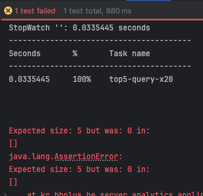
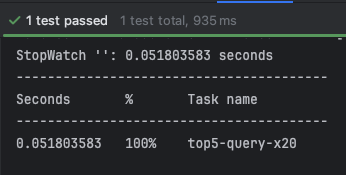
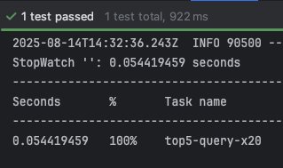
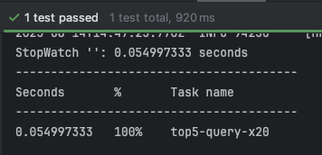
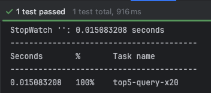
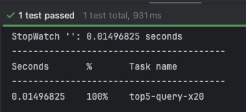
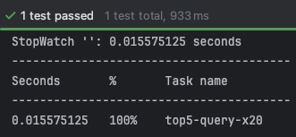

# E-commerce 캐싱 전략 - Redis 

## STEP12 점검항목

- [캐시가 필요한 부분 분석](#캐시가-필요한-부분-분석)
- [redis 기반의 캐시 적용](#redis-기반-캐시-적용)
- [성능 개선 등을 포함한 보고서 제출](#캐싱-테스트-수행-결과-비교)


## 캐시가 필요한 부분 분석

### 조건

- 동일한 파라미터로 반복적인 조회가 발생하는 경우
- 쿼리 연산의 비용의 큰 경우
- 변경 빈도가 낮아 특정 시간동안 같은 정보를 제공해도 값이 유효한 경우

### 피해야 할 조건

- 명확한 캐싱 키가 없는 경우
- 쿼리 연산의 비용이 작아 캐싱의 이득이 적은 경우
- 실시간 데이터처럼, 일관성이 중요한 경우
- 쓰기 빈도가 높아 변경이 자주 발생하는 경우

### 캐싱 대상 서비스 판단

- 조회와 관련된 서비스 기능
  - 잔액 조회 API 
    - 사용자 별 조회를 하더라도, 충전이나 사용이 빈번함
    - 일관성이 중요한 기능으로 **캐싱 불필요 판단**
  - 상품 조회 API
    - 상품 읽기에 대한 접근은 매우 빈번하고, 상품 메타 데이터의 경우 변경이 적음(재고 제외)
    - 재고값의 경우 수정이 빈번함.
    - 현재 상품 테이블은 재고 테이블이 분리되어있지 않고, 조회 쿼리 비용이 높지 않음.
      - ID, 이름, 가격, 재고 
    - 따라서, 현재는 **캐싱 불필요 판단**
  - 상위 상품 조회 API ← 캐싱 구현
    - 상품 별, 일자 별, 주문 수량 관련하여 쿼리 연산이 복잡함
    - 연산을 해야하는 주문 테이블의 경우, 당일을 포함하면 주문량에 따라 변경되는 정보이지만,
    - -1 ~ -3일을 기준으로 캐싱 하는 경우 하루 단위의 캐싱이 가능
    - **캐싱 이점이 가장 큼**

## Redis 기반 캐시 적용

### 통합 테스트 코드 및 Top Products 조회 계층 배치

- [TopProductQueryServiceTest.java](https://github.com/hanghae-plus-anveloper/e-commerce/blob/develop/src/test/java/kr/hhplus/be/server/analytics/application/TopProductQueryServiceTest.java)
  - 테스트 흐름
    - 더미 상품을 6가지 생성 후 3일 치 주문 아이템 생성 저장
      - 1번부터 6번까지 총 수량이 적어지는 방향으로 3일에 각각 나눠서 생성
    - **웜업 1회 수행** 후 20회 조회하여 요청 시간을 측정
    - 반환된 결과 순위가 설정한 순위와 같은 지 확인
    - 5개만 가져왔는 지 확인
 
      ```java
      @DisplayName("최근 3일(어제 ~ 그저께) Top5 상품을 Native Repository를 통해 조회한다")
      @Test
      void top5InLast3Days() {
          queryService.top5InLast3Days(); // 1회 수행
      
          // 쿼리 수행 20회 기록
          StopWatch sw = new StopWatch();
          sw.start("top5-query-x20");
          List<TopProductView> result = new ArrayList<>();
          for (int i = 0; i < 20; i++) {
              result = queryService.top5InLast3Days();
          }
          sw.stop();
          System.out.println(sw.prettyPrint());
      
          // 순위 검증
          assertThat(result).hasSize(5);
          assertThat(result.get(0).soldQty()).isGreaterThanOrEqualTo(result.get(1).soldQty());
          assertThat(result.get(1).soldQty()).isGreaterThanOrEqualTo(result.get(2).soldQty());
          assertThat(result.get(2).soldQty()).isGreaterThanOrEqualTo(result.get(3).soldQty());
          assertThat(result.get(3).soldQty()).isGreaterThanOrEqualTo(result.get(4).soldQty());
      
          List<Long> ids = result.stream().map(TopProductView::productId).toList();
          assertThat(ids).containsExactlyInAnyOrderElementsOf(
                  productRepository.findAll().stream()
                          .filter(p -> List.of("p1", "p2", "p3", "p4", "p5").contains(p.getName()))
                          .map(Product::getId)
                          .toList()
          );
      }
      ```
  
  - `seedOrderItems`함수: 상품과 총량을 역으로 3일에 나눠서 주문 아이템 생성
  - `persistItems` 함수: 상품, 수량, 생성 일자(`orderedDate`), 생성 시간(`orderedAt`)으로 1일치 주문 아이템을 횟수만큼 생성

- 조회용 도메인 분리 `analytics`
  - 엔드포인트가 /products/top 이지만, 실제 사용하는 정보는 OrderItem을 사용함.
  - OrderFacade나 ProductService에 넣지 않고, 별도로 분리.
  - 최초 `Product` 도메인에 있었던 `ProductStatistics`를 제거하고, 상위 판매 상품 조회용 도메인을 분리함.
  - `JPA repository`가 아닌 `Native repository`로 조회용 쿼리만 수행.

- 레이어 배치만 수행한 후 테스트 코드 컴파일만 통과하도록 임시 함수로 구현함(빈 배열 반환)
  -  

### 상품 조회 로직 구현

- [TopProductNativeRepository.java](https://github.com/hanghae-plus-anveloper/e-commerce/blob/develop/src/main/java/kr/hhplus/be/server/analytics/domain/TopProductNativeRepository.java)
  - 시작일자, 종료일자, 획득할 상품수를 받아 상위 상품 목록을 반환하는 함수 구현
   
    
    
    
 
    - 테스트 수행 결과 
      - 0.051 ~ 0.055 초 측정됨

### Cache 환경 설정

- [RadissonCacheConfig.java](https://github.com/hanghae-plus-anveloper/e-commerce/blob/develop/src/main/java/kr/hhplus/be/server/config/redis/RadissonCacheConfig.java)
  - cacheManager 를 Bean으로 등록하여 cacheName 별 TTL 설정
  - CacheNames.TOP_PRODUCTS는 자정을 기준으로 초기화 하기 위해, 캐시된 시간으로부터 자정 + 지터값을 적용하여 TTL에 설정, maxIdleTime은 0으로 비활성(자정까지 유지)
- [CacheNames.java](https://github.com/hanghae-plus-anveloper/e-commerce/blob/develop/src/main/java/kr/hhplus/be/server/common/cache/CacheNames.java): cacheName 상수
- [CacheKey.java](https://github.com/hanghae-plus-anveloper/e-commerce/blob/develop/src/main/java/kr/hhplus/be/server/common/cache/CacheKey.java)
  - 캐시 키 ENUM 값
  - "CACHE:TOP_PRODUCTS", "CACHE:PRODUCT", "CACHE:BALANCE"처럼 고정된 Prefix를 Enum 상수로 정의.
  - key(Object... parts) 메서드로 prefix 뒤에 여러 파라미터를 붙여 최종 캐시 키 문자열 생성.
  - CacheKey.TOP_PRODUCTS.key("LAST_N_DAYS", 3, "TOP", 5) → "CACHE:TOP_PRODUCTS:LAST_N_DAYS:3:TOP:5"

### 캐싱 구현

- [TopProductQueryService.java](https://github.com/hanghae-plus-anveloper/e-commerce/blob/develop/src/main/java/kr/hhplus/be/server/analytics/application/TopProductQueryService.java)
  - `@CacheConfig(cacheNames = CacheNames.TOP_PRODUCTS)` 클래스 레벨 지정하여, 각 함수에서 생략
  - 기본 기능 `top5InLast3Days` 는 확장 가능한 `topNLastNDays`함수를 호출하되, 클래스 내부에서 호출하므로, 각각 `@Cacheable`을 적용
  - `top5InLast3Days`는 3일 5개로 고정된 키 발행, `topNLastNDays`는 파라미터에 의해 발행
  - `@EnableCaching` 으로 캐싱 활성화, `Bean`으로 등록된 `RedissonCacheConfig` > `cacheManager` 로 TTL 적용  
  
    ```java
    @Service
    @RequiredArgsConstructor
    @Transactional(readOnly = true)
    @CacheConfig(cacheNames = CacheNames.TOP_PRODUCTS)
    public class TopProductQueryService {
    
        private final TopProductNativeRepository repository;    
    
        @Cacheable(
            key = "T(kr.hhplus.be.server.common.cache.CacheKey).TOP_PRODUCTS"
                    + ".key('LAST_N_DAYS', 3, 'TOP', 5)",
            sync = true
        )
        public List<TopProductView> top5InLast3Days() {
            return topNLastNDays(3, 5);
        }
    
        @Cacheable(
            key = "T(kr.hhplus.be.server.common.cache.CacheKey).TOP_PRODUCTS"
                    + ".key('LAST_N_DAYS', #days, 'TOP', #limit)",
            sync = true
        )
        public List<TopProductView> topNLastNDays(int days, int limit) {
            if (days <= 0) throw new IllegalArgumentException("days 는 1 이상이어야 합니다.");
            if (limit <= 0) throw new IllegalArgumentException("limit 는 1 이상이어야 합니다.");
    
            LocalDate today = LocalDate.now(); // 오늘을 제외하고,
            LocalDate from = today.minusDays(days);
            LocalDate to = today.minusDays(1);
            return repository.findTopSoldBetween(from, to, limit);
        }
    }
    ```

    
    
    

    - 테스트 수행 결과
      - 0.014 ~ 0.015 초 측정됨
      - 테스트 코드 상에 1회 웜업 진행 후 20회를 측정함


## 캐싱 테스트 수행 결과 비교

### 캐싱 전
 

 
### 캐싱 후
 


### 결과
  - 20회 시행 결과 **평균 0.054초**에서 **평균 0.015초**로 개선됨(**약 70% 개선**)
  - 호출 시행 횟수가 많아질수록 절감 폭이 누적되어 더 큰 향상이 기대됨
