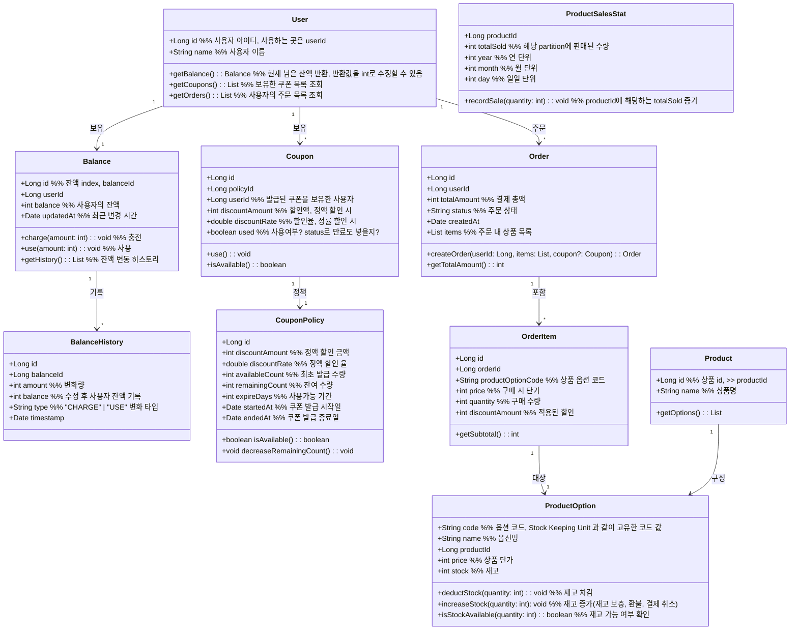

1. Class Diagram

- `User`, `Balance`, `Coupon`, `Order`, `Product` 관련 객체 중심 클래스 다이어그램 작성

```mermaid
classDiagram
    class User {
        +Long   id   %% 사용자 아이디, 사용하는 곳은 userId
        +String name %% 사용자 이름

        +getBalance(): Balance      %% 현재 남은 잔액 반환, 반환값을 int로 수정할 수 있음
        +getCoupons(): List<Coupon> %% 보유한 쿠폰 목록 조회
        +getOrders(): List<Order>   %% 사용자의 주문 목록 조회
    }

    class Balance {
        +Long id        %% 잔액 index, balanceId
        +Long userId
        +int  balance   %% 사용자의 잔액
        +Date updatedAt %% 최근 변경 시간

        +charge(amount: int): void          %% 충전
        +use(amount: int): void             %% 사용
        +getHistory(): List<BalanceHistory> %% 잔액 변동 히스토리
    }

    class BalanceHistory {
        +Long   id
        +Long   balanceId
        +int    amount    %% 변화량
        +int    balance   %% 수정 후 사용자 잔액 기록
        +String type      %% "CHARGE" | "USE" 변화 타입
        +Date   timestamp
    }
    %% userId로 조회 최적화를 고려해야하는 지?
    %% >> history는 여러 Join을 고려하지 않아도 될 것으로 판단됨.
    %% 사용자당 잔액 1:1

    class CouponPolicy {
        +Long   id
        +int    discountAmount %% 정액 할인 금액
        +double discountRate   %% 정액 할인 율
        +int    availableCount %% 최초 발급 수량
        +int    remainingCount %% 잔여 수량
        +int    expireDays     %% 사용가능 기간
        +Date   startedAt      %% 쿠폰 발급 시작일
        +Date   endedAt        %% 쿠폰 발급 종료일

        +boolean isAvailable(): boolean
        +void decreaseRemainingCount(): void
    }

    class Coupon {
        +Long    id
        +Long    policyId
        +Long    userId         %% 발급된 쿠폰을 보유한 사용자
        +int     discountAmount %% 할인액, 정액 할인 시
        +double  discountRate   %% 할인율, 정률 할인 시
        +boolean used           %% 사용여부? status로 만료도 넣을지?

        +use(): void
        +isAvailable(): boolean
    }


    class Order {
        +Long            id
        +Long            userId
        +int             totalAmount %% 결제 총액
        +String          status      %% 주문 상태
        +Date            createdAt
        +List<OrderItem> items       %% 주문 내 상품 목록

        +createOrder(userId: Long, items: List<OrderItem>, coupon?: Coupon): Order
        +getTotalAmount(): int
    }

    class OrderItem {
        +Long   id
        +Long   orderId
        +String productOptionCode %% 상품 옵션 코드
        +int    price             %% 구매 시 단가
        +int    quantity          %% 구매 수량
        +int    discountAmount    %% 적용된 할인

        +getSubtotal(): int
    }

    class Product {
        +Long   id   %% 상품 id, >> productId
        +String name %% 상품명

        +getOptions(): List<ProductOption>
    }

    class ProductOption {
        +String code      %% 옵션 코드, Stock Keeping Unit 과 같이 고유한 코드 값
        +String name      %% 옵션명
        +Long   productId
        +int    price     %% 상품 단가
        +int    stock     %% 재고

        +deductStock(quantity: int): void            %% 재고 차감
        +increaseStock(quantity: int): void          %% 재고 증가(재고 보충, 환불, 결제 취소)
        +isStockAvailable(quantity: int): boolean    %% 재고 가능 여부 확인
    }

    %% 상품 판매 통계
    %% 최소 단위를 일일(혹은 시간대)로 구분해서 기록
    class ProductSalesStat {
        +Long   productId
        +int    totalSold %% 해당 partition에 판매된 수량
        +int    year      %% 연 단위
        +int    month     %% 월 단위
        +int    day       %% 일일 단위
        %% +int   hour      %% 시간대별 판매 통계 추이
        %% +int   weekday   %% 요일별 판매 통계 추이

        +recordSale(quantity: int): void %% productId에 해당하는 totalSold 증가
    }
    %% 쿼리로 전환 할 것인지? 아니면 캐싱 역할로라도 남길 것인 지?
    %% >> 2주차 과제로는 쿼리 사용

    User "1" --> "1" Balance : 보유
    Balance "1" --> "*" BalanceHistory : 기록
    User "1" --> "*" Coupon : 보유
    User "1" --> "*" Order : 주문
    Order "1" --> "*" OrderItem : 포함
    OrderItem "1" --> "1" ProductOption : 대상
    Product "1" --> "*" ProductOption : 구성
    Coupon "1" --> "1" CouponPolicy : 정책

```
