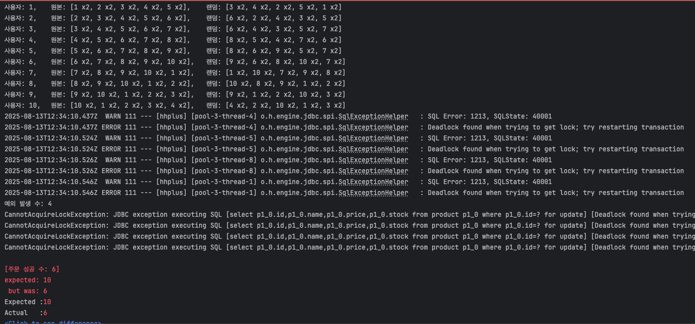
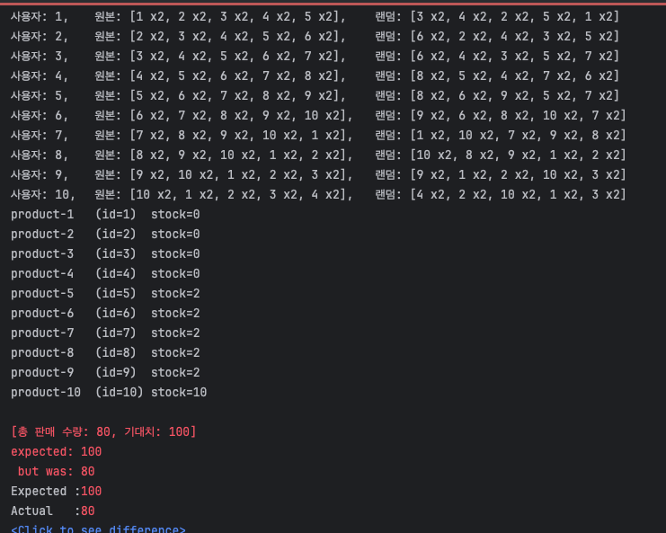
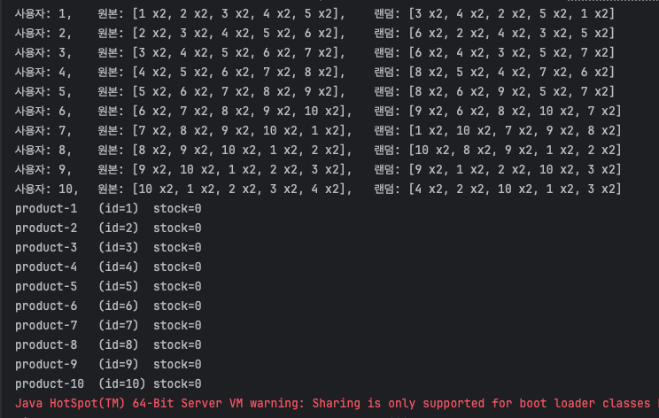
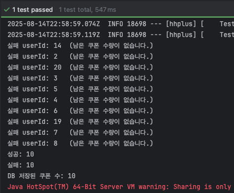

# E-commerce 동시성 문제 - 분산락, Redis

## STEP11 점검항목

- [기능별 통합 테스트](#orderfacadeconcurrencytest-통합-테스트-목적)
- [Redis 분산락 적용](#redis-및-분산락-적용)
- [Test Container 구성](#testcontainer-세팅)

## `OrderFacadeConcurrencyTest` 통합 테스트 목적

- 사용자 및 상품의 갯수가 충분할 때, 모든 주문이 정상적으로 성공해야 한다.
- [OrderFacadeConcurrencyTest.java](https://github.com/hanghae-plus-anveloper/hhplus-e-commerce-java/blob/develop/src/test/java/kr/hhplus/be/server/order/facade/OrderFacadeConcurrencyTest.java)

### 조건

- 상품 10개, 각 재고 10개, 총 100개의 충분한 상품을 설정한다.
- 사용자 10명, 주문 1건 당 상품 5가지를 골라, 각각 2개씩 구매한다. 
  - 총 10 * 5 * 2 = 100개로 재고와 딱 맞아 떨어지는 주문을 동시에 수행한다.
  - 사용자 별 초과되지 않게 상품 5개를 고르는 로직
    ```java
    @Test
    @DisplayName("재고가 10인 10개의 상품을 10명이서 5종류 씩 순서에 상관없이 2개씩 구매할때, 10개의 상품이 모두 정상적으로 판매된다.")
    void placeOrders_concurrently() throws InterruptedException {
        /* ... */
    
        Map<Long, List<OrderItemCommand>> carts = new LinkedHashMap<>();
        for (int u = 0; u < userCount; u++) {
            Long userId = users.get(u).getId();


            List<OrderItemCommand> original = new ArrayList<>();
            for (int k = 0; k < picksPerUser; k++) {
                int pIndex = (u + k) % productCount; // id 기준으로 1개씩 밀어서 장바구니 담기
                Long productId = products.get(pIndex).getId();
                original.add(new OrderItemCommand(productId, qtyPerPick));
            }

            List<OrderItemCommand> shuffled = new ArrayList<>(original);
            Collections.shuffle(shuffled, new Random(userId)); // 랜덤으로 셔플

            System.out.printf("사용자: %d,\t원본: [%s],\t랜덤: [%s]%n", userId, formatCart(original), formatCart(shuffled));

            carts.put(userId, shuffled);
        }
    
        /* ... */
    }
    ```
- 주문 시 상품의 순서는 무작위로 담는다.
- 쿠폰과 잔액으로 인한 실패는 배제한다.

### 테스트 결과

#### 1. 상품 정렬 미실시 - 실패(데드락)

- 주문 시 상품을 랜덤 순서로 담아서 요청하고, `OrderFacade` 에서 그대로 처리
- 이미 이전 주에 `sorted`로 `productId` 기준 정렬을 하는 코드가 있어, 주석 후 실행



- 이전 주에 비관적 락을 구현하긴 했으나, 에러는 데드락으로 인하여 요청일부가 실패하는 코드가 발생함
- 이외에 간헐적으로 테스트가 통과되어도 재고를 모두 소진하지 못함

#### 2. 상품 정렬 실시 - 실패(재고 미소진)

- `OrderFacade`에서 `productId`로 `sorted` 수행(주석 해제)
  ```java
    @Transactional
    public Order placeOrder(Long userId, List<OrderItemCommand> orderItems, Long couponId) {
        User user = userService.findById(userId);

        List<OrderItem> items = orderItems.stream()
                .sorted(Comparator.comparing(OrderItemCommand::getProductId)) // 상품 순서 정렬
                .map(command -> {
                    Product product = productService.verifyAndDecreaseStock(command.getProductId(), command.getQuantity());
                    return OrderItem.of(product, product.getPrice(), command.getQuantity(), 0);
                })
                .toList();
    }
  ```



- 순서에 의한 데드락은 발생하지 않는 것으로 확인
- 하지만, 여전히 재고 차감은 기대치 만큼 발생하지 않음
- 경쟁 조건이 발생하여 재고 업데이트가 누락되는 것으로 추정

## Redis 및 분산락 적용

### 분산락 커스텀 어노테이션 구현

- [DistributedLock.java](https://github.com/hanghae-plus-anveloper/hhplus-e-commerce-java/blob/develop/src/main/java/kr/hhplus/be/server/common/lock/DistributedLock.java): 분산락 적용을 위한 커스텀 어노테이션
  - `prefix`: 도메인 별 `lock`을 획득하기 위한 `key` ([LockKey.java](https://github.com/hanghae-plus-anveloper/hhplus-e-commerce-java/blob/develop/src/main/java/kr/hhplus/be/server/common/lock/LockKey.java))
  - `ids`: 멀티 키를 위한 `id`배열, 주로 `PK`를 사용
- [DistributedLockAspect.java](https://github.com/hanghae-plus-anveloper/hhplus-e-commerce-java/blob/develop/src/main/java/kr/hhplus/be/server/common/lock/DistributedLockAspect.java): 커스텀 어노테이션 기반 AOP 구현 클래스 
  - `@Order(Ordered.HIGHEST_PRECEDENCE)`: **최우선 순위 보장**
    -  기본 `@Transactional`은 `LOWEST_PRECEDENCE`로 등록됨
  - `lock`함수: @DistributedLock 어노테이션이 붙은 메서드를 실행하기 전 후로, 분산락 처리
    - `prefix`와 `ids`를 기반으로 멀티 키를 획득, 문자열 사전 순 정렬
      ```java
        List<String> lockKeys = toKeys(prefixStr, idsVal).stream().sorted().toList(); // 키 목록 생성, 정렬
      ```
    - **정렬 기반 순차 락(Sequential Sorted Locking)**
      - 정렬된 키를 기준으로 for 문으로 모든 키를 획득
      - 중간에 획득하지 못하면 에러를 발생시키도록 구현
      ```java
      @Around("@annotation(kr.hhplus.be.server.common.lock.DistributedLock)")
      public Object lock(ProceedingJoinPoint joinPoint)  throws Throwable {
        /* ... */
      
        List<RLock> acquiredLocks = new ArrayList<>();

        try {
            for (String key : lockKeys) {
                RLock lock = redissonClient.getLock(key); // 정렬된 순서대로 락획득
                boolean locked = lock.tryLock(
                        distributedLock.waitTimeoutMillis(),
                        distributedLock.ttlMillis(),
                        TimeUnit.MILLISECONDS
                );
                if (!locked) {
                    for (RLock l : acquiredLocks) {
                        try { l.unlock(); } catch (Exception ignore) {}
                    }
                    throw new IllegalStateException("Failed to acquire lock: " + key);
                }
                acquiredLocks.add(lock);
            }

            return joinPoint.proceed(); // 비즈니스 로직 실행
        } finally {
            Collections.reverse(acquiredLocks);
            for (RLock l : acquiredLocks) {
                try { l.unlock(); } catch (IllegalMonitorStateException e) {
                    log.info("Lock already unlocked: {}", l.getName());
                }
            }
        }
      }
      ```
      - 데드락 문제는 회피가 가능하나 원자성이 보장되지 않음
    
    - **멀티락(RedissonMultiLock)**
      - 여러 RLock을 묶어서 하나의 락처럼 취급함
      - 내부적으로 모든 키에 대해 tryLock을 수행하고 전부 성공해야만 획득 완료
      ```java
      @Around("@annotation(kr.hhplus.be.server.common.lock.DistributedLock)")
      public Object lock(ProceedingJoinPoint joinPoint)  throws Throwable {
        /* ... */
      
        RedissonMultiLock multiLock = new RedissonMultiLock(lockList.toArray(new RLock[0]));

        try {
            boolean locked = multiLock.tryLock(
                    distributedLock.waitTimeoutMillis(),
                    distributedLock.ttlMillis(),
                    TimeUnit.MILLISECONDS
            );
            if (!locked) {
                throw new IllegalStateException("Failed to acquire multi lock: " + lockKeys);
            }
            return joinPoint.proceed();
        } finally {
            try {
                multiLock.unlock();
            } catch (IllegalMonitorStateException e) {
                log.info("MultiLock already unlocked: keys={}", lockKeys);
            }
        }
      }
      ``` 
      - 순차락과 달리 멀티키로 단일 대기 수행
      - 순차락에 비해 성능 및 오버헤드가 락 개수 및 경합도에 비례하여 커짐
   
  - `toKeys`함수: `DistributedLock.ids()` 값(단일값, 배열, Iterable)을 모두 `List<String>` 락 키 목록으로 변환

### 분산락 적용

- [OrderFacade.java](https://github.com/hanghae-plus-anveloper/hhplus-e-commerce-java/blob/develop/src/main/java/kr/hhplus/be/server/order/facade/OrderFacade.java): 커스컴 AOP 적용
  - `OrderFacade`에서 사용되는 `Product, Coupon, Balance, Order` 중 다른 사용자와 경합이 많이 발생하는 `Product`로 분산락 적용함
  - `Coupon, Balance, Order` 기존 DB락으로 유지
  - 로직 변경없이 `@DistributedLock` 적용 
  - `@Order(Ordered.HIGHEST_PRECEDENCE)`로 구현되어 있어 `@Transactional`보다 먼저 진입, 나중에 해제됨
    ```java
    @Component
    @RequiredArgsConstructor
    public class OrderFacade {
        /* ... */
    
        @Transactional
        @DistributedLock(prefix = LockKey.PRODUCT, ids = "#orderItems.![productId]")
        public Order placeOrder(Long userId, List<OrderItemCommand> orderItems, Long couponId) {
            /* ... */
    
            List<OrderItem> items = orderItems.stream()
                .sorted(Comparator.comparing(OrderItemCommand::getProductId)) // 상품 순서 정렬
                .map(command -> {
                    Product product = productService.verifyAndDecreaseStock(command.getProductId(), command.getQuantity());
                    return OrderItem.of(product, product.getPrice(), command.getQuantity(), 0);
                })
                .toList();
    
            /* ... */    
        }
    }
    ```

### 조건부 업데이트 쿼리 수정

- [ProductRepository.java](https://github.com/hanghae-plus-anveloper/hhplus-e-commerce-java/blob/develop/src/main/java/kr/hhplus/be/server/product/domain/ProductRepository.java): 조건부 업데이트 쿼리
  - 비관적 락에서 조건부 업데이트 쿼리로 수정
  - 분산락에서 `productId` 단위로 직렬화를 보장하기 때문에, DB 업데이트 시 원자적 차감만을 이용하여 성능적 이점을 확보함
    ```java
    
    public interface ProductRepository extends JpaRepository<Product, Long> {
        /* 코드는 남아 있으나 미사용 */
    
        @Query(""" 
                UPDATE Product p 
                   SET p.stock = p.stock - :qty 
                 WHERE p.id = :id AND p.stock >= :qty
        """)
        @Modifying
        int decreaseStockIfAvailable(@Param("id") Long id, @Param("qty") int qty);
    }
    ```
- [ProductService.java](https://github.com/hanghae-plus-anveloper/hhplus-e-commerce-java/blob/develop/src/main/java/kr/hhplus/be/server/product/application/ProductService.java)
  - `verifyAndDecreaseStock` 내부 로직 변경
    ```java
    @Service
    @RequiredArgsConstructor
    public class ProductService {
        /* ... */
        
        @Transactional
        public Product verifyAndDecreaseStock(Long productId, int requiredQuantity) {
            int updatedRows = productRepository.decreaseStockIfAvailable(productId, requiredQuantity);
    
            if (updatedRows == 0) {
                throw new IllegalStateException("상품 재고가 부족하거나 상품을 찾을 수 없습니다.");
            }
            return productRepository.findById(productId)
                    .orElseThrow(() -> new ProductNotFoundException("상품을 찾을 수 없습니다."));
        }
    }
    ```

### 테스트 성공 결과



- **통합 테스트 목적에 맞게 테스트가 수행됨**
  - 주문된 상품 순서에 관계없이
  - 모든 주문이 통과하고
  - 모든 상품의 재고가 소진됨
- 순차락, 멀티락 동일하게 통과, 현재는 멀티락 적용
    

## TestContainer 세팅

### @Profile("test") 테스트 환경 세팅
- [IntegrationTestContainersConfig.java](https://github.com/hanghae-plus-anveloper/hhplus-e-commerce-java/blob/develop/src/test/java/kr/hhplus/be/server/IntegrationTestContainersConfig.java)
  - 기존에 있던 MySQL 테스트 컨테이너와 병합
  - 단일 Redis를 컨테이너에 띄우고, 기본 포트 6379로 매핑함
    ```java
    public static final GenericContainer<?> REDIS = new GenericContainer<>(DockerImageName.parse("redis:7.2"))
        .withExposedPorts(6379);
    ``` 
  - `RedissonClient`을 `Bean`으로 등록    
    ```java
    @Bean(destroyMethod = "shutdown")
    public RedissonClient redissonClient() {
        String addr = "redis://" + REDIS.getHost() + ":" + REDIS.getFirstMappedPort();
        Config cfg = new Config();
        cfg.useSingleServer()
            .setAddress(addr)
            .setConnectTimeout(10_000)
            .setTimeout(3_000)
            .setRetryAttempts(3)
            .setRetryInterval(1_500)
            .setPingConnectionInterval(1_000)
            .setKeepAlive(true)
            .setTcpNoDelay(true);
        return Redisson.create(cfg);
    }
    ```
  - `MySQL`과 동일하게 종료 처리함
    ```java
    @PreDestroy
    public void shutdown() {
        if (REDIS.isRunning()) REDIS.stop();
        if (MYSQL.isRunning()) MYSQL.stop();
    }
    ```
  - 모든 통합 테스트에 `@ActiveProfiles("test")`로 동작함


## `CouponFacadeConcurrencyTest` 쿠폰 선착순 발급 통합 테스트 목적

- 쿠폰의 정해진 개수 만큼만 쿠폰이 발급되어야 한다.
- [CouponFacadeConcurrencyTest.java](https://github.com/hanghae-plus-anveloper/hhplus-e-commerce-java/blob/develop/src/test/java/kr/hhplus/be/server/coupon/facade/CouponFacadeConcurrencyTest.java)

### 조건

- 수량이 10개인 쿠폰 정책에 대하여 20명의 사용자가 발급을 시도한다.

### 테스트 결과



- 분산락 적용 전 이미 테스트를 통과
- 테스트의 목적인 **잔여 수량만큼만 발급**하는 것은 이전 주차에 적용한 조건부 업데이트 쿼리만으로도 통과 가능
  ```java
  @Modifying(clearAutomatically = true)
  @Query("""
      UPDATE CouponPolicy cp
         SET cp.remainingCount = cp.remainingCount - 1
       WHERE cp.id = :policyId
         AND cp.remainingCount > 0
  """)
  int decreaseRemainingCount(@Param("policyId") Long policyId);
  ``` 
- 다만 분산락으로도 선착순이라는 비즈니스 로직은 충족할 수 없기 때문에, 
- 차후 Kafka 추가 시 정확한 비즈니스 로직을 구현하는 것으로 대체
