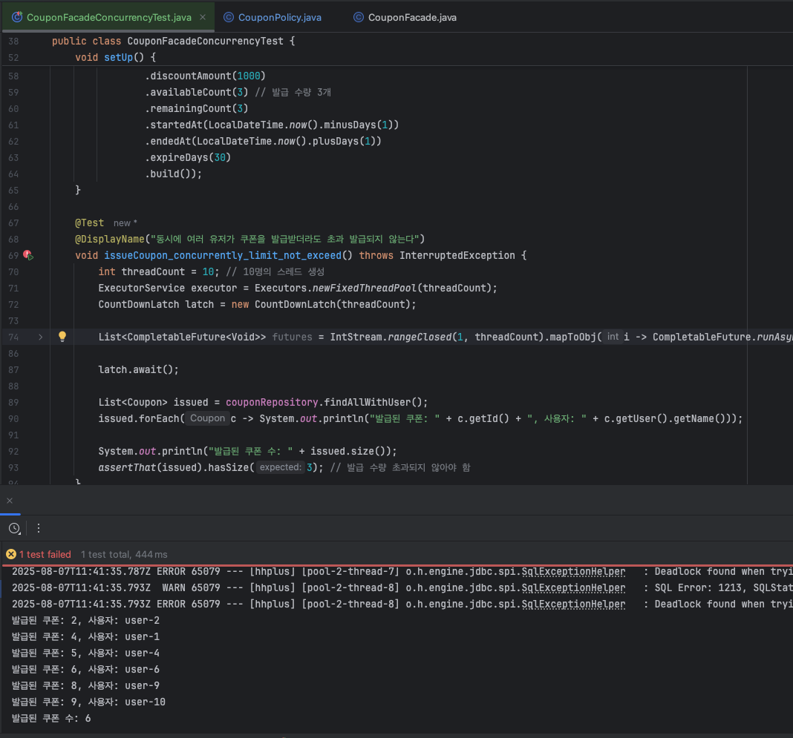
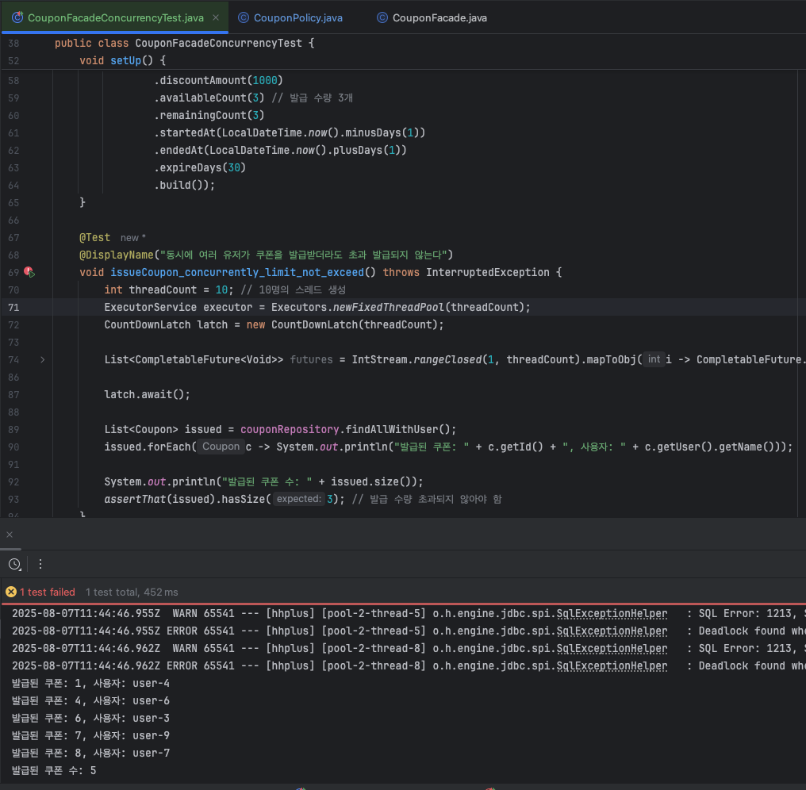

# 테스트를 통한 동시성 해결 결과

## 1. 상품 재고 차감

- 상품의 재고 10개에 대하여 20개의 요청, 5개의 요청에서 요청만큼 재고가 차감, 초과 차감은 되지 않도록 보장
- [ProductServiceConcurrencyTest](https://github.com/hanghae-plus-anveloper/hhplus-e-commerce-java/blob/develop/src/test/java/kr/hhplus/be/server/product/application/ProductServiceConcurrencyTest.java)

<details><summary>주요 테스트 코드</summary>

```java

    @BeforeEach
    void setUp() {
        productRepository.deleteAll();

        product = productRepository.save(Product.builder()
                .name("상품-A")
                .price(10000)
                .stock(10)  // 초기 재고 10개
                .build());
    }

    @Test
    @DisplayName("동시에 여러 사용자가 재고를 차감하면 초과 차감되지 않아야 한다")
    void decreaseStock_concurrently_not_exceed() throws InterruptedException {
        int threadCount = 20; // 요청은 20번
        ExecutorService executor = Executors.newFixedThreadPool(threadCount);
        CountDownLatch latch = new CountDownLatch(threadCount);

        List<CompletableFuture<Void>> futures = IntStream.rangeClosed(1, threadCount).mapToObj(i -> CompletableFuture.runAsync(() -> {
            try {
                productService.verifyAndDecreaseStock(product.getId(), 1);
            } catch (Exception e) {
            // 예외 발생 무시: 재고 부족
            } finally {
                latch.countDown();
            }
        }, executor)).toList();

        latch.await();

        Product result = productRepository.findById(product.getId())
                  .orElseThrow();

        System.out.println("최종 재고: " + result.getStock());
        List<Product> all = productRepository.findAll();
        assertThat(result.getStock()).isGreaterThanOrEqualTo(0);
        assertThat(result.getStock()).isEqualTo(0); // 10개보다 적게 차감되면 안됨
    }
    
```

</details>

### 동시성 문제 확인: 동일한 상품에 대한 엔티티 조회 → 경쟁 조건에 의한 실패

<details><summary>실패 이미지</summary>


</details>

- 실패 결과 요약
  - 테스트 1~2: 20개의 요청, 최종 재고 3 → 차감이 누락, 중복 처리됨
  - 테스트 3: 5개의 요청, 최종 재고 8 → 차감이 누락, 중복 처리됨

- 원인 정리
  - 도메인 함수 자체에서 재고 0개에 대한 예외처리를 하고 있어, 음수 재고는 나타나지 않음
  - `@Transactional` 내에서 동일한 상품에 대한 재고 차감을 동시에 시도하여 충돌로 인한 실패만 확인됨

### 동시성 제어 구현
  - `@Lock(LockModeType.PESSIMISTIC_WRITE)` 비관적 락 적용, Service 코드 수정
  - [ProductRepository.java](https://github.com/hanghae-plus-anveloper/hhplus-e-commerce-java/blob/develop/src/main/java/kr/hhplus/be/server/product/domain/ProductRepository.java)
  - [ProductService.java](https://github.com/hanghae-plus-anveloper/hhplus-e-commerce-java/blob/develop/src/main/java/kr/hhplus/be/server/product/application/ProductService.java)

<details><summary>주요 구현 코드</summary>

```java
    // ProductRepository.java
    @Lock(LockModeType.PESSIMISTIC_WRITE)
    @Query("SELECT p FROM Product p WHERE p.id = :id")
    Optional<Product> findByIdForUpdate(@Param("id") Long id);

    // ProductService.java
    @Transactional
    public Product verifyAndDecreaseStock(Long productId, int requiredQuantity) {
        Product product = productRepository.findByIdForUpdate(productId)
                .orElseThrow(() -> new ProductNotFoundException("상품을 찾을 수 없습니다."));
        /* ... */
    }
```

</details>

<details><summary>성공 이미지</summary>


</details>

- 성공 결과 요약
  - 테스트 1~2(요청 5): 최종 재고 5, 기대값 통과  
  - 테스트 3(요청 20): 최종 재고 0, 기대값 통과
  
- 결론
  - 비관적 락으로 정확한 예측 값을 확인하여 동시성 문제는 완전히 해결됨
  - 현재는 상품 1에 대한 동시성을 확인하였지만, 상품 목록을 기준으로 여러 상품을 차감하는 경우에 데드락까지 고려되어야 함
  - 인덱스를 사용하지 않으면 테이블 전체에 락이 걸릴 수 있음을 유의해야함

## 2. 쿠폰 선착순 발급

- 발급 수량이 `3개`인 쿠폰 정책(`CouponPolicy`)에 대하여 `10`개의 스레드로 동시요청 하는 경우, 쿠폰이 초과 발급 되지 않도록 보장
- 경쟁 조건이 발생하는 지와 트랜젝션에 의한 데드락을 확인하고, `@Version`이나 `@Modifying` 쿼리로 제거가 가능 한지 검증
  - 이전 주차에 이미 `@Version`을 적용하여 해당 부분은 주석처리하고 테스트 코드 작성
- [CouponFacadeConcurrencyTest.java](https://github.com/hanghae-plus-anveloper/hhplus-e-commerce-java/blob/develop/src/test/java/kr/hhplus/be/server/coupon/facade/CouponFacadeConcurrencyTest.java)

<details><summary>주요 테스트 코드</summary>

    ```java
        @BeforeEach
        void setUp() {
            couponRepository.deleteAll();
            userRepository.deleteAll();
            couponPolicyRepository.deleteAll();
        
            policy = couponPolicyRepository.save(CouponPolicy.builder()
                    .discountAmount(1000)
                    .availableCount(3) // 발급 수량 3개
                    .remainingCount(3)
                    .startedAt(LocalDateTime.now().minusDays(1))
                    .endedAt(LocalDateTime.now().plusDays(1))
                    .expireDays(30)
                    .build());
        }
        
        @Test
        @DisplayName("동시에 여러 유저가 쿠폰을 발급받더라도 초과 발급되지 않는다")
        void issueCoupon_concurrently_limit_not_exceed() throws InterruptedException {
            int threadCount = 10; // 10명의 스레드 생성
            ExecutorService executor = Executors.newFixedThreadPool(threadCount);
            CountDownLatch latch = new CountDownLatch(threadCount);
        
            List<CompletableFuture<Void>> futures = IntStream.rangeClosed(1, threadCount).mapToObj(i -> CompletableFuture.runAsync(() -> {
                try {
                    User user = userRepository.save(User.builder().name("user-" + i).build());
        
                    couponFacade.issueCoupon(user.getId(), policy.getId());
                } catch (Exception e) {
                    // e.printStackTrace();
                    // fail("error: " + e.getMessage());
                } finally {
                    latch.countDown();
                }
            }, executor)).toList();
        
            latch.await();
        
            List<Coupon> issued = couponRepository.findAllWithUser();
            issued.forEach(c -> System.out.println("발급된 쿠폰: " + c.getId() + ", 사용자: " + c.getUser().getName()));
        
            System.out.println("발급된 쿠폰 수: " + issued.size());
            assertThat(issued).hasSize(3); // 발급 수량 초과되지 않아야 함
        }
    ``` 

</details>

### 동시성 문제 확인: 경쟁 조건 + 데드락

<details><summary>실패 이미지</summary>




</details>

- 실패 결과 요약
  - 테스트 1: 발급된 쿠폰 수 6
  - 테스트 2: 발급된 쿠폰 수 5 
  - 추가로 데드락 식별

- 원인 정리
  - `@Version`을 주석 처리 하면서 초과발급은 예상이 되었으나, 에러 메세지 중 데드락도 추가로 식별함
  - `CouponService`의 `@Transactional issueCoupon` 내에서 `policy.decreaseRemainingCount` 도메인 함수로 인해 동일한 `row`에 다수의 트랜젝션이 `update`를 시도
    - → 이에 따라 `InnoDB 락`으로 인해 데드락 발생

### 동시성 제어 구현
  - `@Version`을 주석 해제하는 것만으로도 테스트가 통과되는 것을 확인함
  - 추가적인 학습을 위해 `@Modifying` 쿼리를 통한 제어를 구현하여 테스트
  - [CouponPolicyRepository.java](https://github.com/hanghae-plus-anveloper/hhplus-e-commerce-java/blob/develop/src/main/java/kr/hhplus/be/server/coupon/domain/CouponPolicyRepository.java)
  - [CouponService.java](https://github.com/hanghae-plus-anveloper/hhplus-e-commerce-java/blob/develop/src/main/java/kr/hhplus/be/server/coupon/application/CouponService.java)

<details><summary>주요 구현 코드</summary>

    ```
        // CouponPolicyRepository.java
        @Modifying(clearAutomatically = true)
        @Query("""
            UPDATE CouponPolicy cp
               SET cp.remainingCount = cp.remainingCount - 1
             WHERE cp.id = :policyId
               AND cp.remainingCount > 0
        """)
        int decreaseRemainingCount(@Param("policyId") Long policyId);

        @Transactional
        public Coupon issueCoupon(User user, Long policyId) {
            CouponPolicy policy = couponPolicyRepository.findById(policyId)
                    .orElseThrow(() -> new InvalidCouponException("존재하지 않는 쿠폰 정책입니다."));
    
            if (!policy.isWithinPeriod()) {
                throw new InvalidCouponException("쿠폰 정책이 유효하지 않습니다.");
            }
    
            // policy.decreaseRemainingCount(); // 도메인에서 감소
    
            int updated = couponPolicyRepository.decreaseRemainingCount(policyId);
            if (updated == 0) {
                throw new CouponSoldOutException("남은 쿠폰 수량이 없습니다.");
            }
    
            /* ... */
        }
    ```

</details>

<details><summary>성공 이미지</summary>


</details>

- 성공 결과 요약
  - 테스트 4~5: 3건의 쿠폰만 발급, 콘솔에 데드락 출력
  - 트랜젝션 간 락 경합은 발생하되, 특정 트랜젝션에서 락을 얻지 못하고 롤백되고 전체 프로세스가 중단되지는 않음
  - 의도대로 3건의 쿠폰만 정상 발급되어 정합성 문제는 없다고 판단됨

- 유의할 점
  - `@Transactional` 안에서 `@Version`과 도메인 함수 없이 `@Modifying` 쿼리로 직접 수행 할 경우 영속성 컨텍스트 내에서 해당 엔티티의 값은 변경되지 않음
  - `@Modifying(clearAutomatically = true)` 옵션을 사용하거나, `EntityManager.clear()`를 직접 호출해 컨텍스트 초기화
  - `decreaseRemainingCount` 도메인 함수를 사용하지 않기 때문에 `remainingCount <= 0` 도메인 규칙이 무시되어 별도로 예외처리를 해야함

- 사용해본 결과 
  - `@Modifying`이 성능적으로는 우세하다고 하지만, `@Version` 으로 낙관적 락을 적용하는 것이 객체 지향적이며, JPA의 변경 감지를 활용하여 트렌젝션 내에서의 일관된 상태를 유지하기 용이한 것으로 판단됨


## 3. 쿠폰 사용

- 사용자 한명에게 발급된 쿠폰 하나에 대한 10개의 동시 요청 중 1개만 성공하도록 보장
- `used = true` 값이 무조건 반환되어 단순 결과값만으로는 확인 불가
- 10회 요청 중 성공과 예외처리를 카운트 하여 경쟁 상태를 확인
- [CouponServiceConcurrencyTest.java](https://github.com/hanghae-plus-anveloper/hhplus-e-commerce-java/blob/develop/src/test/java/kr/hhplus/be/server/coupon/application/CouponServiceConcurrencyTest.java)

<details><summary>주요 테스트 코드</summary>

```java

    @Test
    @DisplayName("동시에 동일한 쿠폰을 사용하려고 할 때 중복 사용이 발생하지 않아야 한다")
    void useCoupon_concurrently_only_once_used() throws InterruptedException {
        int threadCount = 10;
        ExecutorService executor = Executors.newFixedThreadPool(threadCount);
        CountDownLatch latch = new CountDownLatch(threadCount);

        AtomicInteger successCount = new AtomicInteger(0);
        ConcurrentMap<String, AtomicInteger> exceptionMap = new ConcurrentHashMap<>();

        for (int i = 0; i < threadCount; i++) {
            CompletableFuture.runAsync(() -> {
                try {
                    couponService.useCoupon(issuedCoupon.getId(), user.getId());
                    successCount.incrementAndGet();
                } catch (Exception e) {
                    exceptionMap
                            .computeIfAbsent(e.getClass().getSimpleName(), key -> new AtomicInteger(0))
                            .incrementAndGet();
                } finally {
                    latch.countDown();
                }
            }, executor);
        }

        latch.await();
        executor.shutdown();

        Coupon result = couponRepository.findById(issuedCoupon.getId()).orElseThrow();


        System.out.println("최종 used 상태: " + result.isUsed());
        System.out.println("성공한 사용 요청 수: " + successCount.get());
        System.out.println("실패한 예외 현황:");
        for (Map.Entry<String, AtomicInteger> entry : exceptionMap.entrySet()) {
            System.out.println(" - " + entry.getKey() + ": " + entry.getValue().get());
        }

        assertThat(result.isUsed()).isTrue();
        assertThat(successCount.get()).isEqualTo(1);
    }

```

</details>

### 동시성 문제 확인: 하나의 쿠폰 사용 요청에 대한 다수 성공 확인

<details><summary>실패 이미지</summary>


</details>

- 실패 결과 요약
  - 테스트: 1개의 쿠폰에 대한 10개의 사용요청 중 3개 성공
- 원인 정리
  - `coupon.isAvailable()` 도메인 함수를 통해 `!used && policy.isWithinPeriod()` 체크를 하고 있지만, 
  - 요청 시 used 가 아직 false 인 값을 모두 조회하여 이후 true로 수정하는 update 수행

### 동시성 제어 구현

- @Modifying 쿼리를 통한 낙관적 동시성 제어 구현
- [CouponRepository.java](https://github.com/hanghae-plus-anveloper/hhplus-e-commerce-java/blob/develop/src/main/java/kr/hhplus/be/server/coupon/domain/CouponRepository.java)
- [CouponService.java](https://github.com/hanghae-plus-anveloper/hhplus-e-commerce-java/blob/develop/src/main/java/kr/hhplus/be/server/coupon/application/CouponService.java)

<details><summary>주요 구현 코드</summary>

```java
    // CouponRepository.java
    @Modifying(clearAutomatically = true)
    @Query("""
                UPDATE Coupon c
                   SET c.used = true
                 WHERE c.id = :couponId
                   AND c.user.id = :userId
                   AND c.used = false
            """)
    int markCouponAsUsed(@Param("couponId") Long couponId, @Param("userId") Long userId);    

    // CouponService.java
    @Transactional
    public Coupon useCoupon(Long couponId, Long userId) {
        Coupon coupon = findValidCouponOrThrow(couponId, userId);
        // coupon.use();

        int updated = couponRepository.markCouponAsUsed(couponId, userId); // 조건부 update
        if (updated == 0) {
            throw new InvalidCouponException("이미 사용된 쿠폰이거나 유효하지 않습니다.");
        }
        return couponRepository.findByIdAndUserId(couponId, userId)
                .orElseThrow(() -> new InvalidCouponException("쿠폰 조회 실패"));
    }
```

</details>

<details><summary>성공 이미지</summary>


</details>

- 성공 결과 요약
  - `@Modifying` 쿼리를 통한 낙관적 동시성 제어로 10건의 요청중 1건만 성공 후 9건은 실패 반환
  - `used = false` 조건을 만족하는 쿠폰만 true로 갱신하기 때문에, 중복 사용을 방지함
  - DB를 직접 수정하여 `JPA`의 영속성 컨텍스트 내에서 이미 선언된 엔티티의 used가 갱신되진 않지만, 
  - 해당 시점에서 쿠폰 사용과 관련된 사항은 추가로 발생하지 않기 때문에 컨텍스트와 DB의 일치 여부는 큰 영향이 없다고 판단함


## 4. 잔액 차감 - 주문 중복 요청 & 5. 잔액 충전 및 사용 - 주문과 충전의 충돌, 충전 동시 요청 (테스트 실패)

- 사용자 한명에 대하여 잔액의 차감이 중복으로 발생하거나, 충전과 사용이 동시에 진행되지 않도록 보장
- [BalanceServiceConcurrencyTest.java](https://github.com/hanghae-plus-anveloper/hhplus-e-commerce-java/blob/develop/src/test/java/kr/hhplus/be/server/balance/application/BalanceServiceConcurrencyTest.java)

<details><summary>주요 테스트 코드(동시성 문제 확인 실패)</summary>

```java

    @Test
    @DisplayName("동시에 두 번의 주문 요청이 들어올 경우 잔액이 음수가 되지 않아야 한다")
    void useBalance_concurrently() throws InterruptedException {
        int threadCount = 2;
        int amountToUse = 3000;

        ExecutorService executor = Executors.newFixedThreadPool(threadCount);
        CountDownLatch latch = new CountDownLatch(threadCount);

        AtomicInteger successCount = new AtomicInteger(0);
        ConcurrentMap<String, AtomicInteger> exceptionMap = new ConcurrentHashMap<>();

        for (int i = 0; i < threadCount; i++) {
            CompletableFuture.runAsync(() -> {
                try {
                    balanceService.useBalance(user, amountToUse);
                    successCount.incrementAndGet();
                } catch (Exception e) {
                    exceptionMap
                            .computeIfAbsent(e.getClass().getSimpleName(), key -> new AtomicInteger(0))
                            .incrementAndGet();
                } finally {
                    latch.countDown();
                }
            }, executor);
        }

        latch.await();
        executor.shutdown();

        Balance result = balanceRepository.findByUserId(user.getId())
                .orElseThrow(() -> new IllegalStateException("잔액 정보 없음"));

        System.out.println("최종 잔액: " + result.getBalance());
        System.out.println("성공 요청 수: " + successCount.get());
        System.out.println("실패 예외 현황:");
        for (Map.Entry<String, AtomicInteger> entry : exceptionMap.entrySet()) {
            System.out.println(" - " + entry.getKey() + ": " + entry.getValue().get());
        }

        assertThat(successCount.get()).isEqualTo(1);
        assertThat(result.getBalance()).isEqualTo(2000);
    }

```

</details>

### 동시성 문제 확인 - 확인 불가 

<details><summary>동시성 문제 확인 불가 이미지</summary>


</details>

- 확인 불가 예측 
  - 락을 추가하지 않았음에도 테스트 자체가 실패하지 않음
  - `CannotAcquireLockException`이 발생하면서 접근했던 두 요청 중 하나가 무조건 실패하여 락없이도 하나만 반영이 됨
  - 다만 충전과 사용도 같은 예외가 발생하는데, 항상 코드 순서상 먼저 호출된 충전이 성공하고 사용이 실패함
  - `readyLatch` 를 통해 완전히 동시에 실행하는 함수로 구현하면서 통과값을 2000, 8000으로 수정함
  - 완전 동시 실행이라고 하는데, 10번 중 10번이 먼저 선언된 함수가 성공함

### 동시성 제어 구현

- `@Version` 낙관적 락 적용, 요청 중 하나만 성공해도 로직상 문제 없음
- [Balance.java](https://github.com/hanghae-plus-anveloper/hhplus-e-commerce-java/blob/develop/src/main/java/kr/hhplus/be/server/balance/domain/Balance.java)
- [BalanceService.java](https://github.com/hanghae-plus-anveloper/hhplus-e-commerce-java/blob/develop/src/main/java/kr/hhplus/be/server/balance/application/BalanceService.java)

<details><summary>주요 구현 코드</summary>

```java

// Balance.java
@Getter
@Entity
@Table(name = "balance")
public class Balance {

    @Version
    private Long version;

}

// BalanceService.java
@Service
@RequiredArgsConstructor
public class BalanceService {

    private final BalanceRepository balanceRepository;
    private final BalanceHistoryRepository balanceHistoryRepository;

    @Transactional
    public void chargeBalance(User user, int amount) {
        Balance balance = balanceRepository.findByUserId(user.getId())
                .orElseGet(() -> {
                    Balance newBalance = new Balance(user, 0);
                    user.setBalance(newBalance);
                    return balanceRepository.save(newBalance);
                });
        
        /* ...  */
    }

    @Transactional
    public void useBalance(User user, int amount) {  
        Balance balance = balanceRepository.findByUserId(user.getId())
                .orElseThrow(() -> new IllegalArgumentException("잔액 정보 없음"));
        
        /* ...  */
    }       
}
```

</details>

<details><summary>테스트 통과 유지 이미지</summary>


</details>

- 적용 결과
  - 락 없이도 이미 트랙젝션 선에서 처리가 되고 있는 상태
  - 추가로 작성할 주문 생성 중 잔액 차감이 포함되어 부분적 서비스 차원의 낙관적 락을 추가함
  - 테스트는 변동 없이 1건 통과, 1건 `CannotAcquireLockException` 실패
  - 사용과 충전의 충돌 테스트는 예측값을 범위로 지정했음에도 동일한 최종 금액을 반환함 
  - 코드 순서에 따라 앞에 함수가 항상 먼저 트랜젝션이 생성되는 것으로 보임 10회 시도 중 10회 동일


