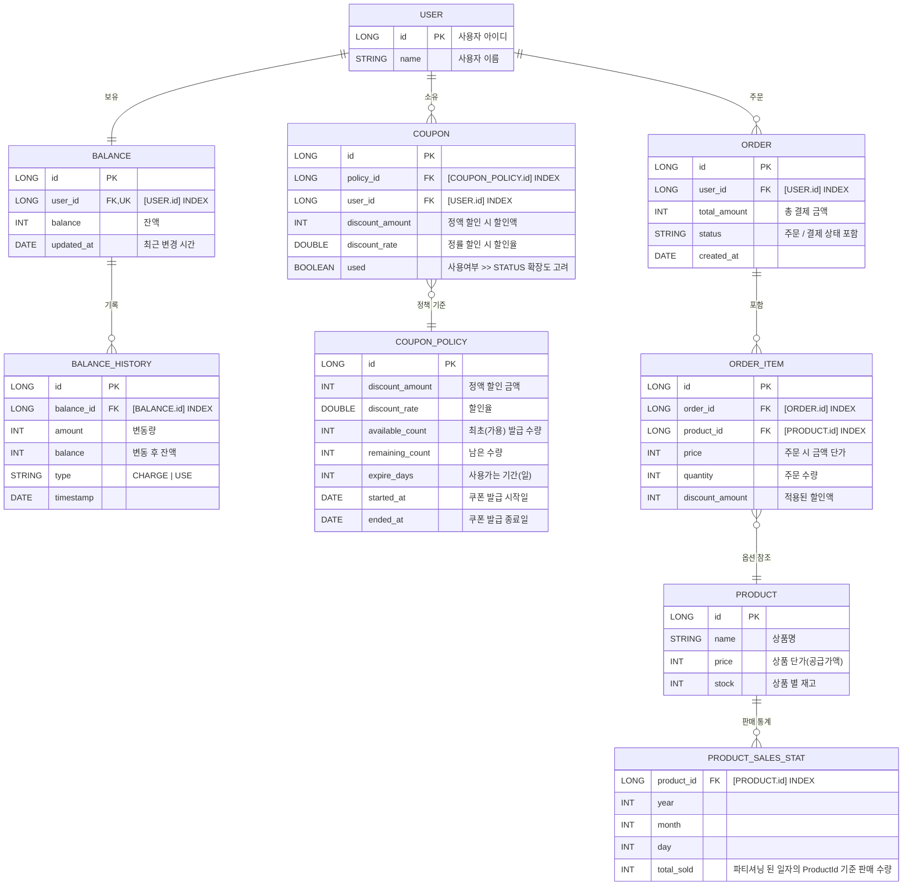
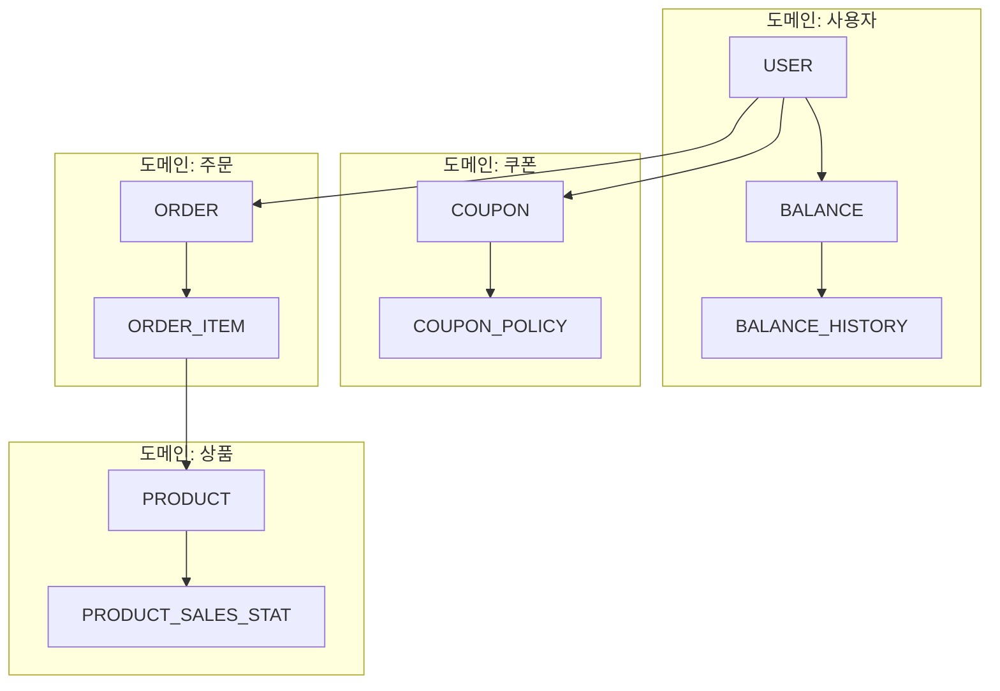
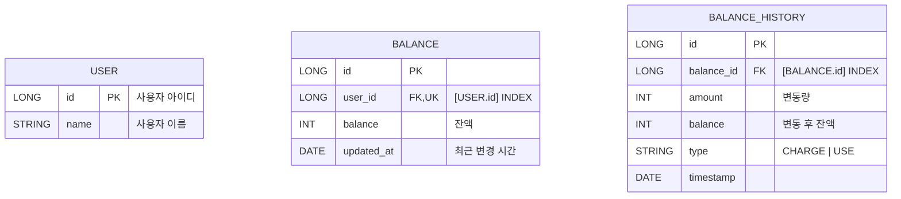
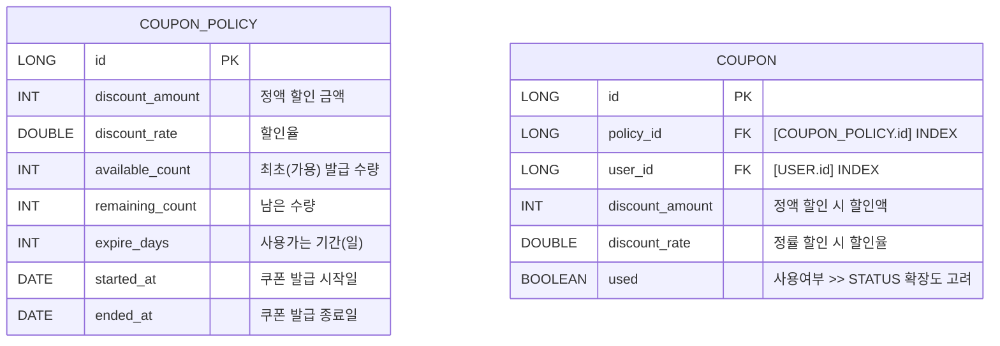
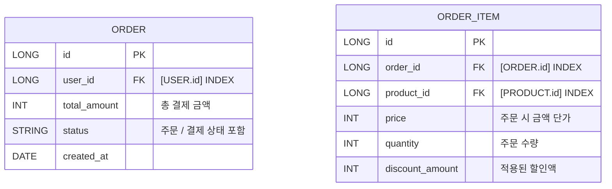
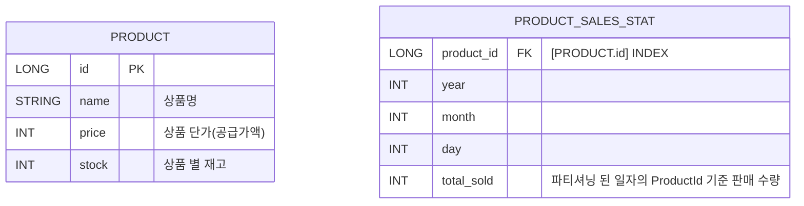

### Entity Relationship Diagram

- 사용자, 쿠폰, 주문, 상품을 도메인으로 각 테이블 구성

```mermaid
erDiagram
    USER {
        LONG    id PK   "사용자 아이디"
        STRING  name    "사용자 이름"
    }

    BALANCE {
        LONG    id PK
        LONG    user_id FK, UK  "[USER.id] INDEX"
        INT     balance         "잔액"
        DATE    updated_at      "최근 변경 시간"
    }

    BALANCE_HISTORY {
        LONG    id PK
        LONG    balance_id FK   "[BALANCE.id] INDEX"
        INT     amount          "변동량"
        INT     balance         "변동 후 잔액"
        STRING  type            "CHARGE | USE" 
        DATE    timestamp
    }

    COUPON_POLICY {
        LONG    id PK
        INT     discount_amount "정액 할인 금액"
        DOUBLE  discount_rate   "할인율"
        INT     available_count "최초(가용) 발급 수량"
        INT     remaining_count "남은 수량"
        INT     expire_days     "사용가는 기간(일)"
        DATE    started_at      "쿠폰 발급 시작일"
        DATE    ended_at        "쿠폰 발급 종료일"
    }

    COUPON {
        LONG    id PK
        LONG    policy_id FK    "[COUPON_POLICY.id] INDEX"
        LONG    user_id FK      "[USER.id] INDEX"
        INT     discount_amount "정액 할인 시 할인액"
        DOUBLE  discount_rate   "정률 할인 시 할인율"
        BOOLEAN used            "사용여부 >> STATUS 확장도 고려"
    }

    ORDER {
        LONG    id PK
        LONG    user_id FK      "[USER.id] INDEX"
        INT     total_amount    "총 결제 금액"
        STRING  status          "주문 / 결제 상태 포함"
        %% DRAFT | PENDING | PAID | IN_TRANSIT | CONFIRMED | CANCELLED | REFUNDED
        DATE    created_at
    }

    ORDER_ITEM {
        LONG    id PK
        LONG    order_id FK             "[ORDER.id] INDEX"
        LONG    product_id FK           "[PRODUCT.id] INDEX"
        %% 주문 시와 현재 상품 금액과 다를 수 있음
        INT     price                   "주문 시 금액 단가"
        INT     quantity                "주문 수량"
        %% 주문서에 상품마다 얼마나 할인되었는 지 표기 -12,000원
        INT     discount_amount         "적용된 할인액"
    }

    PRODUCT {
        LONG    id PK
        STRING  name    "상품명"
        INT     price   "상품 단가(공급가액)"
        INT     stock   "상품 별 재고"
    }
    
    %% 상품 기준 사전 집계 혹은 요청 시 1회 집계 후 재사용
    PRODUCT_SALES_STAT {
        LONG    product_id FK   "[PRODUCT.id] INDEX"
        INT     year 
        INT     month
        INT     day
        INT     total_sold      "파티셔닝 된 일자의 ProductId 기준 판매 수량"
        
        %% INDEX product_id, year, month, day
    }
    
    
    USER ||--|| BALANCE : "보유"
    BALANCE ||--o{ BALANCE_HISTORY : "기록"
    USER ||--o{ COUPON : "소유"
    COUPON }o--|| COUPON_POLICY : "정책 기준"
    USER ||--o{ ORDER : "주문"
    ORDER ||--o{ ORDER_ITEM : "포함"
    ORDER_ITEM }o--|| PRODUCT : "옵션 참조"
    PRODUCT ||--o{ PRODUCT_SALES_STAT : "판매 통계"

```

### 도메인 별 테이블 분류

```mermaid
flowchart TD
  subgraph UserDomain["도메인: 사용자"]
    USER
    BALANCE
    BALANCE_HISTORY
  end

  subgraph CouponDomain["도메인: 쿠폰"]
    COUPON
    COUPON_POLICY
  end

  subgraph OrderDomain["도메인: 주문"]
    ORDER
    ORDER_ITEM
  end

  subgraph ProductDomain["도메인: 상품"]
    PRODUCT
    PRODUCT_SALES_STAT
  end

  USER --> BALANCE
  BALANCE --> BALANCE_HISTORY
  USER --> COUPON
  COUPON --> COUPON_POLICY
  USER --> ORDER
  ORDER --> ORDER_ITEM
  ORDER_ITEM --> PRODUCT
  PRODUCT --> PRODUCT_SALES_STAT

```

### 개별 테이블

- 사용자

```mermaid
erDiagram
    USER {
        LONG    id PK   "사용자 아이디"
        STRING  name    "사용자 이름"
    }

    BALANCE {
        LONG    id PK
        LONG    user_id FK, UK  "[USER.id] INDEX"
        INT     balance         "잔액"
        DATE    updated_at      "최근 변경 시간"
    }

    BALANCE_HISTORY {
        LONG    id PK
        LONG    balance_id FK   "[BALANCE.id] INDEX"
        INT     amount          "변동량"
        INT     balance         "변동 후 잔액"
        STRING  type            "CHARGE | USE" 
        DATE    timestamp
    }
```

- 쿠폰

```mermaid
erDiagram
    COUPON_POLICY {
        LONG    id PK
        INT     discount_amount "정액 할인 금액"
        DOUBLE  discount_rate   "할인율"
        INT     available_count "최초(가용) 발급 수량"
        INT     remaining_count "남은 수량"
        INT     expire_days     "사용가는 기간(일)"
        DATE    started_at      "쿠폰 발급 시작일"
        DATE    ended_at        "쿠폰 발급 종료일"
    }

    COUPON {
        LONG    id PK
        LONG    policy_id FK    "[COUPON_POLICY.id] INDEX"
        LONG    user_id FK      "[USER.id] INDEX"
        INT     discount_amount "정액 할인 시 할인액"
        DOUBLE  discount_rate   "정률 할인 시 할인율"
        BOOLEAN used            "사용여부 >> STATUS 확장도 고려"
    }
```

- 주문

```mermaid
erDiagram
    ORDER {
        LONG    id PK
        LONG    user_id FK      "[USER.id] INDEX"
        INT     total_amount    "총 결제 금액"
        STRING  status          "주문 / 결제 상태 포함"
        %% DRAFT | PENDING | PAID | IN_TRANSIT | CONFIRMED | CANCELLED | REFUNDED
        DATE    created_at
    }

    ORDER_ITEM {
        LONG    id PK
        LONG    order_id FK             "[ORDER.id] INDEX"
        LONG    product_id FK           "[PRODUCT.id] INDEX"
        %% 주문 시와 현재 상품 금액과 다를 수 있음
        INT     price                   "주문 시 금액 단가"
        INT     quantity                "주문 수량"
        %% 주문서에 상품마다 얼마나 할인되었는 지 표기 -12,000원
        INT     discount_amount         "적용된 할인액"
    }
```

- 상품

```mermaid
erDiagram
    PRODUCT {
        LONG    id PK
        STRING  name    "상품명"
        INT     price   "상품 단가(공급가액)"
        INT     stock   "상품 별 재고"
    }

    %% 상품 기준 사전 집계 혹은 요청 시 1회 집계 후 재사용
    PRODUCT_SALES_STAT {
        LONG    product_id FK   "[PRODUCT.id] INDEX"
        INT     year
        INT     month
        INT     day
        INT     total_sold      "파티셔닝 된 일자의 ProductId 기준 판매 수량"

    %% INDEX product_id, year, month, day
    }
```