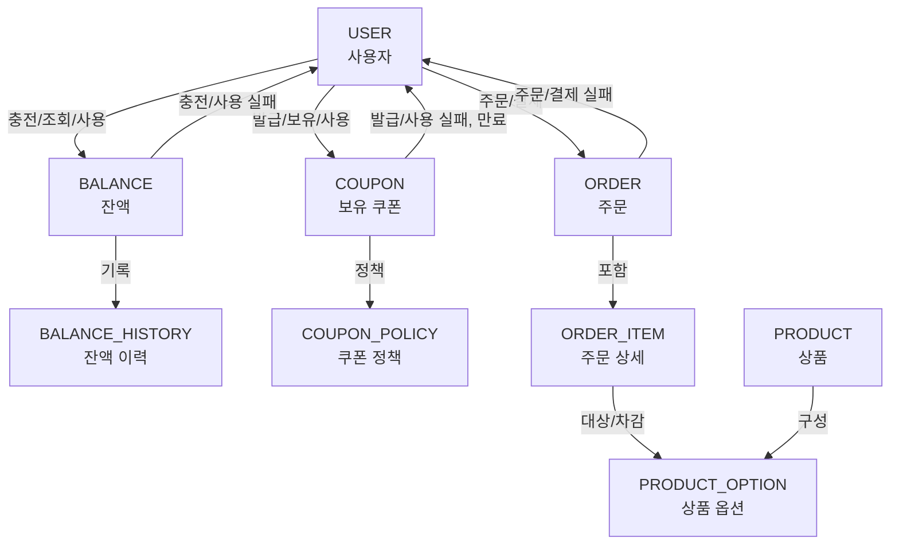
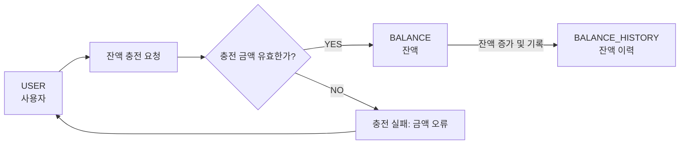
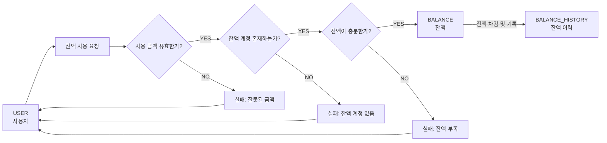
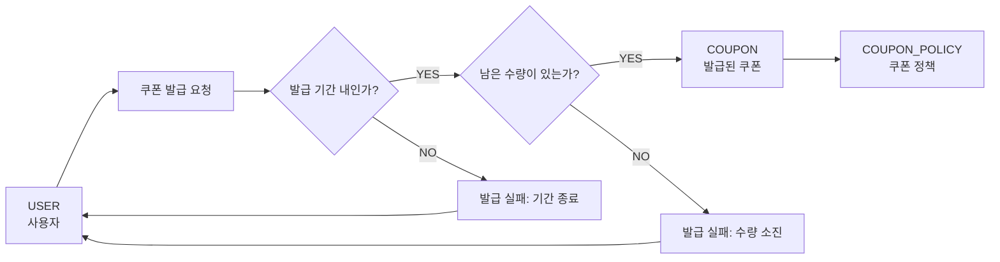
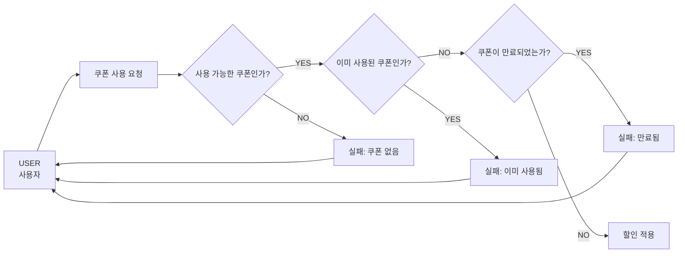
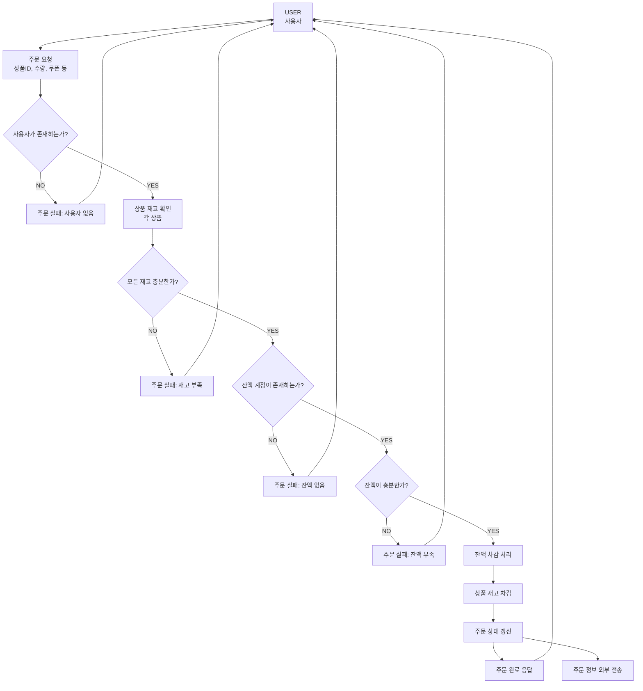

### Flow Chart

- 사용자 도메인 기준 플로우 차트

```mermaid
flowchart TD
    USER[USER<br>사용자]
    BALANCE[BALANCE<br>잔액]
    BALANCE_HISTORY[BALANCE_HISTORY<br>잔액 이력]
    COUPON[COUPON<br>보유 쿠폰]
    COUPON_POLICY[COUPON_POLICY<br>쿠폰 정책]

    ORDER[ORDER<br>주문]
    ORDER_ITEM[ORDER_ITEM<br>주문 상세]
    PRODUCT[PRODUCT<br>상품]
    PRODUCT_OPTION[PRODUCT_OPTION<br>상품 옵션]

    USER -->|"충전/조회/사용"| BALANCE
    BALANCE -->|"기록"| BALANCE_HISTORY
    USER -->|"발급/보유/사용"| COUPON
    COUPON -->|"정책"| COUPON_POLICY
    USER -->|"주문/결제"| ORDER
    ORDER -->|"포함"| ORDER_ITEM
    ORDER_ITEM -->|"대상/차감"| PRODUCT_OPTION
    PRODUCT -->|"구성"| PRODUCT_OPTION

    BALANCE --> |"충전/사용 실패"| USER
    COUPON -->|"발급/사용 실패, 만료"| USER
    ORDER -->|"주문/결제 실패"| USER
```

### 1. 잔액 충전 / 사용 흐름

- 잔액 충전

```mermaid
flowchart LR
    USER[USER<br>사용자]
    CHARGE_REQ[잔액 충전 요청]
    CHARGE_VALID{충전 금액 유효한가?}
    BALANCE[BALANCE<br>잔액]
    BALANCE_HISTORY[BALANCE_HISTORY<br>잔액 이력]
    CHARGE_FAIL[충전 실패: 금액 오류]

    USER --> CHARGE_REQ --> CHARGE_VALID
    CHARGE_VALID -- NO --> CHARGE_FAIL --> USER
    CHARGE_VALID -- YES --> BALANCE -->|"잔액 증가 및 기록"| BALANCE_HISTORY

```

- 잔액 사용

```mermaid
flowchart LR
    USER[USER<br>사용자]
    USE_REQ[잔액 사용 요청]
    USE_VALID{사용 금액 유효한가?}
    BALANCE_EXIST{잔액 계정 존재하는가?}
    BALANCE_SUFFICIENT{잔액이 충분한가?}
    BALANCE[BALANCE<br>잔액]
    BALANCE_HISTORY[BALANCE_HISTORY<br>잔액 이력]

    USE_FAIL_INVALID[실패: 잘못된 금액]
    USE_FAIL_NO_ACCOUNT[실패: 잔액 계정 없음]
    USE_FAIL_INSUFFICIENT[실패: 잔액 부족]

    USER --> USE_REQ --> USE_VALID
    USE_VALID -- NO --> USE_FAIL_INVALID --> USER
    USE_VALID -- YES --> BALANCE_EXIST
    BALANCE_EXIST -- NO --> USE_FAIL_NO_ACCOUNT --> USER
    BALANCE_EXIST -- YES --> BALANCE_SUFFICIENT
    BALANCE_SUFFICIENT -- NO --> USE_FAIL_INSUFFICIENT --> USER
    BALANCE_SUFFICIENT -- YES --> BALANCE -->|"잔액 차감 및 기록"| BALANCE_HISTORY
```

### 2. 쿠폰 발급/사용 흐름

- 쿠폰 발급

```mermaid
flowchart LR
    USER[USER<br>사용자]
    REQ[쿠폰 발급 요청]
    POLICY_VALID{발급 기간 내인가?}
    COUPON_REMAIN{남은 수량이 있는가?}
    COUPON[COUPON<br>발급된 쿠폰]
    COUPON_POLICY[COUPON_POLICY<br>쿠폰 정책]
    EXCEEDED[발급 실패: 수량 소진]
    EXPIRED[발급 실패: 기간 종료]

    USER --> REQ --> POLICY_VALID
    POLICY_VALID -- NO --> EXPIRED --> USER
    POLICY_VALID -- YES --> COUPON_REMAIN
    COUPON_REMAIN -- NO --> EXCEEDED --> USER
    COUPON_REMAIN -- YES --> COUPON --> COUPON_POLICY

```

- 쿠폰 사용

```mermaid
flowchart LR
    USER[USER<br>사용자]
    USE_REQ[쿠폰 사용 요청]
    COUPON_EXIST{사용 가능한 쿠폰인가?}
    COUPON_USED{이미 사용된 쿠폰인가?}
    COUPON_EXPIRED{쿠폰이 만료되었는가?}
    APPLY[할인 적용]

    FAIL_NOT_FOUND[실패: 쿠폰 없음]
    FAIL_USED[실패: 이미 사용됨]
    FAIL_EXPIRED[실패: 만료됨]

    USER --> USE_REQ --> COUPON_EXIST
    COUPON_EXIST -- NO --> FAIL_NOT_FOUND --> USER
    COUPON_EXIST -- YES --> COUPON_USED
    COUPON_USED -- YES --> FAIL_USED --> USER
    COUPON_USED -- NO --> COUPON_EXPIRED
    COUPON_EXPIRED -- YES --> FAIL_EXPIRED --> USER
    COUPON_EXPIRED -- NO --> APPLY

```

### 3. 주문 / 결제 / 재고 차감

```mermaid
flowchart TB
    %% 주문 요청
    USER[USER<br>사용자]
    ORDER_REQ[주문 요청<br>상품ID, 수량, 쿠폰 등]
    USER_EXISTS{사용자가 존재하는가?}
    USER_NOT_FOUND[주문 실패: 사용자 없음]

    %% 재고 확인
    CHECK_STOCK[상품 재고 확인<br>각 상품]
    STOCK_OK{모든 재고 충분한가?}
    STOCK_FAIL[주문 실패: 재고 부족]

    %% 잔액 확인 및 차감
    BALANCE_EXIST{잔액 계정이 존재하는가?}
    BALANCE_NOT_FOUND[주문 실패: 잔액 없음]
    BALANCE_SUFFICIENT{잔액이 충분한가?}
    BALANCE_INSUFFICIENT[주문 실패: 잔액 부족]
    DEDUCT_BALANCE[잔액 차감 처리]

    %% 재고 차감 및 주문 저장
    DEDUCT_STOCK[상품 재고 차감]
    SAVE_ORDER[주문 상태 갱신]
    SEND_TO_EXTERNAL[주문 정보 외부 전송]
    ORDER_SUCCESS[주문 완료 응답]

    %% 흐름 구성
    USER --> ORDER_REQ --> USER_EXISTS
    USER_EXISTS -- NO --> USER_NOT_FOUND --> USER
    USER_EXISTS -- YES --> CHECK_STOCK --> STOCK_OK
    STOCK_OK -- NO --> STOCK_FAIL --> USER
    STOCK_OK -- YES --> BALANCE_EXIST
    BALANCE_EXIST -- NO --> BALANCE_NOT_FOUND --> USER
    BALANCE_EXIST -- YES --> BALANCE_SUFFICIENT
    BALANCE_SUFFICIENT -- NO --> BALANCE_INSUFFICIENT --> USER
    BALANCE_SUFFICIENT -- YES --> DEDUCT_BALANCE --> DEDUCT_STOCK --> SAVE_ORDER
        SAVE_ORDER --> ORDER_SUCCESS --> USER
    SAVE_ORDER --> SEND_TO_EXTERNAL


```
