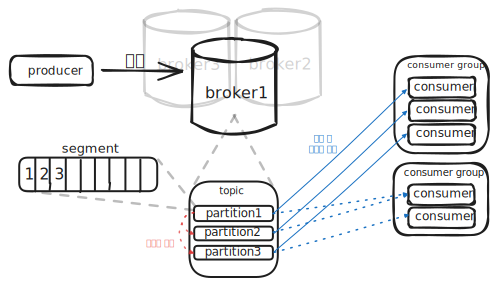
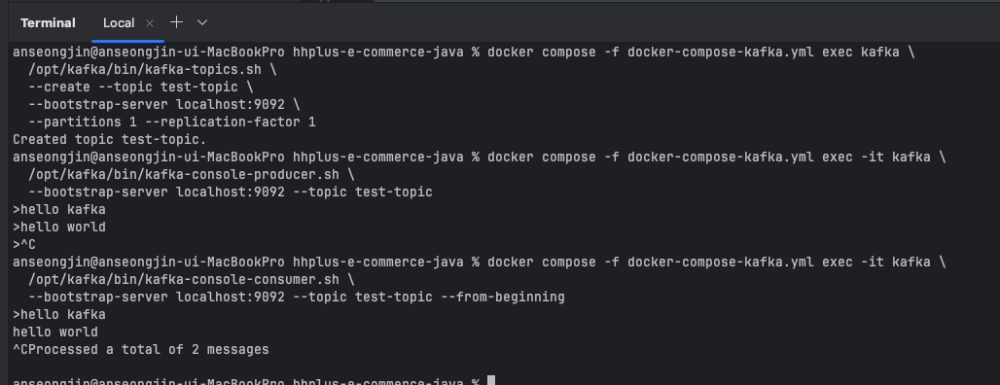

# Kafka 학습 내용 정리

## Kafka 구조 및 동작 정리

### 기능 역할

- `Cluster`: `Kafka Broker`로 이루어진 집합
- `Producer`: 메세지를 `Topic`/`Broker`에 `Partition`으로 발행하는 서비스
- `Consumer`: `Topic`의 `Partition`에 적재된 메세지를 소비하는 서비스 → ex) DB에 실제 저장하는 로직, 서드 파티 호출
  - `offset`: `Partition`에서 어디까지 읽었는 지 나타내는 위치 포인터
- `Broker`: 클러스터 내에 존재하는 카프카 서버 프로세스
  - `Topic`: 메세지를 논리적으로 묶는 카테고리, 하나 이상의 `Partition`을 보유
  - `Partition`: `Topic`을 분할한 단위, `key`값을 이용해 같은 `Partition`내에서만 순서가 보장 → ex) User 여러명의 데이터는 한번에 처리해도 되지만, 한 User의 충전/차감은 같은 Partition에 존재하여 순차 보장
  - `Segment`: 각 `Partition` 로그 파일을 일정 크기/시간 단위로 분할된 조각, 보존/삭제가 동작되는 단위
- `Controller`: `Cluster` 메타데이터를 관리하고, Broker/Partition 상태를 감시해, 장애가 발생한 Broker 내에 리더가 존재한다면 다른 Partition을 리더로 선출/재할당 수행
- `Coordinator`: `Cousumer Group` 상태를 보면서, 장애 발생 시 다른 `Consumer`에게 재할당, `Consumer`, `Partition` 수 변경 시 `Rebalancing` 역할

### 실행 흐름



`Producer` 발행/생산 → 각 `Partition` 적재 → `Consumer Group`별 소비 

- 1. `Producer`가 메세지 발행
  - `Topic`의 어떤 `Partition`으로 적재할 지 `key`를 통해 확인
- 2. 리더 `Broker` 파티션이 디스크에 기록, 다른 부가 `Broker`로 복제
  - 기록되면 소비의 대상이되고, 장애가 나도 복제본에 전가
- 3. `Concumer`가 메세지를 읽어 처리
  - DB에 영속화하거나, 외부 API를 호출하는 등의 최종 로직 수행
  - 하나의 `Partition`에는 동시에 하나의 `Consumer`만 소비(`Consumer Group` 내에서)

### Kafka 장단점


### 환경 세팅

- docker-compose-kafka.yml
```yaml
services:
  kafka:
    image: apache/kafka:4.0.0
    container_name: kafka
    ports:
      - "9092:9092"
    environment:
      KAFKA_LISTENERS: CONTROLLER://localhost:9091,HOST://0.0.0.0:9092,DOCKER://0.0.0.0:9093
      KAFKA_ADVERTISED_LISTENERS: HOST://localhost:9092,DOCKER://kafka:9093
      KAFKA_LISTENER_SECURITY_PROTOCOL_MAP: CONTROLLER:PLAINTEXT,DOCKER:PLAINTEXT,HOST:PLAINTEXT

      KAFKA_NODE_ID: 1 # 노드 수
      KAFKA_PROCESS_ROLES: broker,controller
      KAFKA_CONTROLLER_LISTENER_NAMES: CONTROLLER
      KAFKA_CONTROLLER_QUORUM_VOTERS: 1@localhost:9091

      KAFKA_INTER_BROKER_LISTENER_NAME: DOCKER

      KAFKA_OFFSETS_TOPIC_REPLICATION_FACTOR: 1

      KAFKA_LOG_DIRS: /var/lib/kafka/data
    volumes:
      - ./kafka-data:/var/lib/kafka/data

```

- 실행
```bash
docker compose -f docker-compose-kafka.yml up -d
```

### CLI 예제 토픽 생성 및 소비 


- `docker` 실행 후 `kafka` 라이브러리에 포함된 예제 토픽 발행
- `kafka-console-producer.sh`: `hello kafka` 메세지 발행
- `kafka-console-consumer.sh`: 적재된 `hello kafka` 메세지 소비

<details><summary>동봉된 예제 실행 CLI</summary>

```bash
# 생성
docker compose -f docker-compose-kafka.yml exec kafka \
  /opt/kafka/bin/kafka-topics.sh \
  --create --topic test-topic \
  --bootstrap-server localhost:9092 \
  --partitions 1 --replication-factor 1

# Producer 메세지 발행
docker compose -f docker-compose-kafka.yml exec -it kafka \
  /opt/kafka/bin/kafka-console-producer.sh \
  --bootstrap-server localhost:9092 --topic test-topic
# 후 입력

# Consumer 메세지 소비
docker compose -f docker-compose-kafka.yml exec -it kafka \
  /opt/kafka/bin/kafka-console-consumer.sh \
  --bootstrap-server localhost:9092 --topic test-topic --from-beginning

# 삭제
docker compose -f docker-compose-kafka.yml exec kafka \
  /opt/kafka/bin/kafka-topics.sh \
  --delete --topic test-topic \
  --bootstrap-server localhost:9092
```
</details>


# E-commerce Kafka 설계서

## 시퀀스 다이어그램


