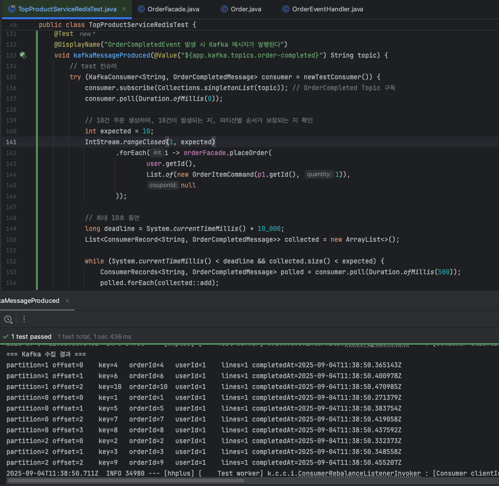

# Kafka 학습 내용 정리

## Kafka 구조 및 동작 정리

### 기능 역할

- `Cluster`: `Kafka Broker`로 이루어진 집합
- `Producer`: 메세지를 `Topic`/`Broker`에 `Partition`으로 발행하는 서비스
- `Consumer`: `Topic`의 `Partition`에 적재된 메세지를 소비하는 서비스 → ex) DB에 실제 저장하는 로직, 서드 파티 호출
  - `offset`: `Partition`에서 어디까지 읽었는 지 나타내는 위치 포인터
- `Broker`: 클러스터 내에 존재하는 카프카 서버 프로세스
  - `Topic`: 메세지를 논리적으로 묶는 카테고리, 하나 이상의 `Partition`을 보유
  - `Partition`: `Topic`을 분할한 단위, `key`값을 이용해 같은 `Partition`내에서만 순서가 보장 → ex) User 여러명의 데이터는 한번에 처리해도 되지만, 한 User의 충전/차감은 같은 Partition에 존재하여 순차 보장
  - `Segment`: 각 `Partition` 로그 파일을 일정 크기/시간 단위로 분할된 조각, 보존/삭제가 동작되는 단위
- `Controller`: `Cluster` 메타데이터를 관리하고, Broker/Partition 상태를 감시해, 장애가 발생한 Broker 내에 리더가 존재한다면 다른 Partition을 리더로 선출/재할당 수행
- `Coordinator`: `Cousumer Group` 상태를 보면서, 장애 발생 시 다른 `Consumer`에게 재할당, `Consumer`, `Partition` 수 변경 시 `Rebalancing` 역할

### 실행 흐름


`Producer` 발행/생산 → 각 `Partition` 적재 → `Consumer Group`별 소비 

- 1. `Producer`가 메세지 발행
  - `Topic`의 어떤 `Partition`으로 적재할 지 `key`를 통해 확인
- 2. 리더 `Broker` 파티션이 디스크에 기록, 다른 부가 `Broker`로 복제
  - 기록되면 소비의 대상이되고, 장애가 나도 복제본에 전가
- 3. `Concumer`가 메세지를 읽어 처리
  - DB에 영속화하거나, 외부 API를 호출하는 등의 최종 로직 수행
  - 하나의 `Partition`에는 동시에 하나의 `Consumer`만 소비(`Consumer Group` 내에서)

### Kafka 장단점

- 장점
  - 병렬처리로 높은 처리량을 발휘, 확장성이 뛰어남
  - 디스크에 기록되어 소실 위험이 없음, 내구성 높음, 재처리 쉬움
  - 생산하는 쪽과 소비하는쪽의 분리, 장애 격리

- 단점/주의
  - 전역 순서 미보장, 파티션 단위만 순서 보장됨
  - 리밸런싱이 발생한 동안 소비기 일시 중단됨

### 환경 세팅

- docker-compose-kafka.yml
```yaml
services:
  kafka:
    image: apache/kafka:4.0.0
    container_name: kafka
    ports:
      - "9092:9092"
    environment:
      KAFKA_LISTENERS: CONTROLLER://localhost:9091,HOST://0.0.0.0:9092,DOCKER://0.0.0.0:9093
      KAFKA_ADVERTISED_LISTENERS: HOST://localhost:9092,DOCKER://kafka:9093
      KAFKA_LISTENER_SECURITY_PROTOCOL_MAP: CONTROLLER:PLAINTEXT,DOCKER:PLAINTEXT,HOST:PLAINTEXT

      KAFKA_NODE_ID: 1 # 노드 수
      KAFKA_PROCESS_ROLES: broker,controller
      KAFKA_CONTROLLER_LISTENER_NAMES: CONTROLLER
      KAFKA_CONTROLLER_QUORUM_VOTERS: 1@localhost:9091

      KAFKA_INTER_BROKER_LISTENER_NAME: DOCKER

      KAFKA_OFFSETS_TOPIC_REPLICATION_FACTOR: 1

      KAFKA_LOG_DIRS: /var/lib/kafka/data
    volumes:
      - ./kafka-data:/var/lib/kafka/data

```

- 실행
```bash
docker compose -f docker-compose-kafka.yml up -d
```

### CLI 예제 토픽 생성 및 소비 


- `docker` 실행 후 `kafka` 라이브러리에 포함된 예제 토픽 발행
- `kafka-console-producer.sh`: `hello kafka` 메세지 발행
- `kafka-console-consumer.sh`: 적재된 `hello kafka` 메세지 소비

<details><summary>동봉된 예제 실행 CLI</summary>

```bash
# 생성
docker compose -f docker-compose-kafka.yml exec kafka \
  /opt/kafka/bin/kafka-topics.sh \
  --create --topic test-topic \
  --bootstrap-server localhost:9092 \
  --partitions 1 --replication-factor 1

# Producer 메세지 발행
docker compose -f docker-compose-kafka.yml exec -it kafka \
  /opt/kafka/bin/kafka-console-producer.sh \
  --bootstrap-server localhost:9092 --topic test-topic
# 후 입력

# Consumer 메세지 소비
docker compose -f docker-compose-kafka.yml exec -it kafka \
  /opt/kafka/bin/kafka-console-consumer.sh \
  --bootstrap-server localhost:9092 --topic test-topic --from-beginning

# 삭제
docker compose -f docker-compose-kafka.yml exec kafka \
  /opt/kafka/bin/kafka-topics.sh \
  --delete --topic test-topic \
  --bootstrap-server localhost:9092
```
</details>


# E-commerce Kafka 실시간 주문

## Kafka 주문 메세지 발행

### 목적

> 주문 생성 시 Kafka에 메세지를 발행할 수 있다.

### 설계 방향

- 주문 생성은 기존 `OrderFacade`의 주문 생성 트랜젝션 커밋후 실행
- OrderCompletedEvent를 발행하여 핸들러에서 Kafka 메세지를 발행

### 주요 코드

- [OrderCompletedMessage.java](https://github.com/hanghae-plus-anveloper/hhplus-e-commerce-java/blob/develop/src/main/java/kr/hhplus/be/server/kafka/message/OrderCompletedMessage.java)
  ```java
  public record OrderCompletedMessage(
          String orderId,
          String userId,
          List<Line> lines,
          Instant completedAt
  ) {
      public record Line(Long productId, int quantity) {}
  }
  ```
  - 주문완료 시 kafka에 적재할 메세지 스키마

- [KafkaTopics.java](https://github.com/hanghae-plus-anveloper/hhplus-e-commerce-java/blob/develop/src/main/java/kr/hhplus/be/server/kafka/KafkaTopics.java)
  ```java
  @Component
  public class KafkaTopics {
  
    @Bean
    NewTopic orderCompletedTopic(
            @Value("${app.kafka.topics.order-completed}") String name,
            @Value("${app.kafka.partitions.order-completed:3}") int partitions
    ) {
      return TopicBuilder.name(name).partitions(partitions).replicas(1).build();
    }
    
    @Bean
    NewTopic couponIssuedTopic(
            @Value("${app.kafka.topics.coupon-issued}") String name,
            @Value("${app.kafka.partitions.coupon-issued:3}") int partitions
    ) {
      return TopicBuilder.name(name).partitions(partitions).replicas(1).build();
    }
  }
  ```
  - 어플리케이션 실행 시 `Bean`으로 토픽을 등록(있으면 무시)
  - 파티션은 `application.yml`과 동일하게 3으로 세팅
    - 로컬 테스트용으로 replicas 1 지정, 실제로는 3 이상 필요,
  - 심화과제를 위해 `couponIssuedTopic` 함께 작성

- [OrderCompletedKafkaPublisher.java](https://github.com/hanghae-plus-anveloper/hhplus-e-commerce-java/blob/develop/src/main/java/kr/hhplus/be/server/kafka/publisher/OrderCompletedKafkaPublisher.java)
  ```java
  @Slf4j
  @Component
  @RequiredArgsConstructor
  public class OrderCompletedKafkaPublisher {
  
      private final KafkaTemplate<String, OrderCompletedMessage> kafkaTemplate;
    
      @Value("${app.kafka.topics.order-completed}")
      private String topic;
    
      @TransactionalEventListener(phase = TransactionPhase.AFTER_COMMIT)
      public void on(OrderCompletedEvent event) {
          OrderCompletedMessage message = new OrderCompletedMessage(
                  String.valueOf(event.orderId()),
                  String.valueOf(event.userId()), 
                  event.lines().stream()
                          .map(l -> new OrderCompletedMessage.Line(l.productId(), l.quantity()))
                          .toList(),
                  Instant.now()
          );
  
          String key = String.valueOf(event.orderId());
  
          kafkaTemplate.send(topic, key, message).whenComplete((result, ex) -> {
              if (ex != null) {
                  // 실패 로깅 + 재시도 로직 or 알람
                  log.error("[KAFKA] publish failed: orderId={}, reason={}", event.orderId(), ex.getMessage(), ex);
              } else {
                  var md = result.getRecordMetadata();
                  log.info("[KAFKA] published: orderId={}, partition={}, offset={}", event.orderId(), md.partition(), md.offset());
              }
          });
      }
  }
  ```
  - `@TransactionalEventListener(AFTER_COMMIT)`으로 트랜젝션 커밋 후 보장
  - `orderId`로 파티셔닝 수행, 동일 파티션 내에서는 순차가 보장됨

### 테스트 환경 추가

```java
@TestConfiguration
@Profile("test")
public class IntegrationTestContainersConfig {
    /* ... */

    public static final KafkaContainer KAFKA =
          new KafkaContainer(DockerImageName.parse("apache/kafka:4.0.0"));

    static {
        /* ... */
        KAFKA.start();
        
        /* ... */
        System.setProperty("spring.kafka.bootstrap-servers", KAFKA.getBootstrapServers());
    }
    
    /* ... */
    @PreDestroy
    public void shutdown() {
        /* ... */
        if (KAFKA.isRunning()) KAFKA.stop();
    }
}
```
- `kafka 4.0`부터 `zookeeper`없이 `KRaft`(내장 컨트롤러) 모드가 역할을 대체함
  - 클러스터 메타데이터 저장·합의(컨트롤러 선출)
  - 브로커 멤버십 관리
  - 토픽/파티션 메타데이터
  - 리더 선출

### 메세지 발행 테스트

- [TopProductServiceRedisTest.java](https://github.com/hanghae-plus-anveloper/hhplus-e-commerce-java/blob/develop/src/test/java/kr/hhplus/be/server/analytics/application/TopProductServiceRedisTest.java)
  - 기존 Redis 검증용 테스트 파일에 테스트 항목(`kafkaMessageProduced`)을 하나 더 추가했습니다.

- 검증용 테스트 Consumer 추가
  ```java
  // test consumer 세팅
  private KafkaConsumer<String, kr.hhplus.be.server.kafka.message.OrderCompletedMessage> newTestConsumer() {
      Properties props = new Properties();
      props.put(ConsumerConfig.BOOTSTRAP_SERVERS_CONFIG, System.getProperty("spring.kafka.bootstrap-servers"));
      props.put(ConsumerConfig.GROUP_ID_CONFIG, "test-consumer-" + UUID.randomUUID());
      props.put(ConsumerConfig.AUTO_OFFSET_RESET_CONFIG, "earliest");
      props.put(ConsumerConfig.KEY_DESERIALIZER_CLASS_CONFIG, "org.apache.kafka.common.serialization.StringDeserializer");
      props.put(ConsumerConfig.VALUE_DESERIALIZER_CLASS_CONFIG, "org.springframework.kafka.support.serializer.JsonDeserializer");
      props.put(JsonDeserializer.TRUSTED_PACKAGES, "kr.hhplus.*");
      props.put(JsonDeserializer.USE_TYPE_INFO_HEADERS, false);
      props.put(JsonDeserializer.VALUE_DEFAULT_TYPE, "kr.hhplus.be.server.kafka.message.OrderCompletedMessage");
  
      return new KafkaConsumer<>(props);
  }
  ```
- 테스트 항목 추가
  ```java
  @Test
  @DisplayName("OrderCompletedEvent 발생 시 Kafka 메시지가 발행된다")
  void kafkaMessageProduced(@Value("${app.kafka.topics.order-completed}") String topic) {
      // test 컨슈머
      try (KafkaConsumer<String, OrderCompletedMessage> consumer = newTestConsumer()) {
          consumer.subscribe(Collections.singletonList(topic)); // OrderCompleted Topic 구독
          consumer.poll(Duration.ofMillis(0));
  
          // 10건 주문 생성하여, 10건이 발생되는 지, 파티션별 순서가 보장되는 지 확인
          int expected = 10;
          IntStream.rangeClosed(1, expected)
                  .forEach(i -> orderFacade.placeOrder(
                          user.getId(),
                          List.of(new OrderItemCommand(p1.getId(), 1)),
                          null
                  ));
  
          // 최대 10초 동안
          long deadline = System.currentTimeMillis() + 10_000;
          List<ConsumerRecord<String, OrderCompletedMessage>> collected = new ArrayList<>();
  
          while (System.currentTimeMillis() < deadline && collected.size() < expected) {
              ConsumerRecords<String, OrderCompletedMessage> polled = consumer.poll(Duration.ofMillis(500));
              polled.forEach(collected::add);
          }
  
          printKafkaRecords(collected);
  
          // 10건 수집 건수 확인, 건 별 정합성 확인
          assertThat(collected.size()).isGreaterThanOrEqualTo(expected);
          for (ConsumerRecord<String, OrderCompletedMessage> rec : collected) {
              OrderCompletedMessage msg = rec.value();
              assertThat(msg).isNotNull();
              assertThat(msg.userId()).isEqualTo(user.getId().toString());
              assertThat(msg.lines()).isNotEmpty();
          }
  
          // 파티션 별 순번 보장(증가하는 지) 확인
          Map<TopicPartition, Long> lastOffsetByPartition = new HashMap<>();
          for (ConsumerRecord<String, OrderCompletedMessage> rec : collected) {
              TopicPartition tp = new TopicPartition(rec.topic(), rec.partition());
              Long prev = lastOffsetByPartition.get(tp);
              if (prev != null) {
                  assertThat(rec.offset()).isGreaterThan(prev); // 증가
              }
              lastOffsetByPartition.put(tp, rec.offset());
          }
      }
  }
  ```
  - 10건의 주문을 발행하여, 10건의 메세지가 적재되는 지 확인
  - 파티션별로 orderId의 순차(증가)가 보장이 되는 지 확인

### 테스트 결과


- 수집결과 10건의 메세지가 정상적으로 방행됨
- 파티션별로 `orderId`값의 증가함을 확인함(전역 순차 X)


