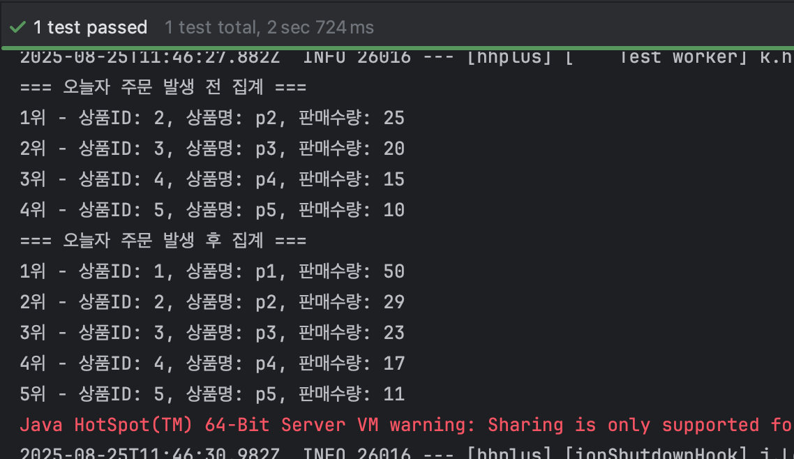
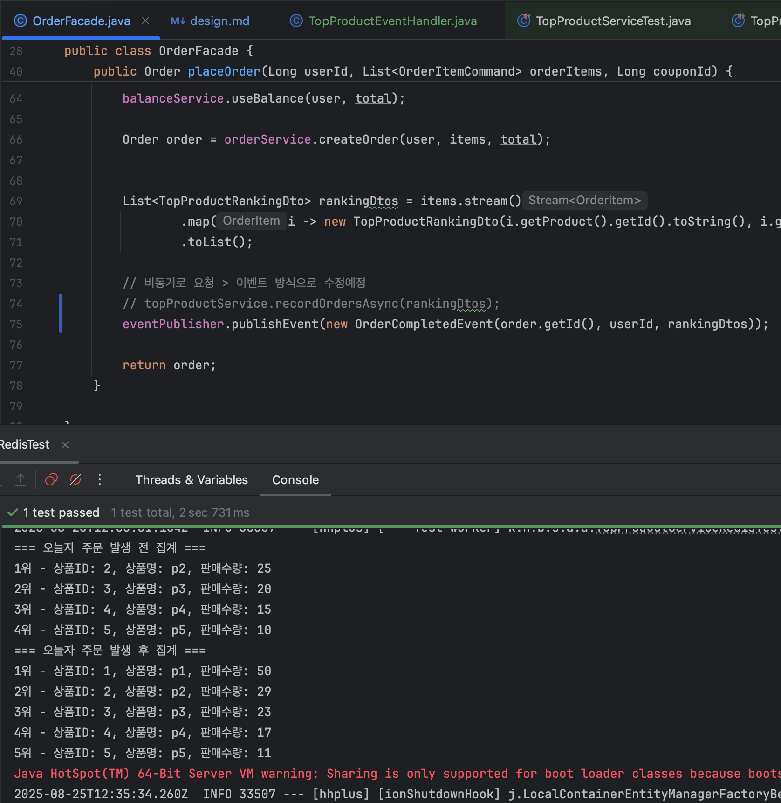
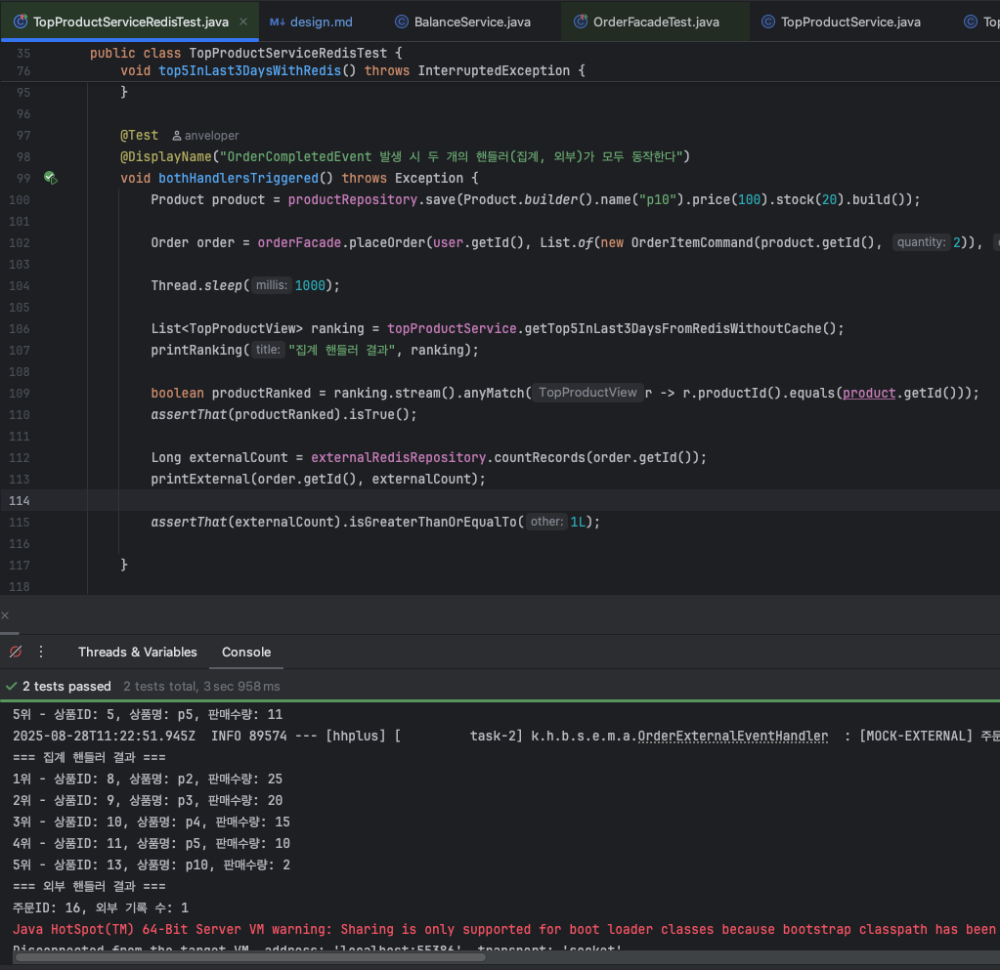

# E-commerce Order Additional Event

## 부가 로직에 대한 관심사 분리 
### 목적

> 주문 생성 시 핵심 트랜잭션과 부가기능(집계, 알림 등)을 분리하여 안정성과 가독성 확보

### 설계 방향

- 주문 생성은 `OrderFacade` 내에서 트랜잭션 단위로 처리
- 주문 생성 완료 시점에 **주문 완료 이벤트(`OrderCompletedEvent`)** 발행
- 부가 로직은 별도 이벤트 핸들러에서 수행
- 동일 이벤트에 대해 내부 집계(`TopProduct`) 와 외부 집계(`Mock External`) 가 동시에 동작하도록 구현

### 이벤트 흐름

- `OrderFacade.placeOrder()`
  -  사용자 검증, 상품 재고 차감, 쿠폰 사용, 잔액 차감, 주문 생성 처리
  - 완료 후 `OrderCompletedEvent` 발행
- `TopProductEventHandler`
  - `OrderCompletedEvent` 수신
  - 주문 상품 정보를 기반으로 랭킹 집계 수행
- `OrderExternalEventHandler`(`Mock External`)
  - 동일하게 `OrderCompletedEvent` 수신
  - 외부 시스템에 전달되는 시뮬레이션을 Redis 저장소에 기록
  - 학습 목적으로 외부 API 대신 로그 기록 및 `Redis` 저장소(`OrderExternalRedisRepository`)를 사용

### 기능 구현 전 테스트 코드

- 기존에 구현한 테스트 코드가 성공하는 상태가 유지 되도록 이벤트 방식의 기능으로 수정되어야 함
- 기능 구현 전 테스트 코드 성공 상태 확인

  - `setUp`: 2~6번 상품 Redis에 직접 세팅
    - 6번 상품은 3일전으로 집계되지 않음
  - 오늘자 주문 생성 후 1번 상품이 1위로 집계되고,
  - 2~5번 상품 또한 오늘 발생한 주문 수량만큼 추가 집계됨

## 기능 구현

### 이벤트 관련 클래스 구현

- [OrderCompletedEvent.java](https://github.com/hanghae-plus-anveloper/e-commerce/blob/main/src/main/java/kr/hhplus/be/server/common/event/OrderCompletedEvent.java)
  ```java
  public record OrderCompletedEvent(Long orderId, Long userId, List<OrderLineSummary> lines) {
  }
  ```
  - 주문 생성 성공 이벤트

- [TopProductEventHandler.java](https://github.com/hanghae-plus-anveloper/e-commerce/blob/main/src/main/java/kr/hhplus/be/server/analytics/application/TopProductEventHandler.java)
  ```java
  @Component
  @RequiredArgsConstructor
  public class TopProductEventHandler {

      private final TopProductService topProductService;

      @Async
      @TransactionalEventListener(phase = TransactionPhase.AFTER_COMMIT)
      public void on(OrderCompletedEvent event) {
          topProductService.recordOrdersAsync(event.orderId(), event.lines());
      }
  }
  ```
  - `AFTER_COMMIT` 에 의해 트랜젝션이 커밋 되고 나서 이벤트 동작으로 구현
  - 주문 생성 함수의 `OrderCompletedEvent`를 수집하여 `TopProductService`에 집계 요청

- [TopProductService.java](https://github.com/hanghae-plus-anveloper/e-commerce/blob/main/src/main/java/kr/hhplus/be/server/analytics/application/TopProductService.java)
  ```java
  @Service
  @RequiredArgsConstructor
  public class TopProductService {
      /* ... */
      @Async
      public void recordOrdersAsync(Long orderId, List<OrderLineSummary> lines) {
          if (redisRepository.isAlreadyIssued(orderId)) {
              return;
          }
          try {
              redisRepository.recordOrders(lines.stream().map(TopProductMapper::toRecord).toList());
              redisRepository.markIssued(orderId);
          } catch (Exception ignored) {
          }
      }
      /* ... */
  }
  ```
  - 기록된 주문인지 확인
  - 상품 번호 및 수량 배열로 RedisRepository에 기록
  - 주문 번호 기록

- [TopProductRedisRepository.java](https://github.com/hanghae-plus-anveloper/e-commerce/blob/main/src/main/java/kr/hhplus/be/server/analytics/infrastructure/TopProductRedisRepository.java)
  ```java
  @Repository
  @RequiredArgsConstructor
  public class TopProductRedisRepository {
      /* ... */
    
      private static final int TTL_DAYS = 4;
      private static final String PRODUCT_RANKING_PREFIX = "RANKING:PRODUCT:";
      private static final String ISSUED_ORDER_SET = PRODUCT_RANKING_PREFIX + "ISSUED";
  
      private String getDailyKey(LocalDate date) {
          return PRODUCT_RANKING_PREFIX + date.format(FORMATTER);
      }
  
      public boolean isAlreadyIssued(Long orderId) {
          return Boolean.TRUE.equals(redisTemplate.opsForSet().isMember(ISSUED_ORDER_SET, orderId.toString()));
      }
  
      public void markIssued(Long orderId) {
          redisTemplate.opsForSet().add(ISSUED_ORDER_SET, orderId.toString());
          redisTemplate.expire(ISSUED_ORDER_SET, Duration.ofDays(TTL_DAYS));
      }
  
      public void recordOrders(List<TopProductRecord> items) {
          String key = getDailyKey(LocalDate.now());
  
          for (TopProductRecord item : items) {
              redisTemplate.opsForZSet().incrementScore(key, item.productId(), item.soldQty());
          }
  
          redisTemplate.expire(key, Duration.ofDays(TTL_DAYS));
      }
      
      /* ... */
  }
  ```
  - `isAlreadyIssued`: SET 자료구조의 중복 발급 확인 함수
  - `markIssued`: 상품별 수량 증가 후 완료된 주문 기록, TTL은 집계함수와 동일하게 설정
  - `recordOrders`: 상품 배열 기반으로 `날짜별` 판매량 을 ZSET에 기록

### 테스트 성공 상태 확인


- 주문 완료 후 이벤트 기반으로 `TopProductEventHandler`가 정보를 수집하여 Redis 집계가 정상적으로 이루어짐을 확인
- 기존 테스트(최근 3일간 Top5 조회)는 이벤트 방식 적용 이후에도 그대로 성공 상태 유지
- 핵심 트랜잭션과 분리된 부가 로직이 이벤트 → 핸들러 구조로 대체되었음에도 기능 동작과 정합성은 변하지 않음

## 집계 및 외부 송신 테스트

### 외부 전송 Mock 핸들러 구현

- [OrderExternalEventHandler.java](https://github.com/hanghae-plus-anveloper/e-commerce/blob/main/src/main/java/kr/hhplus/be/server/external/mock/application/OrderExternalEventHandler.java)
  - `OrderExternalEventHandler` 외부 Mock API 핸들러: 호출 결과를 Redis에 기록
    ```java
    @Slf4j
    @Component
    @RequiredArgsConstructor
    public class OrderExternalEventHandler {
    
        private final OrderExternalRedisRepository redisRepository;
    
        @Async
        @TransactionalEventListener(phase = TransactionPhase.AFTER_COMMIT)
        public void on(OrderCompletedEvent event) {
            log.info("[MOCK-EXTERNAL] 주문 완료 이벤트 전송: orderId={}, items={}",
                    event.orderId(), event.lines().size());
    
            mockSendToExternalSystem(event);
        }
    
        private void mockSendToExternalSystem(OrderCompletedEvent event) {
            log.debug("[MOCK-EXTERNAL] 외부 MOCK 이벤트 송신 - orderId={}, userId={}",
                    event.orderId(), event.userId());
    
            redisRepository.recordSent(event.orderId(), event.userId());
        }
    }
    ```

- [OrderExternalRedisRepository.java](https://github.com/hanghae-plus-anveloper/e-commerce/blob/main/src/main/java/kr/hhplus/be/server/external/mock/infrastructure/OrderExternalRedisRepository.java)
  ```java
  @Repository
  @RequiredArgsConstructor
  public class OrderExternalRedisRepository {
  
      private final StringRedisTemplate redisTemplate;
      private static final String KEY_PREFIX = "EXTERNAL:ORDER:";
  
      public void recordSent(Long orderId, Long userId) {
          String key = KEY_PREFIX + orderId;
          String value = "sentAt=" + LocalDateTime.now() + ", userId=" + userId;
          redisTemplate.opsForList().rightPush(key, value);
      }
  
      public Long countRecords(Long orderId) {
          return redisTemplate.opsForList().size(KEY_PREFIX + orderId);
      }
  
      public void clear(Long orderId) {
          redisTemplate.delete(KEY_PREFIX + orderId);
      }
  }
  ```
  
### 테스트 코드 추가 작성

- Mock 핸들러의 구현 난이도가 낮아 순위 집계 핸들러에 이어서 기능 구현 후 추가 테스트를 작성했습니다.

- [TopProductServiceRedisTest.java](https://github.com/hanghae-plus-anveloper/e-commerce/blob/main/src/test/java/kr/hhplus/be/server/analytics/application/TopProductServiceRedisTest.java)
  - 첫 번째 테스트는 위 내용에 포함되어있습니다.
  - 추가 테스트 조건은 10번 상품을 등록하고 주문하여, 5위에 집계 되는지, 외부 전송 주문이 기록되는 지 확인했습니다.
  ```java
  @Test
  @DisplayName("OrderCompletedEvent 발생 시 두 개의 핸들러(집계, 외부)가 모두 동작한다")
  void bothHandlersTriggered() throws Exception {
      Product product = productRepository.save(Product.builder().name("p10").price(100).stock(20).build());
  
      Order order = orderFacade.placeOrder(user.getId(), List.of(new OrderItemCommand(product.getId(), 2)), null);
  
      Thread.sleep(1000);
  
      List<TopProductView> ranking = topProductService.getTop5InLast3DaysFromRedisWithoutCache();
      printRanking("집계 핸들러 결과", ranking);
  
      boolean productRanked = ranking.stream().anyMatch(r -> r.productId().equals(product.getId()));
      assertThat(productRanked).isTrue();
  
      Long externalCount = externalRedisRepository.countRecords(order.getId());
      printExternal(order.getId(), externalCount);
  
      assertThat(externalCount).isGreaterThanOrEqualTo(1L);
  
  }
  ```
  

### 한 개의 이벤트로 두 개의 핸들러 동시 동작 테스트 성공 결과



- `OrderCompletedEvent` 발행 후:
  - `TopProductEventHandler` → Redis 집계 반영 확인
  - `OrderExternalEventHandler` → 외부 모의 전송 Redis 기록 확인
- 테스트에서 새로 등록한 상품(`p10`)이 **Top5 집계에 포함**되는 것을 검증
- 동시에 외부 전송 저장소에서도 주문 ID에 대한 기록이 생성됨을 확인
- 주문 ID가 `16`인 것은 DB auto-increment 특성으로, 이전 테스트에서 엔티티 삭제가 있어도 시퀀스 값은 초기화되지 않고 증가하기 때문 (정상 동작)

## 테스트 결과 요약

- 핵심 트랜잭션(Order 생성)과 부가 로직(TopProduct 집계, 외부 전송) 분리 이후에도 기존 테스트가 모두 성공적으로 유지됨을 확인
- `OrderCompletedEvent` 하나로 **두 개의 핸들러**(`TopProductEventHandler`, `OrderExternalEventHandler`)가 **동시에 동작**하여:
  - Redis 기반 집계에 정상 반영됨
  - Mock 외부 전송 기록이 Redis 저장소에 정상적으로 누적됨
- 테스트에서 `p10` 상품 주문 시 Top5 집계에 포함되는 것과, 외부 전송 횟수가 기록되는 것을 검증
- 인덱스(`orderId=16`)는 DB auto-increment 특성으로, 이전 테스트에서 삭제 후에도 시퀀스 값은 증가하기 때문에 정상 동작으로 판단