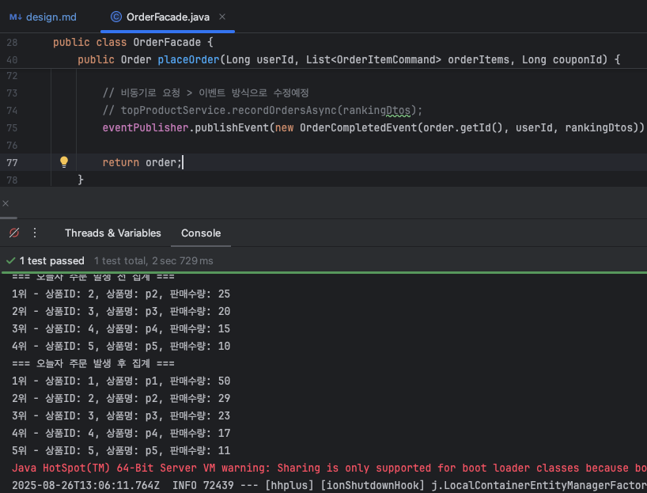

# E-commerce Order Additional Event

## 부가 로직에 대한 관심사 분리 
### 목적

> 주문 생성 시 핵심 트랜잭션과 부가기능(집계, 알림 등)을 분리하여 안정성과 가독성 확보

### 설계 방향

- 주문 생성은 `OrderFacade` 내에서 트랜잭션 단위로 처리
- 주문 생성 완료 시점에 **주문 완료 이벤트(`OrderCompletedEvent`)** 발행
- 부가 로직은 별도 이벤트 핸들러에서 수행

### 이벤트 흐름

- `OrderFacade.placeOrder()`
  -  사용자 검증, 상품 재고 차감, 쿠폰 사용, 잔액 차감, 주문 생성 처리
  - 완료 후 `OrderCompletedEvent` 발행
- `TopProductEventHandler`
  - `OrderCompletedEvent` 수신
  - 주문 상품 정보를 기반으로 랭킹 집계 수행

### 기능 구현 전 테스트 코드

- 기존에 구현한 테스트 코드가 성공하는 상태가 유지 되도록 이벤트 방식의 기능으로 수정되어야 함
- 기능 구현 전 테스트 코드 성공 상태 확인

  - `setUp`: 2~6번 상품 Redis에 직접 세팅
    - 6번 상품은 3일전으로 집계되지 않음
  - 오늘자 주문 생성 후 1번 상품이 1위로 집계되고,
  - 2~5번 상품 또한 오늘 발생한 주문 수량만큼 추가 집계됨

## 기능 구현

### 이벤트 관련 클래스 구현

- [OrderCompletedEvent.java](https://github.com/hanghae-plus-anveloper/hhplus-e-commerce-java/blob/develop/src/main/java/kr/hhplus/be/server/common/event/OrderCompletedEvent.java)
  ```java
  package kr.hhplus.be.server.common.event;
  
  import kr.hhplus.be.server.analytics.application.TopProductRankingDto;
  
  import java.util.List;
  
  public record OrderCompletedEvent(
          Long orderId,
          Long userId,
          List<TopProductRankingDto> rankingDtoList
  ) {
  }
  ```
  - 주문 생성 성공 이벤트

- [TopProductEventHandler.java](https://github.com/hanghae-plus-anveloper/hhplus-e-commerce-java/blob/develop/src/main/java/kr/hhplus/be/server/analytics/application/TopProductEventHandler.java)
  ```java
  @Component
  @RequiredArgsConstructor
  public class TopProductEventHandler {
  
    private final TopProductService topProductService;
  
    @Async
    @TransactionalEventListener(phase = TransactionPhase.AFTER_COMMIT)
    public void on(OrderCompletedEvent event) {
      topProductService.recordOrdersAsync(event.rankingDtoList());
    }
  } 
  ```
  - `AFTER_COMMIT` 에 의해 트랜젝션이 커밋 되고 나서 이벤트 동작으로 구현

### 테스트 성공 상태 확인


- Facade에서 이벤트로 주문 성공 상태를 발행해도 현재 테스트가 성공하는 것을 확인

