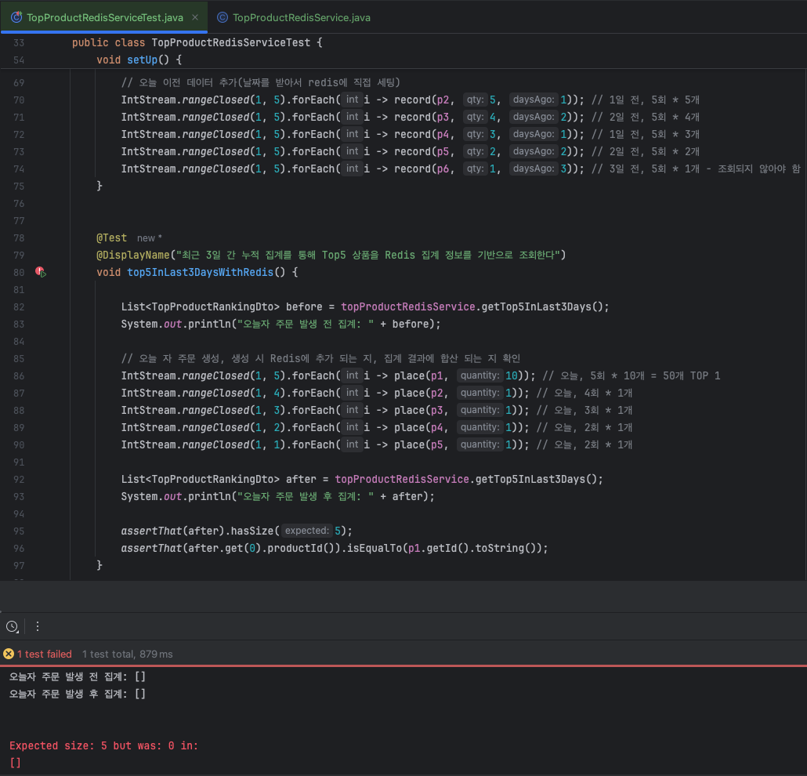
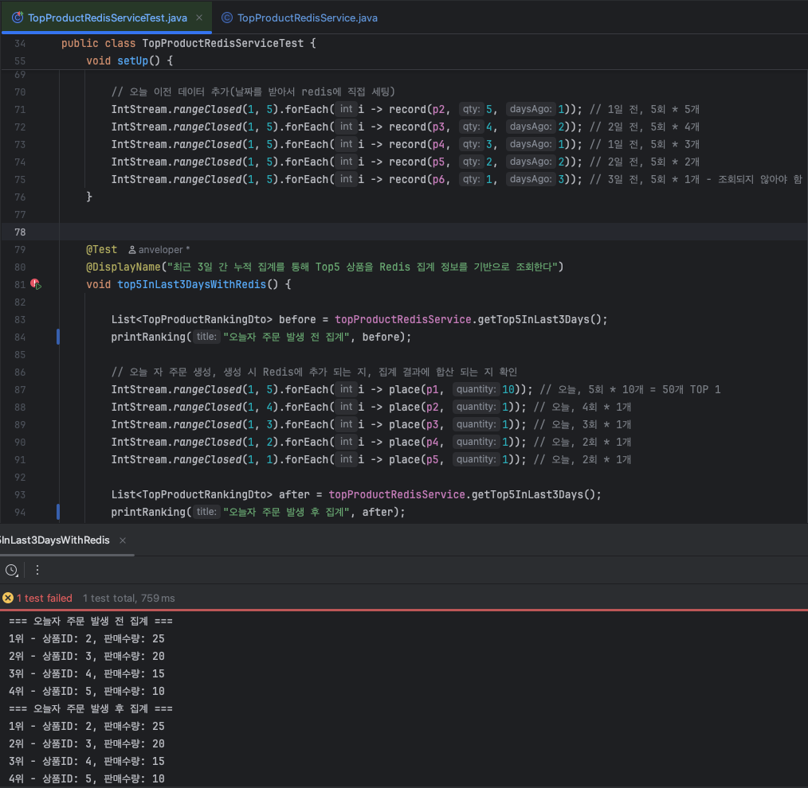
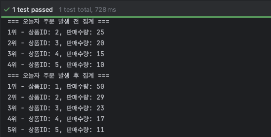

# E-commerce Ranking Design

> `Redis` 기반의 가장 많이 주문한 상품 랭킹을 설계한다.
> 해당 설계를 기반으로 개발 및 구현한다.

## Redis 기반 상품 랭킹 설계

### 목표

- 기존 DB(NativeQuery) + 캐싱 기반의 상품 랭킹에서, Redis 기반 집계 방식으로 전환
- 트래픽 급증 상황에서도 빠른 랭킹 조회 성능 확보 
- 조회 조건: 오늘을 포함한 최근 3일 간 랭킹

### 기존 방식

- **DB 쿼리 기반 + 캐싱**
  - 사용자 조회 시 캐시 확인 → 없으면 DB Native Query 실행
  - 실행 결과를 Redis 캐시에 저장 (자정 만료)
- 장점: DB 데이터 정합성 100% 보장
- 단점: 조회 시점마다 DB 부하 발생 → 트래픽 급증 시 성능 저하

### 개선 방식 (Redis 기반 집계)

- 주문 발생 시점에 Redis에 바로 집계 반영
  - 주문 생성 시 Redis Sorted Set(`ZSET`)에 `ZINCRBY`로 상품 판매량 업데이트
- 랭킹 조회 시점
  - Redis Sorted Set(ZSET)에서 누적된 값 바로 활용
  - 최근 3일 집계: `ZUNIONSTORE` 또는 `ZUNION` 연산으로 3일치 키 병합
- 정합성 보장
  - Redis 업데이트는 트랜잭션 커밋 이후에만 수행 ← `차주 추가 구현, 일단 기능 수행`
  - ~~이벤트 트리거는 `AOP` `@PublishedOrder`로 표준화~~ ← 적절하지 않음
    > `AOP`는 횡단 관심사(`cross-cutting concern`)를 모듈화 하는데 적합하며,
    > 특정 기능을 타겟하는 `AOP`는 오히려 비즈니스 로직이 가려지고, 가독성이 떨어지게 됨.
  - ~~`@TransactionalEventListener(AFTER_COMMIT)` 구간에서 `ZINCRBY` 호출~~
    > Redis 자료구조를 활용해 보는 것으로 구현
    > 차주에 이벤트 발행 방식으로 변경
- 중복 집계 방지
  - 멱등 키(`RANK:PROCESSED:{orderId}`)를 함께 발급함

### Key & 자료구조

- `Redis` 자료구조
  - Sorted Set (ZSet): 상품 별 판매량을 score로 관리하여 정렬 및 집계에 용이함.
  - Key: `RANKING:PRODUCT:20250817`  
  - Value: member - productId, score - quantity(판매수량) 


## 통합 테스트

### 통합 테스트 목적

- 각각의 주문이 생성되면, Redis에 집계되어야 한다.
- 오늘을 포함한 3일 치의 상품에 대한 ID와 판매수량을 확인할 수 있어야 한다.

### 조건

- [TopProductRedisServiceTest.java](https://github.com/hanghae-plus-anveloper/hhplus-e-commerce-java/blob/develop/src/test/java/kr/hhplus/be/server/analytics/application/TopProductRedisServiceTest.java)
- 사용자는 1명으로 고정하여 순수하게 상품과 판매 수량만 집계되는 정보로 통제
- 잔액이나 상품의 수량은 충분하여 주문이 실패하지 않음
- 과거 1~3일 전의 데이터는 `setUp` 단계에서 미리 세팅(Product 1번 제외)
  - 실제로 시스템의 날짜를 바꿔가면서 넣어보려 하였으나, 주요 로직에 집중하고자 이전 데이터는 미리 넣는 것으로 구현했습니다.
  ```java
  @BeforeEach
  void setUp() {     
      /* ... */
  
      // 오늘 이전 데이터 추가(날짜를 받아서 redis에 직접 세팅)
      IntStream.rangeClosed(1, 5).forEach(i -> record(p2, 5, 1)); // 1일 전, 5회 * 5개
      IntStream.rangeClosed(1, 5).forEach(i -> record(p3, 4, 2)); // 2일 전, 5회 * 4개
      IntStream.rangeClosed(1, 5).forEach(i -> record(p4, 3, 1)); // 1일 전, 5회 * 3개
      IntStream.rangeClosed(1, 5).forEach(i -> record(p5, 2, 2)); // 2일 전, 5회 * 2개
      IntStream.rangeClosed(1, 5).forEach(i -> record(p6, 1, 3)); // 3일 전, 5회 * 1개 - 조회되지 않아야 함
  }
  ```

- 오늘자의 주문은 실제 Redis에 정보를 발행하는 OrderFacade를 통해 직접 호출
  - 오늘자 주문 생성 전 어제자까지의 집계 상태 확인
  - 오늘자 주문 생성 후 **상품 5개**가 반환되는 지 확인
  - 오늘 가장 주문을 많이 생성한 **1번 상품이** 3일 전체에서 **1위인 지** 확인
  ```java
  @Test
  @DisplayName("최근 3일 간 누적 집계를 통해 Top5 상품을 Redis 집계 정보를 기반으로 조회한다")
  void top5InLast3DaysWithRedis() {

      List<TopProductRankingDto> before = topProductRedisService.getTop5InLast3Days();
      System.out.println("오늘자 주문 발생 전 집계: " + before);

      // 오늘 자 주문 생성, 생성 시 Redis에 추가 되는 지, 집계 결과에 합산 되는 지 확인
      IntStream.rangeClosed(1, 5).forEach(i -> place(p1, 10)); // 오늘, 5회 * 10개 = 50개 TOP 1
      IntStream.rangeClosed(1, 4).forEach(i -> place(p2, 1)); // 오늘, 4회 * 1개
      IntStream.rangeClosed(1, 3).forEach(i -> place(p3, 1)); // 오늘, 3회 * 1개
      IntStream.rangeClosed(1, 2).forEach(i -> place(p4, 1)); // 오늘, 2회 * 1개
      IntStream.rangeClosed(1, 1).forEach(i -> place(p5, 1)); // 오늘, 2회 * 1개

      List<TopProductRankingDto> after = topProductRedisService.getTop5InLast3Days();
      System.out.println("오늘자 주문 발생 후 집계: " + after);

      assertThat(after).hasSize(5);
      assertThat(after.get(0).productId()).isEqualTo(p1.getId().toString());
  }
  ```
  - `place`함수: `OrderFacade`에 주문을 생성하는 헬프 함수
  - `record`함수: `TopProductRedisService`에 직접 기록하는 함수(오늘 이전 데이터 세팅)
  - `printRanking`함수: 테스트 진행 간 집계 결과 출력용 함수(추가)
 
### 실패 테스트 작성 결과
 


- 컴파일만 되는 상태 구현
  - 빈 배열만 반환

## 기능 구현

### Redis 저장 함수 / 집계 로직 구현 

- [TopProductRedisService.java](https://github.com/hanghae-plus-anveloper/hhplus-e-commerce-java/blob/develop/src/main/java/kr/hhplus/be/server/analytics/application/TopProductRedisService.java)
- 주문이 발생할 때 Redis에 반영하기 위한 `TopProductRedisService` 구현
  - 기존 DB 쿼리 기반인 `TopProductQueryService`와 분리하여 구현했습니다.
  - `OrderFacade`에서 사용하는 계층으로 기존 `analytics/application`에 위치시켰습니다.

- 전체 코드(주요 로직)
  ```java
  @Service
  @RequiredArgsConstructor
  public class TopProductRedisService {
  
      private final StringRedisTemplate redisTemplate;
      private static final DateTimeFormatter FORMATTER = DateTimeFormatter.BASIC_ISO_DATE;
  
      private static final int TTL_DAYS = 4;
      private static final String PRODUCT_RANKING_PREFIX = "RANKING:PRODUCT:";
  
      private String getDailyKey(LocalDate date) {
          return PRODUCT_RANKING_PREFIX + date.format(FORMATTER);
      }
  
      // 당일
      public void recordOrder(String productId, int quantity) {
          recordOrder(productId, quantity, LocalDate.now());
      }
  
      // 특정 일자
      public void recordOrder(String productId, int quantity, LocalDate date) {
          String key = getDailyKey(date);
          redisTemplate.opsForZSet().incrementScore(key, productId, quantity);
  
          LocalDateTime expireAt = date.plusDays(TTL_DAYS).atStartOfDay(); // 단순 생성시간(java.time)으로 교체 가능
          Instant instant = expireAt.atZone(ZoneId.systemDefault()).toInstant();
          redisTemplate.expireAt(key, instant);
      }
  
      public List<TopProductRankingDto> getTop5InLast3Days() {
          LocalDate today = LocalDate.now();
          List<String> keys = List.of(
                  getDailyKey(today),
                  getDailyKey(today.minusDays(1)),
                  getDailyKey(today.minusDays(2))
          );
  
          String unionKey =  PRODUCT_RANKING_PREFIX + "TOP5LAST3DAYS";
  
          // 합집합 새로 저장
          redisTemplate.opsForZSet().unionAndStore(keys.get(0), keys.subList(1, keys.size()), unionKey);
  
          // score 값을 포함한 튜플 조회
          Set<ZSetOperations.TypedTuple<String>> tuples =
                  redisTemplate.opsForZSet().reverseRangeWithScores(unionKey, 0, 4);
  
          if (tuples == null) {
              return List.of();
          }
  
          return tuples.stream()
                  .map(t -> new TopProductRankingDto(
                          t.getValue(),
                          t.getScore() != null ? t.getScore().intValue() : 0
                  ))
                  .collect(Collectors.toList());
      }
  }
  ```

- `redisTemplate.opsForZSet().incrementScore` 함수에 `key`, `value`, `delta`값을 사용하여 `score = score + delta`로 판매수량 누적
- `redisTemplate.expireAt` 만료시간 주입(java.time 으로도 가능)
- `redisTemplate.opsForZSet().unionAndStore`로 오늘자 키에 어제, 그제 키를 합침
  - `productId`를 `value`로 같은 `score`는 합산되어 저장 
  - `unionKey`는 이미 있는 경우 덮어씌워지기 때문에 일자가 바뀌면 이전 일자는 덮어쓰기 됨
- `redisTemplate.opsForZSet().reverseRangeWithScores` 역순으로 0번 부터 4번까지 반환
  - 튜플로 받아서 `score`값도 `soldQty`에 사용할 수 있도록 수정

### 구현 후 테스트 결과



- 집계 결과는 출력되는 것 확인
- 하지만 오늘 주문이 발생한 뒤에도 5개가 아니라 4개만 반환되어 테스트 실패
  - `setUp`에선 2 ~ 6번까지 5가지 상품을 넣었지만, 6번 상품은 3일 전 값으로 반영하여 조회되지 않는 것이 정상
- 1번 상품이 없어서 테스트 실패
  - 오늘자 데이터는 OrderFacade에 placeOrder로 생성되어야 하기 때문에 아직 미구현된 상태여서 실패하는 것이 정상

### 주문 생성 시 Redis 저장 로직 구현

- [OrderFacade.java](https://github.com/hanghae-plus-anveloper/hhplus-e-commerce-java/blob/develop/src/main/java/kr/hhplus/be/server/order/facade/OrderFacade.java) 수정
  - 주문 생성 이후 (트랜젝션 내에서) redis에 비동기 적으로 저장하도록 요청 
    - 기존에 repository에 주문을 저장하면서 return 하는 부분은 order로 담아두고,
    - items 배열에서 ProductId와 quantity만 사용하여 `topProductRedisService`에 비동기로 요청합니다.    
    ```java
    @Transactional
    @DistributedLock(prefix = LockKey.PRODUCT, ids = "#orderItems.![productId]")
    public Order placeOrder(Long userId, List<OrderItemCommand> orderItems, Long couponId) {
        /* ... */
        
        Order order = orderService.createOrder(user, items, total);
    
        List<TopProductRankingDto> rankingDtos = items.stream()
                .map(i -> new TopProductRankingDto(i.getProduct().getId().toString(), i.getQuantity()))
                .toList();
    
        // 비동기로 요청
        topProductRedisService.recordOrdersAsync(rankingDtos);    
    
        return order;
    }
    ```
  - 현재 상태는 트랜젝션 내부에서 실행중이므로, 커밋이 보장되지 않을 수 있음 
  - `Transactional Outbox` 패턴을 추후에 적용하여 이벤트 방식으로 수정 필요

- [TopProductRedisService.java](https://github.com/hanghae-plus-anveloper/hhplus-e-commerce-java/blob/develop/src/main/java/kr/hhplus/be/server/analytics/application/TopProductRedisService.java)
  - `recordOrdersAsync` 함수 추가
    - `@Async` 어노테이션을 사용하기 위해 OrderFacade 외부에 선언 필요
    - 배열을 받아서 `Redis`에 저장하되, 저장 시마다 `try {} catch (ignored){}` 로 에러가 반환되지 않도록 구현
    ```java
    @Service
    @RequiredArgsConstructor
    public class TopProductRedisService {
        /* ... */
    
        @Async
        public void recordOrdersAsync(List<TopProductRankingDto> items) {
            for (TopProductRankingDto item : items) {
                try {
                    recordOrder(item.productId(), (int) item.soldQty());
                } catch (Exception ignored) {
                }
            }
        }
    
        /* ... */
    }
    ```
  
### 구현 후 테스트 성공 결과



- 처음 의도한 대로, 세팅 직후에는 4개 상품만 노출되며
- 오늘자 주문이 모두 추가된 뒤에는 **1번 상품이 포함**되고, **1위로 집계** 됨
- 나머지 주문들도 오늘자 수량이 정상적으로 합산되는 것 확인

## 추후계획

- 생성된 주문이 다시 집계가 되지 않도록 멱등 키(`RANK:PROCESSED:{orderId}`) 추가 로직 구현
- 생성 시점의 DB와 Redis 정합성 보장을 위해 이벤트를 활용한 `Transactional Outbox` 패턴 적용 예정

## 회고

- 이제 설계 > 테스트 코드 작성 > 컴파일만 성공 구현 > 기능 구현 순으로 개발하는 것에 익숙해진 것 같습니다.
- `TopProductRedisService`에서 활용하는 `TopProductRankingDto`는 `domain`에서 가져다 사용하는 DTO가 아니어서 `anlaytic/application`에 함께 배치했는데, 아직 DTO를 어디에 둬야 할 지 헷갈립니다. 
- 일관된 구조를 위해 하나의 기능에서만 쓰이면 그 파일과 함께 배치하고, 재사용되는 것들만 `dto` 디렉토리를 만들어 사용하고 있습니다. 과제 끝내고 다시 한 번 레이어드에서 DTO 어디에 두는 지 복습하는 시간을 갖겠습니다..
