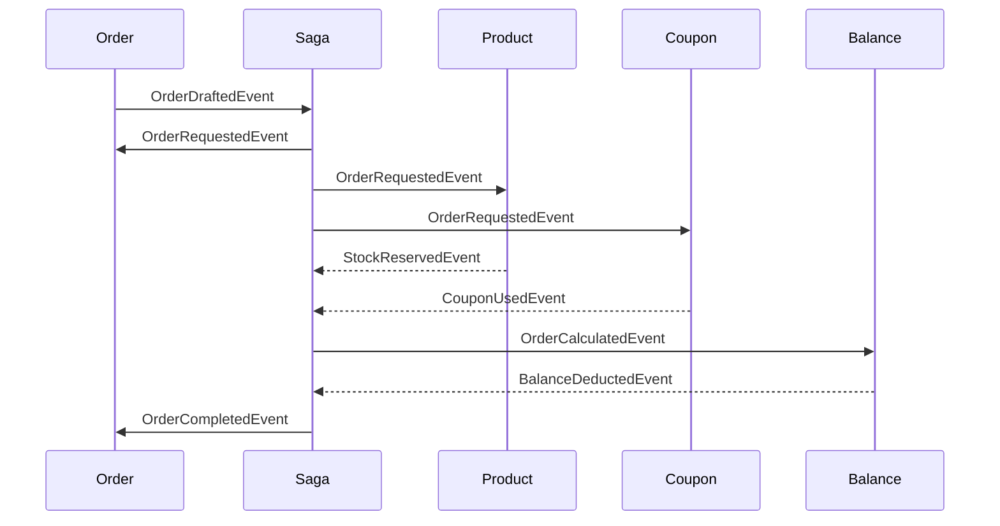
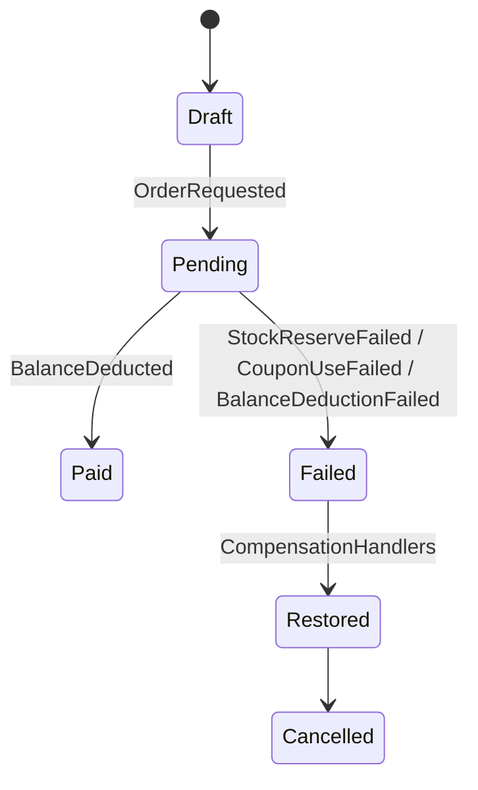
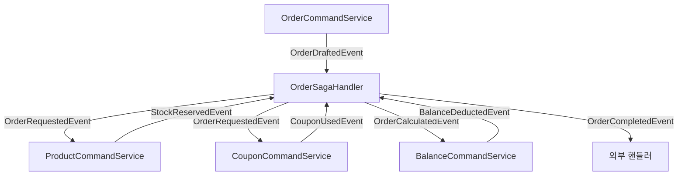

# E-commerce Distributed Transaction 

## 학습 내용

### Saga Pattern

- `Orchestration`: `Orchestrator`가 모든 흐름을 관리
  - 순차적으로 각 도메인을 호출하고, 실패 시 보상 트랜잭션을 지시
  - 흐름이 명확하고 제어가 용이하지만, `Orchestrator`가 과도한 책임을 가지며, 확장성/유연성이 떨어질 수 있음

- `Choreography`: 각 도메인이 이벤트를 발행/구독하며 Saga를 진행
  - 도메인간 결합성이 줄어들고 확장성이 뛰어남
  - 흐름이 분산되어있어 추적/디버깅이 어려움

## 도메인 별 트랜젝션이 분리

### 목적

> 분산 환경을 고려한 도메인별 책임의 트랙젠션 로직 설계   
> 현재 비즈니스 로직 중 다수의 도메인이 모두 연계되어 처리되는 상태를 단일 트랜젝션에서 관리한다면 일관성의 보장은 쉽지만, 확장성이 떨어진다.   
> 분산 트

### 발생 가능한 문제

- 부분 실패 
  - `Order`는 생성되었지만 `Product`에서 재고 차감 실패
  - `Coupon` 사용 처리 후 `Balance` 차감 실패 → 쿠폰만 소모된 상태
- 이벤트 순서 문제
  - `StockReservedEvent`보다 `CouponUsedEvent`가 먼저 도착하거나, 중복 전달되는 경우
- 중복 처리
  - 동일 이벤트가 두 번 소비되면 잔액이 이중 차감될 위험
- 최종 일관성 지연
  - 쓰기(`Command`)는 즉시 반영되었으나, 조회(`Query`)는 이벤트 동기화 지연으로 잠시 다른 상태 보일 수 있음
- 보상 트랜잭션 필요성
  - `Balance` 차감 실패 시 → 이미 차감된 재고/쿠폰을 원복해야 함

## 설계 방향

### 1. 주문 시작
 
- `OrderCommandService`가 사용자 요청을 받아 `Order` 엔티티를 `OrderStatus.DRAFT`로 생성
- 생성 직후 `OrderSagaRepository`에 초기 상태를 기록한 뒤 `OrderRequestedEvent` 발행
  - 커밋 이후에 `DRAFT` 상태로 주문을 커밋/저장하고, 이를 자체 `OrderDraftedEvent` 감지하여 Saga 저장소에 저장
    - 초기 상태를 `OrderSagaRepository`에 저장하는 타이밍이 어려웠습니다.
    - `PENDING` 앞에 상태를 하나 더 둬서 다른 도메인이 호출할 Saga 저장소가 확실히 존재하도록 단계를 나눴습니다.
- 주문 상태를 `PENDING`으로 다른 도메인에 전이

### 2. 이벤트 흐름 및 도메인 역할



- `OrderRequestedEvent` 발행
  - 각 도메인이 이를 구독하여 각각의 트렌젝션에서 로직 실행
  - `Product` 도메인: 재고 확인 및 차감 시도 
    - 성공 시 `StockReservedEvent`, ~~`PriceQuotedEvent`~~ 발행
    - 실패 시 `StockReserveFailedEvent` 발행
  - `Coupon` 도메인: 쿠폰이 있으면 유효성 확인 및 사용 처리 
    - 사용 시 `CouponUsedEvent` 발행
    - 실패 시 `CouponUseFailedEvent` 발행
    - ~~미사용 시에는 `CouponSkippedEvent` 발행 (혹은 0원으로 성공 처리)~~
  - `Balance` 도메인: 총액 및 차감액을 바탕으로 잔액 차감
    - ~~성공 이벤트(`PriceQuotedEvent`, `CouponUsedEvent`/`CouponSkippedEvent`)를 기반으로 최종 결제 금액 계산~~
    - `OrderSagaHandler`가 발행한 `OrderCalculatedEvent`에 의해 잔액 차감 수행
    - 결제 가능 여부 확인 후 차감
    - 성공 시 `BalanceDeductedEvent` 발행
    - 실패 시 `BalanceDeductionFailedEvent` 발행

- `OrderSagaHandler`: 위 이벤트를 구독하여 Saga 상태를 갱신
  - ~~모든~~ Product, Coupon 도메인의 성공 이벤트 수집
    - `Product` → `StockReservedEvent`~~와 `PriceQuotedEvent`~~ 수집
    - `Coupon` → `CouponUsedEvent` ~~또는 `CouponSkippedEvent`~~ 수집
    - ~~`Balance` → `BalanceDeductedEvent` 수집~~
  - [추가] `OrderCalculatedEvent` 발행 (`StockReservedEvent`, `CouponUsedEvent` 수집 시)
    - `Balance` → `BalanceDeductedEvent` 수집
  - 최종적으로 `OrderCompletedEvent` 발행
    - `OrderEventHandler` → `OrderStatus.PAID` 상태 변경  
    - 집계, 외부 전송 핸들러가 이를 수집 


### 3. 보상 트랜잭션 설계 - Compensation



- 각 도메인에서 실패 시 **원복 이벤트**를 발행
  - `Product`: `StockReserveFailedEvent` → 이미 차감된 재고 복구(트랜젝션에 의한 롤백), 쿠폰 사용 원복
  - `Coupon`: `CouponUseFailedEvent` → 쿠폰 사용 상태 되돌림(트랜젝션에 의한 롤백), 상품 재고 원복
  - `Balance`: `BalanceDeductionFailedEvent` → 차감된 금액 환불(트랜젝션에 의한 롤백), 쿠폰 사용 원복, 상품 재고 원복
- 각 도메인은 다른 도메인의 실패 여부를 수집하고, 실행여부를 확인하여 원복 로직 수행
- 다른 도메인의 실패 이벤트로 인한 원복 쿼리와 원래 트랜젝션 쿼리의 충돌이 발생할 수도 있고,
- 실패 이벤트가 먼저 수집된 뒤에 정상 이벤트를 수집하게 되면 실패가 무시되어 실행될 수 있음
- 각 보상 핸들러는 `orderId`로 `SagaState`를 조회해 해당 도메인이 실제로 `SUCCESS`였던 경우에만 복구
- Saga 저장소에서 도메인별 성공/실패/취소됨/복구됨 상태를 관리

### 4. 동시성 제어 설계

- 단일 자원 충돌을 막기 위해 Redisson 기반 `@DistributedLock` 적용
- 주요 기준 키
  - Product: `productId` 기준 → `reserveStock` / `restoreStock`
  - Coupon: `couponId` 기준 → `useCoupon` / `restoreCoupon`
  - Balance: `userId` 기준 → `deductBalance` / `restoreBalance`
- Order 단계에서는 멀티락을 사용하지 않음
  - 주문은 초안(DRAFT)만 생성하고, 실제 차감은 도메인별로 병렬적으로 수행되므로 각 도메인에서 개별 락을 적용
  - userId 기준으로 중복 요청방지를 위한 락 적용 
- @Version 기반 낙관적 락, 조건부 업데이트 쿼리 병행 → DB 일관성과 Redis 분산 환경 모두에서 안전성 확보

### 5. CQRS 설계

- 각 도메인 별 Command, Query 모델을 분리하여 수정과 조회 로직을 분산
- 롤백이 필요한 수정 함수만 트랜젝션 내에서 처리 가능
- 다만, 지금 모든 도메인이 각자 상태값을 바꾸는 설계로 구현하여 현재 주문 생성 중에는 각 도메인의 `Command` 부분만 사용

### 6. Saga 상태 저장소

- 발급된 Saga의 현재 상태를 추적하기 위한 저장소, JPA 혹은 Redis에 구현 가능
- 모든 도메인이 이벤트 기반으로 움직이기 때문에, 영속성을 강하게 가져가기 위해 JPA 기반으로 구현

- `OrderSagaState`: 필요 상태 정보
  - 주문 메타 정보 
    - `orderId`: 최초 DRAFT의 상태의 주문 정보 PK
    - `userId`: 사용자 ID
    - `items`: 사용자가 요청한 item 배열
      - `productId`: 상품 번호
      - `quantity`: 상품 수량
    - `couponId`: 쿠폰 사용 시 쿠폰 번호
  - 각 도메인 별 트랜젝션 수행 정보: `SUCCESS`, `FAILED`, `CANCELED`, `RESTORED`
    - `productReserved`: 상품 재고 차감 수행, 총액 반환 여부
    - `couponApplied`: 쿠폰 사용 여부
    - `balanceCharged`: 잔액 차감 여부
  - 잔액 계산을 위한 결과값 정보 / 이벤트에 담아서도 전송하지만, 소실되어 이벤트를 재발행하거나, 원복해야할 내용 참조를 위해
    - `subTotalAmount`: 상품 총액 원가
    - `discountAmount`: 쿠폰 할인액
    - `totalAmount`: 최종 금액

## 기능 구현을 위한 필요 클래스

### 상태 저장소 구성

- [OrderSagaRepository](https://github.com/hanghae-plus-anveloper/hhplus-e-commerce-java/blob/develop/src/main/java/kr/hhplus/be/server/saga/domain/OrderSagaRepository.java): Saga 상태 저장소
- [OrderSagaEventStatus](https://github.com/hanghae-plus-anveloper/hhplus-e-commerce-java/blob/develop/src/main/java/kr/hhplus/be/server/saga/domain/OrderSagaEventStatus.java) (enum: PENDING, SUCCESS, FAILED, CANCELED, RESTORED)
- [OrderSagaState](https://github.com/hanghae-plus-anveloper/hhplus-e-commerce-java/blob/develop/src/main/java/kr/hhplus/be/server/saga/domain/OrderSagaState.java): 주문 Saga 상태값
  <details><summary>주요 코드</summary>
  
  ```java
  @Entity
  @Table(name = "order_saga_state")
  @Getter
  @NoArgsConstructor(access = AccessLevel.PROTECTED)
  @AllArgsConstructor
  @Builder
  public class OrderSagaState {
  
      @Id
      private Long orderId;   // 주문 ID (Order 엔티티 PK와 동일)
  
      private Long userId;
  
      @ElementCollection
      @CollectionTable(name = "order_saga_items", joinColumns = @JoinColumn(name = "order_id"))
      private List<OrderSagaItem> items;
  
      private Long couponId;
  
      // 각 도메인 상태
      @Enumerated(EnumType.STRING)
      private OrderSagaEventStatus productReserved;
  
      @Enumerated(EnumType.STRING)
      private OrderSagaEventStatus couponApplied;
  
      @Enumerated(EnumType.STRING)
      private OrderSagaEventStatus balanceCharged;
  
      // 금액 정보
      private Integer subTotalAmount;
      private Integer discountAmount;
      private Integer totalAmount;
  
      public void markProductReservedSuccess(int subTotalAmount) {
          this.productReserved = OrderSagaEventStatus.SUCCESS;
          this.subTotalAmount = subTotalAmount;
      }
  
      public void markCouponAppliedSuccess(int discountAmount) {
          this.couponApplied = OrderSagaEventStatus.SUCCESS;
          this.discountAmount = discountAmount;
      }
  
      public void markBalanceChargedSuccess(int totalAmount) {
          this.balanceCharged = OrderSagaEventStatus.SUCCESS;
          this.totalAmount = totalAmount;
      }
  
      public void markFailedDomain(String domain) {
          switch (domain) {
              case "PRODUCT" -> this.productReserved = OrderSagaEventStatus.FAILED;
              case "COUPON" -> this.couponApplied = OrderSagaEventStatus.FAILED;
              case "BALANCE" -> this.balanceCharged = OrderSagaEventStatus.FAILED;
          }
      }
  
      public boolean isReadyForCalculation() {
          return productReserved == OrderSagaEventStatus.SUCCESS
                  && couponApplied == OrderSagaEventStatus.SUCCESS
                  && subTotalAmount != null
                  && discountAmount != null;
      }
  }
  ```
  </details>


### 도메인 이벤트

- Order
  - `OrderDraftedEvent`: 초안 생성됨 이벤트, 자기 참조용
  - `OrderRequestedEvent`: 주문 요청됨 이벤트, 각 도메인 참조용
  - `OrderCalculatedEvent`: [추가] 상품 총액과 쿠폰 차감액이 성공적으로 반환되었을 때, `OrderSagaHandler.tryTriggerOrderCalculated`에 의해 발행 
  - `OrderCompletedEvent`: 주문 완료 이벤트
  - `OrderFailedEvent`: 주문 실패 이벤트
- Product
  - `StockReservedEvent`: 재고 차감 완료 이벤트
  - `PriceQuotedEvent`: 주문 총액 이벤트(재고 차감 이벤트와 통합 가능) - 제외
  - `StockReserveFailedEvent`: 재고 차감 실패 이벤트 
- Coupon
  - `CouponUsedEvent`: 쿠폰 사용 이벤트 + 할인액 반환
  - `CouponSkippedEvent`: 쿠폰 미사용 이벤트(쿠폰 0원 사용 이벤트로 도 가능 할 것으로 보임) - 제외
  - `CouponUseFailedEvent`: 쿠폰 사용 실패 이벤트
- Balance
  - `BalanceDeductedEvent`: 잔액 차감 이벤트
  - `BalanceDeductionFailedEvent`: 잔액 차감 실패 이벤트

### Saga 상태 머신 핸들러

- [OrderSagaHandler](https://github.com/hanghae-plus-anveloper/hhplus-e-commerce-java/blob/develop/src/main/java/kr/hhplus/be/server/saga/application/OrderSagaHandler.java): Saga의 상태 관리 메타 데이터 및 부가 정보 관리
  <details><summary>주요 코드</summary>
  
  ```java
  @Slf4j
  @Component
  @RequiredArgsConstructor
  public class OrderSagaHandler {
  
      private final ApplicationEventPublisher publisher;
      private final OrderSagaRepository sagaRepository;
  
      // 주문 조안 생성 시 감지 후 저장
      @Async
      @TransactionalEventListener(phase = TransactionPhase.AFTER_COMMIT)
      public void on(OrderDraftedEvent event) {
          // 초안 저장 시 초기 Saga 상태 저장
          OrderSagaState sagaState = OrderSagaState.builder()
                  .orderId(event.orderId())
                  .userId(event.userId())
                  .items(event.items())
                  .couponId(event.couponId())
                  .productReserved(OrderSagaEventStatus.PENDING)
                  .couponApplied(OrderSagaEventStatus.PENDING)
                  .balanceCharged(OrderSagaEventStatus.PENDING)
                  .build();
  
          sagaRepository.save(sagaState);
          log.info("[SAGA] Drafted order={}, user={} saga initialized", event.orderId(), event.userId());
  
          // Saga 저장소 생성 후 각 도메인별 주문 요청 이벤트 발행
          publisher.publishEvent(
                  new OrderRequestedEvent(event.orderId(), event.userId(), event.items(), event.couponId())
          );
      }
  
      private void tryTriggerOrderCalculated(OrderSagaState saga) {
          if (saga.isReadyForCalculation()) {
              int total = saga.getSubTotalAmount() - saga.getDiscountAmount();
              publisher.publishEvent(new OrderCalculatedEvent(
                      saga.getOrderId(),
                      saga.getUserId(),
                      total,
                      saga.getItems(),
                      saga.getCouponId()
              ));
              log.info("[SAGA] order={} calculation prepared → total={}", saga.getOrderId(), total);
          }
      }
  
      // 재고 차감 상태 업데이트
      @Async
      @TransactionalEventListener(phase = TransactionPhase.AFTER_COMMIT)
      public void on(StockReservedEvent event) {
          sagaRepository.findById(event.orderId()).ifPresent(saga -> {
              saga.markProductReservedSuccess(event.subTotalAmount());
              sagaRepository.save(saga);
              log.info("[SAGA] order={} product reserved success, subtotal={}", event.orderId(), event.subTotalAmount());
              tryTriggerOrderCalculated(saga);
          });
      }
  
      // 쿠폰 사용 상태 업데이트
      @Async
      @TransactionalEventListener(phase = TransactionPhase.AFTER_COMMIT)
      public void on(CouponUsedEvent event) {
          sagaRepository.findById(event.orderId()).ifPresent(saga -> {
              saga.markCouponAppliedSuccess(event.discountAmount());
              sagaRepository.save(saga);
              log.info("[SAGA] order={} coupon used success, discount={}", event.orderId(), event.discountAmount());
              tryTriggerOrderCalculated(saga);
          });
      }
  
      // 잔액 차감 완료 상태 업데이트
      @Async
      @TransactionalEventListener(phase = TransactionPhase.AFTER_COMMIT)
      public void on(BalanceDeductedEvent event) {
          sagaRepository.findById(event.orderId()).ifPresent(saga -> {
              saga.markBalanceChargedSuccess(event.totalAmount());
              sagaRepository.save(saga);
              log.info("[SAGA] order={} balance deducted success, total={}", event.orderId(), event.totalAmount());
          });
      }
  
      // 상품 재고 차감 실패 상태 업데이트
      @Async
      @TransactionalEventListener(phase = TransactionPhase.AFTER_COMMIT)
      public void on(StockReserveFailedEvent event) {
          sagaRepository.findById(event.orderId()).ifPresent(saga -> {
              saga.markFailedDomain("PRODUCT");
              sagaRepository.save(saga);
              log.warn("[SAGA] order={} product reserve failed, reason={}", event.orderId(), event.reason());
          });
      }
  
      // 쿠폰 사용 실패 상태 업데이트
      @Async
      @TransactionalEventListener(phase = TransactionPhase.AFTER_COMMIT)
      public void on(CouponUseFailedEvent event) {
          sagaRepository.findById(event.orderId()).ifPresent(saga -> {
              saga.markFailedDomain("COUPON");
              sagaRepository.save(saga);
              log.warn("[SAGA] order={} coupon use failed, reason={}", event.orderId(), event.reason());
          });
      }
  
      // 잔액 차감 실패 상태 업데이트
      @Async
      @TransactionalEventListener(phase = TransactionPhase.AFTER_COMMIT)
      public void on(BalanceDeductionFailedEvent event) {
          sagaRepository.findById(event.orderId()).ifPresent(saga -> {
              saga.markFailedDomain("BALANCE");
              sagaRepository.save(saga);
              log.warn("[SAGA] order={} balance deduction failed, reason={}", event.orderId(), event.reason());
          });
      }
  }
  ```
  </details>


### 주문 생성 주체

- [OrderCommandService](https://github.com/hanghae-plus-anveloper/hhplus-e-commerce-java/blob/develop/src/main/java/kr/hhplus/be/server/order/application/OrderCommandService.java): 주문 초기값 생성
  <details><summary>주요 코드</summary>
  
  ```java
  @Service
  @RequiredArgsConstructor
  public class OrderCommandService {
  
      private final OrderRepository orderRepository;
      private final ApplicationEventPublisher publisher;
  
      @Transactional
      @DistributedLock(prefix = LockKey.ORDER, ids = "#userId")
      public Order createDraft(Long userId, List<OrderItemCommand> items, Long couponId) {
  
          Order order = Order.draft(userId, couponId);
          orderRepository.save(order);
  
          // Saga 초기화를 위해 DraftedEvent 발행
          publisher.publishEvent(new OrderDraftedEvent(
                  order.getId(),
                  order.getUserId(),
                  OrderSagaMapper.toSagaItems(items),
                  couponId
          ));
  
          return order;
      }
  }
  ```
  </details>

- [OrderEventHandler](https://github.com/hanghae-plus-anveloper/hhplus-e-commerce-java/blob/develop/src/main/java/kr/hhplus/be/server/order/application/OrderEventHandler.java): OrderSagaHandler에 의해 발행된 OrderRequestedEvent 감지하여 `OrderStatus.PENDING`으로 전환
  <details><summary>주요코드</summary>
  
  ```java
  @Slf4j
  @Component
  @RequiredArgsConstructor
  public class OrderEventHandler {
  
      private final OrderRepository orderRepository;
  
      @Async
      @TransactionalEventListener(phase = TransactionPhase.AFTER_COMMIT)
      public void on(OrderRequestedEvent event) {
          orderRepository.findById(event.orderId()).ifPresent(order -> {
              order.markPending();
              orderRepository.save(order);
              log.info("[ORDER] order={} moved to PENDING", event.orderId());
          });
      }

      @Async
      @TransactionalEventListener(phase = TransactionPhase.AFTER_COMMIT)
      public void on(OrderCompletedEvent event) {
          orderRepository.findById(event.orderId()).ifPresent(order -> {
              order.markPaid();
              orderRepository.save(order);
              log.info("[ORDER] order={} moved to PAID", event.orderId());
          });
      }

      @Async
      @TransactionalEventListener(phase = TransactionPhase.AFTER_COMMIT)
      public void on(OrderFailedEvent event) {
          orderRepository.findById(event.orderId()).ifPresent(order -> {
              order.cancel();
              orderRepository.save(order);
              log.info("[ORDER] order={} moved to CANCELED", event.orderId());
          });
      }
  }
  ```
  </details>


### 각 도메인별 핸들러 및 테스트

- Product
  - [ProductCommandService](https://github.com/hanghae-plus-anveloper/hhplus-e-commerce-java/blob/develop/src/main/java/kr/hhplus/be/server/product/application/ProductCommandService.java): 상품 재고 차감/원복 비즈니스 로직
    <details><summary>주요 코드</summary>
    
    ```java
    @Slf4j
    @Service
    @RequiredArgsConstructor
    public class ProductCommandService {
    
        private final ProductRepository productRepository;
        private final ApplicationEventPublisher publisher;
    
        @Transactional
        @DistributedLock(prefix = LockKey.PRODUCT, ids = "#items.![productId]")
        public void reserveStock(Long orderId, List<OrderSagaItem> items, Long couponId) {
            try {
                int subTotal = 0;
    
                for (OrderSagaItem item : items) {
                    Product product = productRepository.findById(item.getProductId())
                            .orElseThrow(() -> new IllegalArgumentException("상품을 찾을 수 없습니다. id=" + item.getProductId()));
    
                    if (product.getStock() < item.getQuantity()) {
                        throw new IllegalStateException("재고 부족: productId=" + product.getId());
                    }
    
                    product.decreaseStock(item.getQuantity());
                    subTotal += product.getPrice() * item.getQuantity();
                }
    
                log.info("[PRODUCT] order={} stock reserved successfully, subTotal={}", orderId, subTotal);
    
                // 성공 이벤트 발행
                publisher.publishEvent(new StockReservedEvent(orderId, subTotal));
    
            } catch (Exception e) {
                log.warn("[PRODUCT] order={} stock reservation failed, reason={}", orderId, e.getMessage());
                publisher.publishEvent(new StockReserveFailedEvent(orderId, couponId, e.getMessage()));
            }
        }
    
        @Transactional
        @DistributedLock(prefix = LockKey.PRODUCT, ids = "#items.![productId]")
        public void restoreStock(Long orderId, List<OrderSagaItem> items) {
            for (OrderSagaItem item : items) {
                Product product = productRepository.findById(item.getProductId())
                        .orElseThrow(() -> new IllegalArgumentException("상품 없음: " + item.getProductId()));
                product.increaseStock(item.getQuantity());
            }
        }
    }
    ```
    </details>

  - `ProductEventHandler`: 상품 차감 및 원가 반환
  - `ProductCompensationHandler`: 차감된 상품 재고 보상
- Coupon
  - [CouponCommandService](https://github.com/hanghae-plus-anveloper/hhplus-e-commerce-java/blob/develop/src/main/java/kr/hhplus/be/server/coupon/application/CouponCommandService.java): 쿠폰 사용/원복 비즈니스 로직
    <details><summary>주요 코드</summary>
  
    ```java
    @Service
    @RequiredArgsConstructor
    public class CouponCommandService {

        private final CouponRepository couponRepository;
        private final ApplicationEventPublisher publisher;

        @Transactional
        @DistributedLock(prefix = LockKey.COUPON, ids = "#couponId")
        public void useCoupon(Long couponId, Long userId, Long orderId, List<OrderSagaItem> items) {
            try {
                int updated = couponRepository.markCouponAsUsed(couponId, userId);
                if (updated == 0) {
                    publisher.publishEvent(new CouponUseFailedEvent(
                            orderId, couponId, "쿠폰을 사용할 수 없거나 이미 사용됨", items));
                    return;
                }
                Coupon coupon = couponRepository.findById(couponId)
                        .orElseThrow(() -> new InvalidCouponException("쿠폰 조회 실패: id=" + couponId));

                int discountAmount = coupon.getDiscountAmount();
                double discountRate = coupon.getDiscountRate();

                publisher.publishEvent(new CouponUsedEvent(orderId, couponId, discountAmount, discountRate));
            } catch (Exception e) {
                publisher.publishEvent(new CouponUseFailedEvent(orderId, couponId, e.getMessage(), items));
            }
        }

        @Transactional
        public void skipCoupon(Long orderId) {
            publisher.publishEvent(new CouponUsedEvent(orderId, null, 0, 0.0));
        }

        @Transactional
        @DistributedLock(prefix = LockKey.COUPON, ids = "#couponId")
        public void restoreCoupon(Long couponId) {
            couponRepository.restoreCouponIfUsed(couponId);
        }
    }
    ```
    </details>

  - `CouponEventHandler`: 쿠폰 사용 및 할인액 반환
  - `CouponCompensationHandler`: 사용된 쿠폰 원복 보상
  - Balance
  - [BalanceCommandService](https://github.com/hanghae-plus-anveloper/hhplus-e-commerce-java/blob/develop/src/main/java/kr/hhplus/be/server/balance/application/BalanceCommandService.java): 잔액 차감/원복 비즈니스 로직
    <details><summary>주요 코드</summary>

    ```java
    @Service
    @RequiredArgsConstructor
    public class BalanceCommandService {
  
        private final BalanceRepository balanceRepository;
        private final ApplicationEventPublisher publisher;
  
        @Transactional
        @DistributedLock(prefix = LockKey.BALANCE, ids = "#userId")
        public void deductBalance(Long orderId, Long userId, int amount, List<OrderSagaItem> items, Long couponId) {
            Balance balance = balanceRepository.findByUserId(userId)
                    .orElseThrow(() -> new IllegalArgumentException("잔액 정보를 찾을 수 없습니다. userId=" + userId));
  
            try {
                balance.use(amount);
                balanceRepository.save(balance);
  
                publisher.publishEvent(new BalanceDeductedEvent(orderId, amount));
  
            } catch (Exception e) {
                publisher.publishEvent(new BalanceDeductionFailedEvent(orderId, items, couponId, e.getMessage()));
            }
        }
  
        @Transactional
        @DistributedLock(prefix = LockKey.BALANCE, ids = "#userId")
        public void restoreBalance(Long userId, int amount) {
            Balance balance = balanceRepository.findByUserId(userId)
                    .orElseThrow(() -> new IllegalArgumentException("잔액 정보가 없습니다. userId=" + userId));
  
            balance.restore(amount);
            balanceRepository.save(balance);
        }
    }
    ```
    </details>

  - `BalanceEventHandler`: 최종 금액 차감
  - `BalanceCompensationHandler`: 잔액 원복
    - 주문이 실패하는 경우에 원복인데, 주문이 이미 만들어진 상태이고, 
    - 각각의 도메인이 먼저 수행된 뒤에 동작이기 때문에 불필요할 것으로 보임  

### 기타 집계 및 외부 호출 Mock 핸들러

- `TopProductEventHandler` (구현됨)
- `OrderExternalEventHandler` (구현됨)

## 기능 구현 



- 아직 일부 구현

## 리뷰 포인트 1

> 설계는 완료되었으나, 코드는 각 도메인 별 이벤트 정의, CommandService, Handler, CompensationHandler 를 배치만 하고, 아직 제대로 구현되진 않았습니다.

- 현재 설계서 상에서는 각 도메인이 요청이나 실패 이벤트를 직접 받아서 스스로 차감이나 사용을 처리하는 `Choreography` 기반으로 생각했습니다.
- 그런데 실제 구현을 해보니, `SagaHandler`가 각 도메인의 반환 여부를 모아서 관리하는 `Orchestrator` 역할을 하고 있습니다.
- 실패 이벤트는 각 도메인이 직접 수신해서 보상 로직을 실행하도록 했고, `Product`와 `Coupon`은 `OrderRequestEvent`를 병렬적으로 처리하도록 했습니다.
- 이렇게 구현하다 보니 `Choreography`와 `Orchestrator` 방식이 섞인 하이브리드 형태가 된 것 같습니다.
- 이런 하이브리드 형태도 가능한 것인지 궁금합니다.

## 리뷰 포인트 2

> 또 다시 계층에 접근 하는 문제를 겪고 있습니다.

- 다른 도메인의 실패 이벤트를 수신했을 때, `CompensationHandler`에서 `orderId`를 기준으로 `SagaRepository`를 조회해 내 작업이 실제로 끝났는지 확인하려고 구상 중입니다.
- `CompensationHandler`는 각 도메인의 `application` 계층에 배치했고, `OrderSagaRepository`는 `saga.domain` 계층에 `JPA`로 선언해둔 상태입니다.
- 이 경우, `CompensationHandler`가 `saga.domain`에 접근하는 구조가 되는데, 이는 곧 **다른 도메인의 domain 계층에 접근하는 모양새**라 적용을 망설이고 있습니다.
- 이런 상황에서 어떤 방식으로 풀어내는 것이 좋은지 궁금합니다.

## 회고

- 설계서에 OrderSagaState를 JPA로 DB에 저장하는 것으로 작성하였고, OrderSageRepository를 코드로 구현했습니다. 
- OrderId로 조회하려면 각 CommandService에서 sagaRepository를 직접 확인하거나, 하나의 접근 지점을 따로 만들어야 할 것 같습니다.
- 이벤트에도 일단 orderId 외에 couponId, items 들을 가지고 있으면서, fail 이벤트 발생 시 다른 도메인이 그 이벤트에 담긴 값을 보고 있는데,
- 이벤트에 담긴 값보다 sagaRepository에 저장된 state를 찾아서 원복하는게 더 원본 데이터를 보는 것 같다고 느껴졌습니다.
- 이벤트를 리스너가 못잡거나, 락으로 인해 미뤄지는 경우 이벤트를 재발행하는 로직이 동작해야하는데, 그때 원천 데이터를 담을 소스라고 생각되었습니다.
- 클래스 파일들과 있어야 할 함수의 기본 기능 정도만 일단 넣어두고 테스트 코드를 미처 작성하지 못하고 제출합니다.
- 차주에 설계서를 바탕으로 Saga 저장소를 확실히 조회하는 구조로 다시 구현해보도록 하겠습니다.

