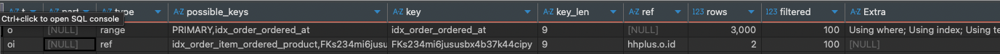
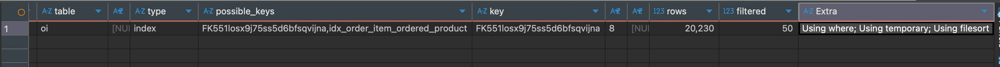
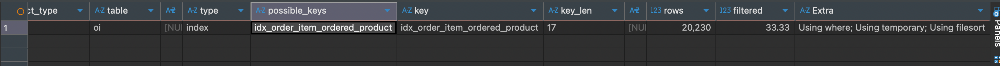

### 조회 성능 저하 기능 식별

1. 3일 이내 주문 기준으로 상품별 판매량 TOP 5를 조회하는 쿼리에 대해, 다음 세 가지 방식의 인덱스 사용 성능을 비교한다.

- 방법 1: Order.orderedAt 필터 + 조인
- 방법 2: OrderItem.orderedAt 단독 필터
- 방법 3-1: 복합 인덱스 (orderedAt, productId)
- 방법 3-2: 복합 인덱스 (productId, orderedAt)


### 더미 데이터 세팅

- `User`: 100명 
- `Product`: 100개 
- `Order`: 10,000건 
- `OrderItem`: 20,000건

```bash

docker exec -i hhplus-mysql mysql -u application -p******* hhplus < ./dummy/insert_users.sql
docker exec -i hhplus-mysql mysql -u application -p******* hhplus < ./dummy/insert_products.sql
docker exec -i hhplus-mysql mysql -u application -p******* hhplus < ./dummy/insert_orders.sql
docker exec -i hhplus-mysql mysql -u application -p******* hhplus < ./dummy/insert_order_items.sql

```

### 쿼리 실행계획 기반 문제 분석

1. 방법1: Order 기준 Join 방식

```sql
EXPLAIN
SELECT oi.product_id, SUM(oi.quantity) AS total_quantity
FROM `order` o
JOIN order_item oi ON o.id = oi.order_id
WHERE o.ordered_at >= NOW() - INTERVAL 3 DAY
GROUP BY oi.product_id
ORDER BY total_quantity DESC
LIMIT 5;
```

- 실행 결과


- 실행 계획 요약

  | table | type  | possible_keys                                                                           | key                          | key_len | rows     | filtered | Extra                                                     |
  | ----- | ----- |-----------------------------------------------------------------------------------------|------------------------------|---------|----------|----------|-----------------------------------------------------------|
  | `o`   | range | PRIMARY,idx_order_ordered_at                                                            | idx_order_ordered_at         | 9       | 3000     | 100.0    | Using where; Using index; Using temporary; Using filesort |
  | `oi`  | ref   | FKs234mi6jususbx4b37k44cipy,<br>FK551losx9j75ss5d6bfsqvijna,<br>idx_order_item_ordered_product  | FKs234mi6jususbx4b37k44cipy  |  9      | 2        | 100.0    |  NULL                                                     |

- 장점: 논리적으로 명확하며, 정규화 모델에 적합
- 단점: 조인 비용이 발생하며, 조인된 결과를 다시 Grouping/정렬해야 하므로 임시 테이블/정렬 비용이 큼

2. 방법2: OrderItem 역정규화 필드 단독 조회 방식

```sql
CREATE INDEX idx_order_item_ordered_at ON order_item (ordered_at);

EXPLAIN
SELECT oi.product_id, SUM(oi.quantity) AS total_quantity
FROM order_item oi
WHERE oi.ordered_at >= NOW() - INTERVAL 3 DAY
GROUP BY oi.product_id
ORDER BY total_quantity DESC
LIMIT 5;
```

- 실행 결과


- 실행 계획 요약
 
  | table | type   | possible_keys                                          | key                          | key_len | `rows` | filtered | Extra                                         |
  |-------|--------|--------------------------------------------------------|------------------------------|---------|--------|----------|-----------------------------------------------|
  | oi    | index  | FK551losx9j75ss5d6bfsqvijna,<br>idx_order_item_ordered_at  | FK551losx9j75ss5d6bfsqvijna  | 8       | 20230  | 29.66    | Using where; Using temporary; Using filesort  |

- 장점: 조인을 제거하여 단순화된 쿼리, 불필요한 Join 제거
- 단점: ordered_at만 필터링하여 product_id 그룹핑/정렬은 여전히 비용 발생


3. 방법3: 인덱스 순서별 비교

```sql
EXPLAIN
SELECT oi.product_id, SUM(oi.quantity) AS total_quantity
FROM order_item oi
WHERE oi.ordered_at >= NOW() - INTERVAL 3 DAY
GROUP BY oi.product_id
ORDER BY total_quantity DESC
LIMIT 5;
```

3-1. (ordered_at, product_id) 순서

```sql
CREATE INDEX idx_order_item_ordered_product ON order_item (ordered_at, product_id);
```

- 실행 결과
  

- 실행 계획 요약

  | table | type   | possible_keys                                              | key                          | key_len | `rows` | filtered | Extra                                         |
  |-------|--------|------------------------------------------------------------|------------------------------|---------|--------|----------|-----------------------------------------------|
  | oi    | index  | FK551losx9j75ss5d6bfsqvijna,<br>idx_order_item_ordered_product | FK551losx9j75ss5d6bfsqvijna  | 8       | 20230  | 50.0     | Using where; Using temporary; Using filesort  |

- 장점:
  - ordered_at 범위 필터링을 위해 인덱스 range scan 가능
  - 같은 인덱스로 product_id도 빠르게 접근 가능
- 단점:
  - Group By/Order By가 여전히 인덱스 컬럼 외의 연산으로 `filesort` 발생

3-2. (product_id, ordered_at) 순서
```sql
CREATE INDEX idx_order_item_ordered_product ON order_item (product_id, ordered_at);
# ProductId FK와 병합됨
```

- 실행 결과
  

- 실행 계획 요약

  | table | type   | possible_keys                   | key                              | key_len | `rows` | filtered | Extra                                         |
  |-------|--------|---------------------------------|----------------------------------|---------|--------|----------|-----------------------------------------------|
  | oi    | index  | idx_order_item_ordered_product  | idx_order_item_ordered_product   | 17      | 20230  | 33.33    | Using where; Using temporary; Using filesort  |

- 장점:
  - Group By 대상인 product_id로 정렬되어 있으므로 그룹핑에 유리

- 단점:
  - **필터 조건인 ordered_at이 후순위여서 range scan 불가, 전범위 스캔 발생**


### 인덱스/쿼리 재설계 및 개선안 도출

| 비교 항목              | 방식 1 (Join) | 방식 2 (단독 필터) | 3-1 (orderedAt, productId) | 3-2 (productId, orderedAt) |
|--------------------| ----------- | ------------ | -------------------------- | -------------------------- |
| 조인 비용              | O           | X            | X                          | X                          |
| 인덱스 범위 필터링 가능   | O           | O            | O                          | X                          |
| Group By 최적화 가능   | 제한적         | 제한적          | 제한적                        | 일부 가능                      |
| filesort 발생 여부     | 있음          | 있음           | 있음                         | 있음                         |
| 최종 성능              | 보통          | 약간 개선        | **가장 안정적**                 | 비교적 비효율                    |

## 결론

- 조인 제거 + 복합 인덱스 사용(3-1) 조합이 가장 적절함
  - WHERE ordered_at 필터에 효율적
  - GROUP BY product_id가 인덱스 커버리지 내에 존재

- 복합 인덱스 생성 시 순서가 매우 중요
  - 필터 조건(`ordered_at`)은 항상 인덱스 앞쪽에 배치해야 효율적인 range scan이 가능함

 
## 추후 계획

- 3일, 5개 고정값을 제거 하고, 사용자 요청사항에 충족하는 추가 통계 지표에 대한 테스트 수행
- 더미데이터를 100배 정도 확장하여 추가 테스트 

